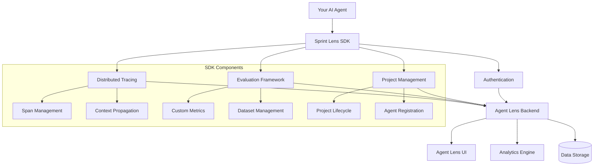

# Part 2: Agent Lens SDK Installation & Configuration

Learn how to install, configure, and verify the Agent Lens SDK for comprehensive AI agent observability.

## 🎯 What You'll Learn

- Install the Agent Lens SDK using poetry and uv
- Configure SDK connection to your Agent Lens backend
- Implement basic authentication and project setup
- Verify connectivity and create your first traces
- Understand SDK architecture and core concepts

## 📋 Prerequisites

- Completed [Part 1: Environment Setup](./01-environment-setup.md)
- Agent Lens backend running and accessible
- Project credentials and API access

## 🏗️ Agent Lens SDK Architecture



## 🛠️ SDK Installation

### Step 1: Install Agent Lens SDK

```bash
# Navigate to your project directory
cd customer-support-agent

# Install Sprint Lens SDK with all features
poetry add sprintlens

# Install with optional dependencies for specific providers
poetry add sprintlens[openai,azure,anthropic]

# Development dependencies for testing
poetry add --group dev pytest-sprintlens
```

### Step 2: Verify Installation

```python
# Create verification script
touch scripts/verify_sdk.py
```

Add to `scripts/verify_sdk.py`:

```python
#!/usr/bin/env python3
"""
Verify Sprint Lens SDK installation and features.
"""

import sys
from typing import Dict, Any

def test_core_imports() -> bool:
    """Test core SDK imports."""
    try:
        import sprintlens
        from sprintlens import configure, track, Trace, Span
        from sprintlens.core.client import SprintLensClient
        print(f"✅ Core SDK imported (version: {sprintlens.__version__})")
        return True
    except ImportError as e:
        print(f"❌ Core SDK import failed: {e}")
        return False

def test_evaluation_imports() -> bool:
    """Test evaluation framework imports."""
    try:
        from sprintlens.evaluation import (
            Evaluator, EvaluationDataset, BaseMetric,
            AccuracyMetric, SimilarityMetric
        )
        print("✅ Evaluation framework imported")
        return True
    except ImportError as e:
        print(f"❌ Evaluation framework import failed: {e}")
        return False

def test_llm_integrations() -> bool:
    """Test LLM provider integrations."""
    try:
        from sprintlens.llm import LLMProvider, OpenAIProvider
        print("✅ LLM integrations imported")
        return True
    except ImportError as e:
        print(f"❌ LLM integrations import failed: {e}")
        return False

def test_management_utilities() -> bool:
    """Test management utilities."""
    try:
        from sprintlens.management import ProjectManager, AgentManager
        print("✅ Management utilities imported")
        return True
    except ImportError as e:
        print(f"❌ Management utilities import failed: {e}")
        return False

def main() -> int:
    """Run all SDK verification tests."""
    print("🔍 Verifying Sprint Lens SDK Installation\n")
    
    tests = [
        test_core_imports(),
        test_evaluation_imports(),
        test_llm_integrations(),
        test_management_utilities()
    ]
    
    if all(tests):
        print("\n🎉 SDK installation verified successfully!")
        return 0
    else:
        print("\n❌ SDK installation has issues. Please reinstall.")
        return 1

if __name__ == "__main__":
    sys.exit(main())
```

Run verification:

```bash
poetry run python scripts/verify_sdk.py
```

## ⚙️ SDK Configuration

### Step 1: Update Environment Variables

Add to your `.env` file:

```env
# Agent Lens SDK Configuration
SPRINTLENS_URL=http://localhost:3000
SPRINTLENS_USERNAME=your_username
SPRINTLENS_PASSWORD=your_password
SPRINTLENS_PROJECT_ID=proj_customer_support_001

# SDK Behavior Configuration
SPRINTLENS_AUTO_TRACE=true
SPRINTLENS_BATCH_SIZE=100
SPRINTLENS_FLUSH_INTERVAL=5000
SPRINTLENS_ENABLE_LOGGING=true
SPRINTLENS_LOG_LEVEL=INFO

# Retry and Timeout Configuration
SPRINTLENS_MAX_RETRIES=3
SPRINTLENS_RETRY_DELAY=1000
SPRINTLENS_REQUEST_TIMEOUT=30000
SPRINTLENS_CONNECTION_TIMEOUT=10000
```

### Step 2: Create SDK Configuration Module

Create `src/customer_support_agent/config/sprintlens_config.py`:

```python
"""
Sprint Lens SDK configuration and initialization.
"""

import os
import logging
from typing import Optional, Dict, Any
from pydantic import BaseSettings, validator
import sprintlens
from sprintlens.core.config import SprintLensConfig
from dotenv import load_dotenv

# Load environment variables
load_dotenv()

logger = logging.getLogger(__name__)

class SprintLensSettings(BaseSettings):
    """Sprint Lens SDK configuration settings."""
    
    # Connection settings
    url: str = "http://localhost:3000"
    username: str = ""
    password: str = ""
    project_id: str = ""
    
    # Behavior settings
    auto_trace: bool = True
    batch_size: int = 100
    flush_interval: int = 5000  # milliseconds
    enable_logging: bool = True
    log_level: str = "INFO"
    
    # Performance settings
    max_retries: int = 3
    retry_delay: int = 1000  # milliseconds
    request_timeout: int = 30000  # milliseconds
    connection_timeout: int = 10000  # milliseconds
    
    # Optional settings
    api_key: Optional[str] = None
    workspace_id: Optional[str] = None
    
    class Config:
        env_prefix = "SPRINTLENS_"
        case_sensitive = False
    
    @validator('url')
    def validate_url(cls, v):
        """Ensure URL is properly formatted."""
        if not v.startswith(('http://', 'https://')):
            raise ValueError('URL must start with http:// or https://')
        return v.rstrip('/')
    
    @validator('log_level')
    def validate_log_level(cls, v):
        """Ensure log level is valid."""
        valid_levels = ['DEBUG', 'INFO', 'WARNING', 'ERROR', 'CRITICAL']
        if v.upper() not in valid_levels:
            raise ValueError(f'Log level must be one of: {valid_levels}')
        return v.upper()

# Global settings instance
settings = SprintLensSettings()

def create_sprintlens_config() -> SprintLensConfig:
    """Create a SprintLens configuration object."""
    return SprintLensConfig(
        url=settings.url,
        username=settings.username,
        password=settings.password,
        project_id=settings.project_id,
        api_key=settings.api_key,
        workspace_id=settings.workspace_id,
        auto_trace=settings.auto_trace,
        batch_size=settings.batch_size,
        flush_interval=settings.flush_interval,
        max_retries=settings.max_retries,
        retry_delay=settings.retry_delay,
        request_timeout=settings.request_timeout,
        connection_timeout=settings.connection_timeout
    )

def configure_sprintlens() -> bool:
    """Configure the Sprint Lens SDK with environment settings."""
    try:
        # Create configuration
        config = create_sprintlens_config()
        
        # Configure SDK
        sprintlens.configure(config)
        
        # Set up logging
        if settings.enable_logging:
            logging.basicConfig(
                level=getattr(logging, settings.log_level),
                format='%(asctime)s - %(name)s - %(levelname)s - %(message)s'
            )
        
        logger.info(f"Sprint Lens SDK configured successfully")
        logger.info(f"Backend URL: {settings.url}")
        logger.info(f"Project ID: {settings.project_id}")
        
        return True
        
    except Exception as e:
        logger.error(f"Failed to configure Sprint Lens SDK: {e}")
        return False

def get_client_info() -> Dict[str, Any]:
    """Get current client information and status."""
    try:
        client = sprintlens.get_client()
        return {
            "configured": True,
            "url": client.config.url if client.config else None,
            "project_id": client.config.project_id if client.config else None,
            "auto_trace": client.config.auto_trace if client.config else None,
            "batch_size": client.config.batch_size if client.config else None
        }
    except Exception as e:
        return {
            "configured": False,
            "error": str(e)
        }

def health_check() -> Dict[str, Any]:
    """Perform a health check of the Sprint Lens connection."""
    try:
        client = sprintlens.get_client()
        
        # Test connection (this might need to be adapted based on actual SDK API)
        # For now, we'll return configuration status
        info = get_client_info()
        
        if info.get("configured"):
            return {
                "status": "healthy",
                "timestamp": os.environ.get("TIMESTAMP", "now"),
                "client_info": info
            }
        else:
            return {
                "status": "unhealthy",
                "error": info.get("error", "Not configured"),
                "timestamp": os.environ.get("TIMESTAMP", "now")
            }
            
    except Exception as e:
        return {
            "status": "unhealthy", 
            "error": str(e),
            "timestamp": os.environ.get("TIMESTAMP", "now")
        }
```

### Step 3: Initialize SDK in Your Application

Create `src/customer_support_agent/__init__.py`:

```python
"""
Customer Support Agent with Sprint Lens integration.
"""

import logging
from .config.sprintlens_config import configure_sprintlens

# Set up logging
logging.basicConfig(level=logging.INFO)
logger = logging.getLogger(__name__)

# Initialize Sprint Lens SDK
def initialize():
    """Initialize the customer support agent and Sprint Lens SDK."""
    logger.info("Initializing Customer Support Agent...")
    
    # Configure Sprint Lens SDK
    if configure_sprintlens():
        logger.info("✅ Sprint Lens SDK configured successfully")
    else:
        logger.error("❌ Failed to configure Sprint Lens SDK")
        raise RuntimeError("SDK configuration failed")
    
    logger.info("✅ Customer Support Agent initialized")

# Auto-initialize when module is imported
try:
    initialize()
except Exception as e:
    logger.warning(f"Auto-initialization failed: {e}")
    logger.info("Manual initialization may be required")
```

## 🧪 Testing SDK Connection

### Step 1: Create Connection Test

Create `tests/test_sdk_connection.py`:

```python
"""
Test Sprint Lens SDK connection and basic functionality.
"""

import pytest
import asyncio
from typing import Dict, Any
import sprintlens
from customer_support_agent.config.sprintlens_config import (
    health_check, 
    get_client_info,
    settings
)

class TestSDKConnection:
    """Test suite for SDK connection and basic operations."""
    
    def test_configuration_loaded(self):
        """Test that configuration is properly loaded."""
        assert settings.url
        assert settings.project_id
        # Don't assert on credentials in tests for security
    
    def test_client_info(self):
        """Test getting client information."""
        info = get_client_info()
        assert isinstance(info, dict)
        assert "configured" in info
    
    def test_health_check(self):
        """Test health check functionality."""
        health = health_check()
        assert isinstance(health, dict)
        assert "status" in health
        assert health["status"] in ["healthy", "unhealthy"]
    
    @pytest.mark.asyncio
    async def test_basic_tracing(self):
        """Test basic tracing functionality."""
        
        @sprintlens.track
        def simple_function(x: int) -> int:
            """A simple function to test tracing."""
            return x * 2
        
        # Execute function
        result = simple_function(5)
        assert result == 10
        
        # Give some time for trace to be sent
        await asyncio.sleep(0.1)
    
    @pytest.mark.asyncio
    async def test_manual_trace_creation(self):
        """Test manual trace and span creation."""
        
        # Create a trace
        trace = sprintlens.Trace(
            name="test_trace",
            input={"test": "input"},
            metadata={"test_type": "manual"}
        )
        
        # Create a span within the trace
        with trace.span(name="test_span") as span:
            span.update(
                input={"operation": "test"},
                output={"result": "success"},
                metadata={"step": 1}
            )
        
        # Finalize trace
        trace.end(output={"final": "result"})
        
        # Give some time for trace to be sent
        await asyncio.sleep(0.1)
    
    def test_trace_context(self):
        """Test trace context management."""
        
        # Create trace
        trace = sprintlens.Trace(name="context_test")
        
        # Set current trace
        sprintlens.set_current_trace(trace)
        
        # Get current trace
        current = sprintlens.get_current_trace()
        
        assert current is not None
        assert current.name == "context_test"
        
        # End trace
        trace.end()

@pytest.mark.integration
class TestSDKIntegration:
    """Integration tests requiring backend connectivity."""
    
    @pytest.mark.asyncio
    async def test_end_to_end_trace(self):
        """Test complete end-to-end tracing workflow."""
        
        @sprintlens.track
        async def async_function(prompt: str) -> str:
            """Simulate an async AI function."""
            await asyncio.sleep(0.01)  # Simulate processing
            return f"Response to: {prompt}"
        
        # Execute function
        result = await async_function("Hello, Agent Lens!")
        assert "Hello, Agent Lens!" in result
        
        # Allow time for trace processing
        await asyncio.sleep(0.5)
    
    def test_error_handling(self):
        """Test error handling in traced functions."""
        
        @sprintlens.track
        def function_with_error():
            """Function that raises an error."""
            raise ValueError("Test error")
        
        # Function should still raise error
        with pytest.raises(ValueError):
            function_with_error()
```

### Step 2: Create Interactive Testing Script

Create `scripts/test_sdk_interactive.py`:

```python
#!/usr/bin/env python3
"""
Interactive script to test Sprint Lens SDK functionality.
"""

import asyncio
import time
from typing import Dict, Any
import sprintlens
from customer_support_agent.config.sprintlens_config import health_check

async def test_basic_functionality():
    """Test basic SDK functionality interactively."""
    
    print("🧪 Testing Sprint Lens SDK Functionality\n")
    
    # 1. Health Check
    print("1. Testing connection health...")
    health = health_check()
    print(f"   Status: {health['status']}")
    if health['status'] == 'unhealthy':
        print(f"   Error: {health.get('error', 'Unknown')}")
        return False
    print("   ✅ Connection healthy\n")
    
    # 2. Simple Traced Function
    print("2. Testing simple traced function...")
    
    @sprintlens.track
    def greet(name: str) -> str:
        """Simple greeting function."""
        time.sleep(0.1)  # Simulate processing
        return f"Hello, {name}!"
    
    result = greet("Agent Developer")
    print(f"   Result: {result}")
    print("   ✅ Function traced successfully\n")
    
    # 3. Async Traced Function
    print("3. Testing async traced function...")
    
    @sprintlens.track
    async def async_process(data: Dict[str, Any]) -> Dict[str, Any]:
        """Simulate async processing."""
        await asyncio.sleep(0.2)
        return {
            "processed": True,
            "input_keys": list(data.keys()),
            "timestamp": time.time()
        }
    
    async_result = await async_process({"test": "data", "type": "async"})
    print(f"   Result: {async_result}")
    print("   ✅ Async function traced successfully\n")
    
    # 4. Manual Trace Management
    print("4. Testing manual trace management...")
    
    trace = sprintlens.Trace(
        name="manual_test_trace",
        input={"test_type": "manual", "purpose": "SDK verification"},
        metadata={"version": "1.0", "environment": "development"}
    )
    
    # Add spans to trace
    with trace.span(name="preparation") as prep_span:
        time.sleep(0.05)
        prep_span.update(
            output={"status": "prepared"},
            metadata={"step": "1"}
        )
    
    with trace.span(name="processing") as proc_span:
        time.sleep(0.1)
        proc_span.update(
            output={"status": "processed", "items": 5},
            metadata={"step": "2"}
        )
    
    with trace.span(name="finalization") as final_span:
        time.sleep(0.05)
        final_span.update(
            output={"status": "finalized"},
            metadata={"step": "3"}
        )
    
    trace.end(output={"completed": True, "total_time": 0.2})
    print("   ✅ Manual trace created successfully\n")
    
    # 5. Error Handling
    print("5. Testing error handling...")
    
    @sprintlens.track
    def function_with_error(should_fail: bool = False):
        """Function that may fail."""
        if should_fail:
            raise ValueError("Intentional test error")
        return "Success!"
    
    # Test success case
    success_result = function_with_error(False)
    print(f"   Success case: {success_result}")
    
    # Test error case
    try:
        function_with_error(True)
    except ValueError as e:
        print(f"   Error case handled: {e}")
    
    print("   ✅ Error handling tested successfully\n")
    
    print("🎉 All SDK tests completed successfully!")
    print("\n📊 Check your Agent Lens dashboard for the traces!")
    
    return True

def main():
    """Run interactive SDK tests."""
    print("🚀 Sprint Lens SDK Interactive Test\n")
    
    try:
        # Run async tests
        result = asyncio.run(test_basic_functionality())
        
        if result:
            print("\n✅ SDK is working correctly!")
            print("🔗 View traces in Agent Lens dashboard:")
            print("   http://localhost:3000/projects/your-project-id/traces")
        else:
            print("\n❌ SDK tests failed. Check configuration.")
            
    except Exception as e:
        print(f"\n💥 Test failed with error: {e}")

if __name__ == "__main__":
    main()
```

### Step 3: Run Tests

```bash
# Run unit tests
poetry run pytest tests/test_sdk_connection.py -v

# Run integration tests (requires backend)
poetry run pytest tests/test_sdk_connection.py::TestSDKIntegration -v

# Run interactive test
poetry run python scripts/test_sdk_interactive.py
```

## 📊 Monitoring and Debugging

### Step 1: Enable Debug Logging

Update your `.env` file:

```env
# Enable detailed logging for debugging
SPRINTLENS_LOG_LEVEL=DEBUG
SPRINTLENS_ENABLE_LOGGING=true
```

### Step 2: Create Debug Utilities

Create `src/customer_support_agent/utils/debug.py`:

```python
"""
Debug utilities for Sprint Lens SDK integration.
"""

import logging
import json
from typing import Dict, Any, Optional
import sprintlens
from customer_support_agent.config.sprintlens_config import get_client_info

logger = logging.getLogger(__name__)

def log_trace_info(trace: sprintlens.Trace) -> None:
    """Log detailed information about a trace."""
    logger.debug(f"Trace Info:")
    logger.debug(f"  ID: {trace.id}")
    logger.debug(f"  Name: {trace.name}")
    logger.debug(f"  Start Time: {trace.start_time}")
    logger.debug(f"  Status: {getattr(trace, 'status', 'Unknown')}")

def log_span_info(span: sprintlens.Span) -> None:
    """Log detailed information about a span."""
    logger.debug(f"Span Info:")
    logger.debug(f"  ID: {span.id}")
    logger.debug(f"  Name: {span.name}")
    logger.debug(f"  Trace ID: {span.trace_id}")
    logger.debug(f"  Parent ID: {getattr(span, 'parent_id', 'None')}")

def log_client_status() -> None:
    """Log current client status and configuration."""
    info = get_client_info()
    logger.info(f"Client Status: {json.dumps(info, indent=2)}")

def create_debug_trace(name: str = "debug_trace") -> sprintlens.Trace:
    """Create a trace specifically for debugging purposes."""
    trace = sprintlens.Trace(
        name=name,
        input={"debug": True, "purpose": "debugging"},
        metadata={"debug_mode": True, "timestamp": "now"}
    )
    
    log_trace_info(trace)
    return trace

class DebugTracer:
    """Context manager for debug tracing."""
    
    def __init__(self, name: str, input_data: Optional[Dict[str, Any]] = None):
        self.name = name
        self.input_data = input_data or {}
        self.trace: Optional[sprintlens.Trace] = None
    
    def __enter__(self) -> sprintlens.Trace:
        self.trace = sprintlens.Trace(
            name=self.name,
            input=self.input_data,
            metadata={"debug": True}
        )
        logger.debug(f"Started debug trace: {self.name}")
        return self.trace
    
    def __exit__(self, exc_type, exc_val, exc_tb):
        if self.trace:
            if exc_type:
                self.trace.end(
                    output={"error": str(exc_val)},
                    metadata={"exception_type": str(exc_type)}
                )
                logger.debug(f"Debug trace ended with error: {self.name}")
            else:
                self.trace.end(output={"success": True})
                logger.debug(f"Debug trace completed successfully: {self.name}")
```

## 🎯 Next Steps

Your Agent Lens SDK is now installed and configured! In the next tutorial, we'll:

1. Create your first traced functions
2. Understand the tracing data model
3. Implement basic observability patterns

Continue to [03-basic-integration.md](./03-basic-integration.md) →

## 📚 Reference

### Environment Variables Reference

| Variable | Description | Default | Required |
|----------|-------------|---------|----------|
| `SPRINTLENS_URL` | Backend URL | `http://localhost:3000` | ✅ |
| `SPRINTLENS_USERNAME` | Username for authentication | - | ✅ |
| `SPRINTLENS_PASSWORD` | Password for authentication | - | ✅ |
| `SPRINTLENS_PROJECT_ID` | Project identifier | - | ✅ |
| `SPRINTLENS_AUTO_TRACE` | Enable automatic tracing | `true` | ❌ |
| `SPRINTLENS_BATCH_SIZE` | Batch size for sending traces | `100` | ❌ |
| `SPRINTLENS_FLUSH_INTERVAL` | Flush interval in ms | `5000` | ❌ |
| `SPRINTLENS_MAX_RETRIES` | Maximum retry attempts | `3` | ❌ |

### Common Issues and Solutions

1. **Connection Refused**: Check backend URL and port
2. **Authentication Failed**: Verify username/password
3. **Project Not Found**: Confirm project ID exists
4. **Timeout Errors**: Increase timeout values in configuration
5. **Import Errors**: Ensure all dependencies are installed correctly

---

**Next:** [03-basic-integration.md](./03-basic-integration.md) - Creating your first traced functions →