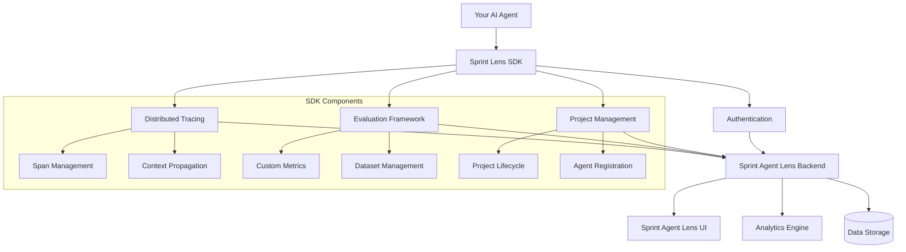

# Part 2: Sprint Lens SDK Installation & Configuration

Learn how to install, configure, and verify the Sprint Lens SDK for comprehensive AI agent observability.

## 🎯 What You'll Learn

- Install the Sprint Lens SDK using poetry and uv
- Configure SDK connection to your Sprint Agent Lens backend
- Implement basic authentication and project setup
- Verify connectivity and create your first traces
- Understand SDK architecture and core concepts

## 📋 Prerequisites

- Completed [Part 1: Environment Setup](./01-environment-setup.md)
- Sprint Agent Lens backend running and accessible
- Project credentials and API access

## 🏗️ Sprint Lens SDK Architecture



## 🛠️ SDK Installation

### Step 1: Install Sprint Lens SDK

Since we're using the local Sprint Lens SDK that's already configured in your `pyproject.toml`, the SDK should already be installed. Let's verify:

```bash
# Navigate to your project directory
cd customer-support-agent

# Install dependencies (including local Sprint Lens SDK)
poetry install

# Verify SDK is available
poetry run python -c "import sprintlens; print(f'Sprint Lens SDK {sprintlens.__version__} installed successfully')"
```

### Step 2: Verify Installation

```python
# Create verification script
touch scripts/verify_sdk.py
```

Add to `scripts/verify_sdk.py`:

```python
#!/usr/bin/env python3
"""
Verify Sprint Lens SDK installation and features.
"""

import sys
from typing import Dict, Any

def test_core_imports() -> bool:
    """Test core SDK imports."""
    try:
        import sprintlens
        from sprintlens import configure, track, get_client
        from sprintlens.core.client import SprintLensClient
        from sprintlens.tracing.context import set_current_trace, get_current_trace
        print(f"✅ Core SDK imported (version: {sprintlens.__version__})")
        return True
    except ImportError as e:
        print(f"❌ Core SDK import failed: {e}")
        return False

def test_evaluation_imports() -> bool:
    """Test evaluation framework imports."""
    try:
        from sprintlens.evaluation import (
            Evaluator, EvaluationDataset, BaseMetric,
            AccuracyMetric, SimilarityMetric, EvaluationResult,
            DatasetItem, BatchEvaluator
        )
        print("✅ Evaluation framework imported")
        return True
    except ImportError as e:
        print(f"❌ Evaluation framework import failed: {e}")
        return False

def test_llm_integrations() -> bool:
    """Test LLM provider integrations."""
    try:
        from sprintlens.llm import LLMProvider, OpenAIProvider, AzureOpenAIProvider
        print("✅ LLM integrations imported")
        return True
    except ImportError as e:
        print(f"❌ LLM integrations import failed: {e}")
        return False

def test_management_utilities() -> bool:
    """Test management utilities."""
    try:
        from sprintlens.management import ProjectManager, AgentManager, DistributedTraceSetup
        print("✅ Management utilities imported")
        return True
    except ImportError as e:
        print(f"❌ Management utilities import failed: {e}")
        return False

def main() -> int:
    """Run all SDK verification tests."""
    print("🔍 Verifying Sprint Lens SDK Installation\n")
    
    tests = [
        test_core_imports(),
        test_evaluation_imports(),
        test_llm_integrations(),
        test_management_utilities()
    ]
    
    if all(tests):
        print("\n🎉 SDK installation verified successfully!")
        return 0
    else:
        print("\n❌ SDK installation has issues. Please reinstall.")
        return 1

if __name__ == "__main__":
    sys.exit(main())
```

Run verification:

```bash
poetry run python scripts/verify_sdk.py
```

## ⚙️ SDK Configuration

### Step 1: Update Environment Variables

Add to your `.env` file:

```env
# Sprint Lens SDK Configuration
SPRINTLENS_URL=http://localhost:3001
SPRINTLENS_USERNAME=admin
SPRINTLENS_PASSWORD=OpikAdmin2024!
SPRINTLENS_WORKSPACE_ID=default
SPRINTLENS_PROJECT_NAME=project-1758599350381

# Optional API Key (alternative to username/password)
# SPRINTLENS_API_KEY=your_api_key_here

# SDK Behavior Configuration
SPRINTLENS_DEBUG=false
SPRINTLENS_TRACING_ENABLED=true
# Enable detailed logging for debugging
SPRINTLENS_LOG_LEVEL=DEBUG
SPRINTLENS_ENABLE_LOGGING=true
```

### Step 2: Create SDK Configuration Module

Create `src/customer_support_agent/config/sprintlens_config.py`:

```python
"""
Sprint Lens SDK configuration and initialization.
"""

import os
import logging
from typing import Optional, Dict, Any
from pydantic_settings import BaseSettings
from pydantic import field_validator
import sprintlens
from sprintlens.core.config import SprintLensConfig
from dotenv import load_dotenv

# Load environment variables
load_dotenv()

logger = logging.getLogger(__name__)

class SprintLensSettings(BaseSettings):
    """Sprint Lens SDK configuration settings."""
    
    # Connection settings
    url: str = "http://localhost:3001"
    username: str = ""
    password: str = ""
    workspace_id: str = "default"
    project_name: str = ""
    
    # Optional settings
    api_key: Optional[str] = None
    debug: bool = False
    tracing_enabled: bool = True
    
    model_config = {
        "env_prefix": "SPRINTLENS_",
        "case_sensitive": False
    }
    
    @field_validator('url')
    @classmethod
    def validate_url(cls, v):
        """Ensure URL is properly formatted."""
        if not v.startswith(('http://', 'https://')):
            raise ValueError('URL must start with http:// or https://')
        return v.rstrip('/')

# Global settings instance
settings = SprintLensSettings()

def create_sprintlens_config() -> SprintLensConfig:
    """Create a SprintLens configuration object."""
    return SprintLensConfig(
        url=settings.url,
        username=settings.username,
        password=settings.password,
        workspace_id=settings.workspace_id,
        project_name=settings.project_name,
        api_key=settings.api_key
    )

def configure_sprintlens() -> bool:
    """Configure the Sprint Lens SDK with environment settings."""
    try:
        # Configure SDK with individual parameters
        sprintlens.configure(
            url=settings.url,
            username=settings.username,
            password=settings.password,
            workspace_id=settings.workspace_id,
            project_name=settings.project_name,
            api_key=settings.api_key
        )
        
        # Set up logging if debug is enabled
        if settings.debug:
            logging.basicConfig(
                level=logging.DEBUG,
                format='%(asctime)s - %(name)s - %(levelname)s - %(message)s'
            )
        
        logger.info(f"Sprint Lens SDK configured successfully")
        logger.info(f"Backend URL: {settings.url}")
        logger.info(f"Project Name: {settings.project_name}")
        
        return True
        
    except Exception as e:
        logger.error(f"Failed to configure Sprint Lens SDK: {e}")
        return False

def get_client_info() -> Dict[str, Any]:
    """Get current client information and status."""
    try:
        client = sprintlens.get_client()
        return {
            "configured": True,
            "url": client.config.url if client.config else None,
            "workspace_id": client.config.workspace_id if client.config else None,
            "project_name": client.config.project_name if client.config else None,
            "tracing_enabled": client.config.tracing_enabled if client.config else None
        }
    except Exception as e:
        return {
            "configured": False,
            "error": str(e)
        }

def health_check() -> Dict[str, Any]:
    """Perform a health check of the Sprint Lens connection."""
    try:
        client = sprintlens.get_client()
        
        # Test connection (this might need to be adapted based on actual SDK API)
        # For now, we'll return configuration status
        info = get_client_info()
        
        if info.get("configured"):
            return {
                "status": "healthy",
                "timestamp": os.environ.get("TIMESTAMP", "now"),
                "client_info": info
            }
        else:
            return {
                "status": "unhealthy",
                "error": info.get("error", "Not configured"),
                "timestamp": os.environ.get("TIMESTAMP", "now")
            }
            
    except Exception as e:
        return {
            "status": "unhealthy", 
            "error": str(e),
            "timestamp": os.environ.get("TIMESTAMP", "now")
        }
```

### Step 3: Initialize SDK in Your Application

Create `src/customer_support_agent/__init__.py`:

```python
"""
Customer Support Agent with Sprint Lens integration.
"""

import logging
from .config.sprintlens_config import configure_sprintlens

# Set up logging
logging.basicConfig(level=logging.INFO)
logger = logging.getLogger(__name__)

# Initialize Sprint Lens SDK
def initialize():
    """Initialize the customer support agent and Sprint Lens SDK."""
    logger.info("Initializing Customer Support Agent...")
    
    # Configure Sprint Lens SDK
    if configure_sprintlens():
        logger.info("✅ Sprint Lens SDK configured successfully")
    else:
        logger.error("❌ Failed to configure Sprint Lens SDK")
        raise RuntimeError("SDK configuration failed")
    
    logger.info("✅ Customer Support Agent initialized")

# Auto-initialize when module is imported
try:
    initialize()
except Exception as e:
    logger.warning(f"Auto-initialization failed: {e}")
    logger.info("Manual initialization may be required")
```

## 🧪 Testing SDK Connection

### Step 1: Create Connection Test

Create `tests/test_sdk_connection.py`:

```python
"""
Test Sprint Lens SDK connection and basic functionality.
"""

import pytest
import asyncio
from typing import Dict, Any
import sprintlens
from customer_support_agent.config.sprintlens_config import (
    health_check, 
    get_client_info,
    settings
)

class TestSDKConnection:
    """Test suite for SDK connection and basic operations."""
    
    def test_configuration_loaded(self):
        """Test that configuration is properly loaded."""
        assert settings.url
        assert settings.project_name
        # Don't assert on credentials in tests for security
    
    def test_client_info(self):
        """Test getting client information."""
        info = get_client_info()
        assert isinstance(info, dict)
        assert "configured" in info
    
    def test_health_check(self):
        """Test health check functionality."""
        health = health_check()
        assert isinstance(health, dict)
        assert "status" in health
        assert health["status"] in ["healthy", "unhealthy"]
    
    @pytest.mark.asyncio
    async def test_basic_tracing(self):
        """Test basic tracing functionality."""
        
        @sprintlens.track
        def simple_function(x: int) -> int:
            """A simple function to test tracing."""
            return x * 2
        
        # Execute function
        result = simple_function(5)
        assert result == 10
        
        # Give some time for trace to be sent
        await asyncio.sleep(0.1)
    
    @pytest.mark.asyncio
    async def test_manual_trace_creation(self):
        """Test manual trace and span creation."""
        
        # Get the configured client
        client = sprintlens.get_client()
        
        # Create a trace manually using Trace constructor
        from sprintlens.tracing.trace import Trace
        trace = Trace(
            name="test_trace",
            client=client,
            tags={"test_type": "manual"},
            metadata={"test_environment": "development"}
        )
        
        # Use trace as context manager
        async with trace:
            # Create a span within the trace
            with trace.span(name="test_span") as span:
                span.set_input({"operation": "test"})
                span.set_output({"result": "success"})
                span.add_metadata("step", 1)
        
        # Give some time for trace to be sent
        await asyncio.sleep(0.1)
    
    def test_trace_context(self):
        """Test trace context management."""
        from sprintlens.tracing.context import TraceContext
        from sprintlens.tracing.trace import Trace
        
        # Get the configured client
        client = sprintlens.get_client()
        
        # Create trace using Trace constructor
        trace = Trace(name="context_test", client=client)
        
        # Use trace context
        with TraceContext(trace):
            # Get current trace
            current = sprintlens.get_current_trace()
            assert current is not None
            assert current.name == "context_test"

@pytest.mark.integration
class TestSDKIntegration:
    """Integration tests requiring backend connectivity."""
    
    @pytest.mark.asyncio
    async def test_end_to_end_trace(self):
        """Test complete end-to-end tracing workflow."""
        
        @sprintlens.track(span_type="llm")
        async def async_function(prompt: str) -> str:
            """Simulate an async AI function."""
            await asyncio.sleep(0.01)  # Simulate processing
            return f"Response to: {prompt}"
        
        # Execute function
        result = await async_function("Hello, Sprint Lens!")
        assert "Hello, Sprint Lens!" in result
        
        # Allow time for trace processing
        await asyncio.sleep(0.5)
    
    def test_error_handling(self):
        """Test error handling in traced functions."""
        
        @sprintlens.track(capture_exception=True)
        def function_with_error():
            """Function that raises an error."""
            raise ValueError("Test error")
        
        # Function should still raise error
        with pytest.raises(ValueError):
            function_with_error()
```

### Step 2: Create Interactive Testing Script

Create `scripts/test_sdk_interactive.py`:

```python
#!/usr/bin/env python3
"""
Interactive script to test Sprint Lens SDK functionality.
"""

import asyncio
import time
from typing import Dict, Any
import sprintlens
from customer_support_agent.config.sprintlens_config import health_check

async def test_basic_functionality():
    """Test basic SDK functionality interactively."""
    
    print("🧪 Testing Sprint Lens SDK Functionality\n")
    
    # 1. Health Check
    print("1. Testing connection health...")
    health = health_check()
    print(f"   Status: {health['status']}")
    if health['status'] == 'unhealthy':
        print(f"   Error: {health.get('error', 'Unknown')}")
        return False
    print("   ✅ Connection healthy\n")
    
    # 2. Simple Traced Function
    print("2. Testing simple traced function...")
    
    @sprintlens.track(span_type="processing")
    def greet(name: str) -> str:
        """Simple greeting function."""
        time.sleep(0.1)  # Simulate processing
        return f"Hello, {name}!"
    
    result = greet("Agent Developer")
    print(f"   Result: {result}")
    print("   ✅ Function traced successfully\n")
    
    # 3. Async Traced Function
    print("3. Testing async traced function...")
    
    @sprintlens.track(span_type="llm", capture_input=True, capture_output=True)
    async def async_process(data: Dict[str, Any]) -> Dict[str, Any]:
        """Simulate async processing."""
        await asyncio.sleep(0.2)
        return {
            "processed": True,
            "input_keys": list(data.keys()),
            "timestamp": time.time()
        }
    
    async_result = await async_process({"test": "data", "type": "async"})
    print(f"   Result: {async_result}")
    print("   ✅ Async function traced successfully\n")
    
    # 4. Manual Trace Management
    print("4. Testing manual trace management...")
    
    client = sprintlens.get_client()
    trace = client.create_trace(
        name="manual_test_trace",
        tags={"test_type": "manual", "purpose": "SDK verification"},
        metadata={"version": "1.0", "environment": "development"}
    )
    
    # Add spans to trace
    with trace.span(name="preparation", span_type="processing") as prep_span:
        time.sleep(0.05)
        prep_span.set_output({"status": "prepared"})
        prep_span.add_metadata("step", "1")
    
    with trace.span(name="processing", span_type="custom") as proc_span:
        time.sleep(0.1)
        proc_span.set_output({"status": "processed", "items": 5})
        proc_span.add_metadata("step", "2")
    
    with trace.span(name="finalization", span_type="custom") as final_span:
        time.sleep(0.05)
        final_span.set_output({"status": "finalized"})
        final_span.add_metadata("step", "3")
    
    trace.set_output({"completed": True, "total_time": 0.2})
    await trace.finish()
    print("   ✅ Manual trace created successfully\n")
    
    # 5. Error Handling
    print("5. Testing error handling...")
    
    @sprintlens.track(capture_exception=True)
    def function_with_error(should_fail: bool = False):
        """Function that may fail."""
        if should_fail:
            raise ValueError("Intentional test error")
        return "Success!"
    
    # Test success case
    success_result = function_with_error(False)
    print(f"   Success case: {success_result}")
    
    # Test error case
    try:
        function_with_error(True)
    except ValueError as e:
        print(f"   Error case handled: {e}")
    
    print("   ✅ Error handling tested successfully\n")
    
    print("🎉 All SDK tests completed successfully!")
    print("\n📊 Check your Sprint Agent Lens dashboard for the traces!")
    
    return True

def main():
    """Run interactive SDK tests."""
    print("🚀 Sprint Lens SDK Interactive Test\n")
    
    try:
        # Run async tests
        result = asyncio.run(test_basic_functionality())
        
        if result:
            print("\n✅ SDK is working correctly!")
            print("🔗 View traces in Sprint Agent Lens dashboard:")
            print("   http://localhost:3001/projects/your-project-id/traces")
        else:
            print("\n❌ SDK tests failed. Check configuration.")
            
    except Exception as e:
        print(f"\n💥 Test failed with error: {e}")

if __name__ == "__main__":
    main()
```

### Step 3: Run Tests

```bash
# Run unit tests
poetry run pytest tests/test_sdk_connection.py -v

# Run integration tests (requires backend)
poetry run pytest tests/test_sdk_connection.py::TestSDKIntegration -v

# Run interactive test
poetry run python scripts/test_sdk_interactive.py
```

## 📊 Monitoring and Debugging

### Step 1: Enable Debug Logging

Update your `.env` file:

```env
# Enable detailed logging for debugging
SPRINTLENS_DEBUG=true
SPRINTLENS_LOG_LEVEL=DEBUG
```

### Step 2: Create Debug Utilities

Create `src/customer_support_agent/utils/debug.py`:

```python
"""
Debug utilities for Sprint Lens SDK integration.
"""

import logging
import json
from typing import Dict, Any, Optional
import sprintlens
from customer_support_agent.config.sprintlens_config import get_client_info

logger = logging.getLogger(__name__)

def log_client_status() -> None:
    """Log current client status and configuration."""
    info = get_client_info()
    logger.info(f"Client Status: {json.dumps(info, indent=2)}")

def create_debug_trace(name: str = "debug_trace"):
    """Create a trace specifically for debugging purposes."""
    client = sprintlens.get_client()
    trace = client.create_trace(
        name=name,
        tags={"debug": "true", "purpose": "debugging"},
        metadata={"debug_mode": True, "timestamp": "now"}
    )
    
    logger.debug(f"Created debug trace: {trace.id}")
    return trace

class DebugTracer:
    """Context manager for debug tracing."""
    
    def __init__(self, name: str, input_data: Optional[Dict[str, Any]] = None):
        self.name = name
        self.input_data = input_data or {}
        self.trace = None
    
    def __enter__(self):
        client = sprintlens.get_client()
        self.trace = client.create_trace(
            name=self.name,
            tags={"debug": "true"},
            metadata={"debug": True}
        )
        if self.input_data:
            self.trace.set_input(self.input_data)
        
        logger.debug(f"Started debug trace: {self.name}")
        return self.trace
    
    async def __aexit__(self, exc_type, exc_val, exc_tb):
        if self.trace:
            if exc_type:
                self.trace.set_output({"error": str(exc_val)})
                self.trace.add_metadata("exception_type", str(exc_type))
                logger.debug(f"Debug trace ended with error: {self.name}")
            else:
                self.trace.set_output({"success": True})
                logger.debug(f"Debug trace completed successfully: {self.name}")
            
            await self.trace.finish()
```

## 🎯 Next Steps

Your Sprint Lens SDK is now installed and configured! 

**Next step**: Continue to the comprehensive integration guide to learn about all available SDK features, patterns, and best practices:

**➡️ [03-sdk-integration-guide.md](./03-sdk-integration-guide.md) - Complete SDK Integration Reference**

This guide covers:
- All decorator types and usage patterns
- Evaluation framework with examples
- LLM provider integrations
- Management utilities
- Real-world implementation examples
- Troubleshooting and best practices

## 📚 Reference

### Environment Variables Reference

| Variable | Description | Default | Required |
|----------|-------------|---------|----------|
| `SPRINTLENS_URL` | Backend URL | `http://localhost:3001` | ✅ |
| `SPRINTLENS_USERNAME` | Username for authentication | - | ✅ |
| `SPRINTLENS_PASSWORD` | Password for authentication | - | ✅ |
| `SPRINTLENS_WORKSPACE_ID` | Workspace identifier | `default` | ❌ |
| `SPRINTLENS_PROJECT_NAME` | Project name | - | ✅ |
| `SPRINTLENS_API_KEY` | API key (alternative to username/password) | - | ❌ |
| `SPRINTLENS_DEBUG` | Enable debug mode | `false` | ❌ |
| `SPRINTLENS_TRACING_ENABLED` | Enable tracing | `true` | ❌ |

### Common Issues and Solutions

1. **Connection Refused**: Check backend URL and port
2. **Authentication Failed**: Verify username/password
3. **Project Not Found**: Confirm project name exists
4. **Timeout Errors**: Increase timeout values in configuration
5. **Import Errors**: Ensure all dependencies are installed correctly

---

**Next:** [03-sdk-integration-guide.md](./03-sdk-integration-guide.md) - Comprehensive SDK integration patterns →