# Part 3: Basic Agent Lens Integration

> **🔥 NEW: Comprehensive Integration Guide Available!**
> 
> For the most complete and up-to-date Sprint Lens SDK integration patterns, examples, and usage information, please refer to our comprehensive guide:
> 
> **➡️ [03-sdk-integration-guide.md](./03-sdk-integration-guide.md) - Complete SDK Integration Reference**
> 
> This comprehensive guide includes all the patterns shown below plus many more advanced examples, troubleshooting tips, and real-world usage scenarios.

Learn the fundamentals of Sprint Lens integration with practical examples and best practices.

> **👋 New to Sprint Lens?** This guide teaches you **3 progressive patterns** for adding observability to your code. You'll build **one complete example file** step by step, never replacing code - only adding to it. By the end, you'll understand when and how to use each pattern.

## 🎯 What You'll Learn

- Understanding traces, spans, and the observability data model
- Implementing automatic tracing with decorators
- Creating manual traces and spans
- Managing trace context and propagation
- Adding metadata and custom attributes
- Error handling and debugging traced functions

## 📋 Prerequisites

- Completed [Part 2: SDK Installation](./02-sdk-installation.md)
- Agent Lens SDK configured and tested
- Basic understanding of Python decorators and context managers

## 🏗️ Agent Lens Data Model

```mermaid
graph TD
    Trace[🔍 Trace] --> Span1[📍 Span 1]
    Trace --> Span2[📍 Span 2]
    Trace --> Span3[📍 Span 3]
    
    Span2 --> ChildSpan1[📍 Child Span 1]
    Span2 --> ChildSpan2[📍 Child Span 2]
    
    subgraph "Trace Properties"
        TraceProps[Name<br/>Input<br/>Output<br/>Status<br/>Duration<br/>Metadata]
    end
    
    subgraph "Span Properties"
        SpanProps[Name<br/>Input<br/>Output<br/>Parent ID<br/>Timing<br/>Tags<br/>Events]
    end
    
    Trace -.-> TraceProps
    Span1 -.-> SpanProps
```



### Core Concepts

- **Trace**: A complete request/operation journey through your system
- **Span**: Individual operations or steps within a trace
- **Context**: Correlation data that flows through the trace
- **Metadata**: Custom attributes for filtering and analysis

## 🚀 Basic Tracing Patterns

Sprint Lens offers **three main patterns** for adding observability to your code. As a first-time user, you'll learn each pattern progressively, building from simple automatic tracing to advanced manual control.

> **📖 How to Use This Section**: Each pattern builds on the previous one. You'll create **one single file** and **add code progressively** - never overwrite previous examples. By the end, you'll have a complete working example with all three patterns.

---

### Pattern 1: Automatic Function Tracing ✨

**What it does**: Automatically tracks function execution with minimal setup
**When to use**: Perfect for getting started - just add `@sprintlens.track()` above any function
**What you get**: Automatic timing, input/output capture, error tracking

The simplest way to add observability is using the `@track` decorator:

```python
# Create src/customer_support_agent/examples/basic_tracing.py

import time
import asyncio
from typing import Dict, Any, List
import sprintlens

# Configure Sprint Lens before using any decorators
sprintlens.configure(
    url="http://localhost:3001",
    username="admin",
    password="OpikAdmin2024!",
    workspace_id="default",
    project_name="project-1758599350381"
)

print("🔧 Sprint Lens SDK configured successfully")
print(f"✅ Backend URL: http://localhost:3001")
print(f"✅ Project: project-1758599350381")
print()

# Simple function tracing with agent tagging
@sprintlens.track(tags={"agent_id": "agent_simpleag_mfw0ut5k"})
def process_customer_query(query: str) -> str:
    """Process a customer query and return a response."""
    # Simulate processing time
    time.sleep(0.1)
    
    # Simple response logic
    if "account" in query.lower():
        return "I can help you with your account. Please provide your account number."
    elif "billing" in query.lower():
        return "For billing questions, I'll transfer you to our billing department."
    else:
        return "Thank you for your query. Let me find the best way to help you."

# Async function tracing with agent tagging
@sprintlens.track(tags={"agent_id": "agent_simpleag_mfw0ut5k"})
async def async_sentiment_analysis(text: str) -> Dict[str, Any]:
    """Analyze sentiment of customer text asynchronously."""
    # Simulate async API call
    await asyncio.sleep(0.2)
    
    # Simple sentiment analysis
    positive_words = ["good", "great", "excellent", "happy", "satisfied"]
    negative_words = ["bad", "terrible", "awful", "angry", "frustrated"]
    
    text_lower = text.lower()
    positive_count = sum(1 for word in positive_words if word in text_lower)
    negative_count = sum(1 for word in negative_words if word in text_lower)
    
    if positive_count > negative_count:
        sentiment = "positive"
    elif negative_count > positive_count:
        sentiment = "negative"
    else:
        sentiment = "neutral"
    
    return {
        "sentiment": sentiment,
        "confidence": abs(positive_count - negative_count) / max(len(text.split()), 1),
        "positive_signals": positive_count,
        "negative_signals": negative_count
    }

# Function with complex input/output and agent tagging
@sprintlens.track(tags={"agent_id": "agent_simpleag_mfw0ut5k"})
def analyze_customer_profile(customer_data: Dict[str, Any]) -> Dict[str, Any]:
    """Analyze customer profile for personalized support."""
    
    # Extract key information
    tier = customer_data.get("tier", "standard")
    history = customer_data.get("support_history", [])
    preferences = customer_data.get("preferences", {})
    
    # Simulate analysis
    time.sleep(0.05)
    
    # Calculate support priority
    priority_score = 0
    if tier == "premium":
        priority_score += 10
    elif tier == "gold":
        priority_score += 5
    
    # Consider history
    recent_issues = len([issue for issue in history if issue.get("recent", False)])
    priority_score += recent_issues * 2
    
    # Determine priority level
    if priority_score >= 15:
        priority = "high"
    elif priority_score >= 8:
        priority = "medium"
    else:
        priority = "low"
    
    return {
        "priority": priority,
        "priority_score": priority_score,
        "tier": tier,
        "recent_issues": recent_issues,
        "recommended_agent": "senior" if priority == "high" else "standard"
    }
```
# 🧪 Test Pattern 1: Try Your First Automatic Tracing

**Add this test code to the end of your `basic_tracing.py` file**:

```python
if __name__ == "__main__":
    print("🚀 Testing Pattern 1: Automatic Function Tracing")
    print("=" * 50)
    
    # Test 1: Simple function tracing
    print("📍 Testing synchronous function with agent tagging...")
    result1 = process_customer_query("I have a billing question")
    print(f"✅ Query Result: {result1}")
    print(f"🏷️  Trace tagged with: agent_simpleag_mfw0ut5k")
    print()
    
    # Test 2: Async function tracing
    print("📍 Testing asynchronous function with agent tagging...")
    import asyncio
    result2 = asyncio.run(async_sentiment_analysis("This service is great!"))
    print(f"✅ Sentiment: {result2}")
    print(f"🏷️  Trace tagged with: agent_simpleag_mfw0ut5k")
    print()
    
    # Test 3: Complex function with detailed input/output
    print("📍 Testing complex function with customer profile...")
    customer_data = {
        "tier": "premium",
        "support_history": [{"recent": True}, {"recent": True}],
        "preferences": {"channel": "email"}
    }
    result3 = analyze_customer_profile(customer_data)
    print(f"✅ Profile Analysis: {result3}")
    print(f"🏷️  Trace tagged with: agent_simpleag_mfw0ut5k")
    print()
    
    print("🎉 Pattern 1 Complete! Check your Sprint Lens dashboard to see the traces.")
    print("🌐 UI Links:")
    print("   📊 All traces: http://localhost:3001/traces")
    print("   📁 Project traces: http://localhost:3001/projects/project-1758599350381")
    print(f"   🔍 Agent traces: Filter by agent_id = agent_simpleag_mfw0ut5k")
```

**Run your test**:
```bash
cd src/customer_support_agent/examples
python basic_tracing.py
```

You should see automatic traces appear in your Sprint Lens dashboard for each function call!

---

### Pattern 2: Manual Trace Management 🎯

**What it does**: Gives you full control over trace creation and span organization
**When to use**: When you need to group multiple operations into one logical workflow
**What you get**: Custom trace names, grouped spans, detailed step-by-step tracking

**Key Difference from Pattern 1**: Instead of each function creating its own trace, you create ONE trace that contains multiple spans (steps).

**Important**: This code gets **ADDED** to your existing `basic_tracing.py` file (don't replace anything!)

For more control, create traces manually:

```python
# ADD this to basic_tracing.py (after the existing functions, before the test section)

def handle_customer_interaction_manual(customer_id: str, query: str) -> Dict[str, Any]:
    """Handle customer interaction with manual trace management.
    
    This demonstrates creating ONE trace with multiple spans (steps) inside it.
    Each span represents a different step in the customer interaction process.
    """
    
    # Get the configured client
    client = sprintlens.get_client()
    
    # Create main trace using correct API
    from sprintlens.tracing.trace import Trace
    trace = Trace(
        name="customer_interaction",
        client=client,
        input_data={
            "customer_id": customer_id,
            "query": query,
            "timestamp": time.time()
        },
        metadata={
            "service": "customer_support",
            "version": "1.0.0",
            "environment": "development"
        }
    )
    
    try:
        # Use trace as async context manager
        async with trace:
            # Step 1: Customer validation
            with trace.span(name="validate_customer") as validation_span:
                validation_span.set_input({"customer_id": customer_id})
                
                # Simulate validation
                time.sleep(0.02)
                is_valid = len(customer_id) > 0  # Simple validation
                
                validation_span.set_output({"valid": is_valid})
                validation_span.set_metadata("validation_method", "simple_check")
                
                if not is_valid:
                    raise ValueError("Invalid customer ID")
            
            # Step 2: Query processing
            with trace.span(name="process_query") as processing_span:
                processing_span.set_input({"query": query, "length": len(query)})
                
                # Process query (reuses our Pattern 1 function!)
                response = process_customer_query(query)
                
                processing_span.set_output({"response": response, "response_length": len(response)})
                processing_span.set_metadata("processing_method", "rule_based")
            
            # Step 3: Response formatting
            with trace.span(name="format_response") as formatting_span:
                formatting_span.set_input({"raw_response": response})
                
                # Format response
                formatted_response = {
                    "message": response,
                    "customer_id": customer_id,
                    "timestamp": time.time(),
                    "interaction_id": f"int_{int(time.time())}"
                }
                
                formatting_span.set_output(formatted_response)
                formatting_span.set_metadata("format", "structured_json")
            
            # Set final trace output
            trace.set_output(formatted_response)
        
        return formatted_response
        
    except Exception as e:
        # Handle errors in trace
        print(f"❌ Error occurred: {e}")
        raise
```
# 🧪 Test Pattern 2: Try Manual Trace Management

**Add this test code to your `if __name__ == "__main__":` section** (replace the existing test):

```python
# REPLACE the existing test section with this expanded version
if __name__ == "__main__":
    print("🚀 Testing All Patterns")
    print("=" * 50)
    
    # Test Pattern 1 - Automatic Functions
    print("\n📝 Pattern 1: Automatic Function Tracing")
    result1 = process_customer_query("I have a billing question")
    print(f"✅ Query Result: {result1}")
    
    # Test Pattern 2 - Manual Trace Management  
    print("\n🎯 Pattern 2: Manual Trace Management")
    import asyncio
    
    # Create a mock async runner for the manual function
    async def test_manual_pattern():
        result = handle_customer_interaction_manual("CUST123", "Help with my account")
        return result
    
    result2 = asyncio.run(test_manual_pattern())
    print(f"✅ Manual Trace Result: {result2}")
    
    print(f"\n🔍 Compare the traces in your dashboard:")
    print(f"   - Pattern 1 creates separate traces for each function")
    print(f"   - Pattern 2 creates ONE trace with multiple spans inside")
```

**What you'll see in the dashboard**:
- **Pattern 1**: Multiple separate traces (one per function call)
- **Pattern 2**: One trace named "customer_interaction" with 3 spans inside: validate_customer → process_query → format_response

---

### Pattern 3: Context Propagation 🔗

**What it does**: Automatically groups multiple traced functions under one parent trace
**When to use**: When you want automatic tracing (Pattern 1) but grouped under one workflow
**What you get**: Best of both worlds - automatic tracing + logical grouping

**Key Difference**: You set a "current trace" and all `@track()` functions become child spans of that trace.

**Important**: This code gets **ADDED** to your existing `basic_tracing.py` file (don't replace anything!)

Manage trace context across function calls:

```python
# ADD this to basic_tracing.py (after the Pattern 2 code, before test section)

# These are helper functions that will become child spans in Pattern 3
@sprintlens.track()
def get_customer_data(customer_id: str) -> Dict[str, Any]:
    """Fetch customer data (simulated).
    
    When used in Pattern 3, this will automatically become a child span
    of whatever trace is currently active.
    """
    time.sleep(0.1)
    return {
        "id": customer_id,
        "tier": "premium",
        "support_history": [
            {"issue": "billing_question", "recent": True},
            {"issue": "account_access", "recent": False}
        ],
        "preferences": {"channel": "chat", "language": "en"}
    }

@sprintlens.track()
def generate_personalized_response(customer_data: Dict[str, Any], query: str) -> str:
    """Generate a personalized response based on customer data.
    
    When used in Pattern 3, this will automatically become a child span.
    """
    tier = customer_data.get("tier", "standard")
    preferences = customer_data.get("preferences", {})
    
    # Simulate AI processing
    time.sleep(0.15)
    
    if tier == "premium":
        prefix = "Thank you for being a valued premium customer. "
    else:
        prefix = "Thank you for contacting us. "
    
    # Get base response (this will also be a child span!)
    base_response = process_customer_query(query)
    
    return f"{prefix}{base_response}"

async def complete_customer_support_flow(customer_id: str, query: str) -> Dict[str, Any]:
    """Complete customer support flow with context propagation.
    
    This creates ONE main trace, then all @track() functions called within
    automatically become child spans of this main trace.
    """
    
    # Get the configured client  
    client = sprintlens.get_client()
    
    # Create main trace using correct API
    from sprintlens.tracing.trace import Trace
    main_trace = Trace(
        name="complete_support_flow",
        client=client,
        input_data={"customer_id": customer_id, "query": query},
        metadata={"flow_type": "complete", "version": "2.0"}
    )
    
    # Set as current trace for context propagation
    sprintlens.set_current_trace(main_trace)
    
    try:
        async with main_trace:
            # All subsequent @track() functions will be child spans of main_trace
            
            # Step 1: Get customer data (automatically becomes child span)
            customer_data = get_customer_data(customer_id)
            
            # Step 2: Analyze customer profile (automatically becomes child span)
            profile_analysis = analyze_customer_profile(customer_data)
            
            # Step 3: Perform sentiment analysis (automatically becomes child span)
            sentiment = await async_sentiment_analysis(query)
            
            # Step 4: Generate personalized response (automatically becomes child span)
            response = generate_personalized_response(customer_data, query)
            
            # Compile final result
            result = {
                "response": response,
                "customer_profile": profile_analysis,
                "sentiment": sentiment,
                "interaction_metadata": {
                    "customer_tier": customer_data.get("tier"),
                    "priority": profile_analysis.get("priority"),
                    "timestamp": time.time()
                }
            }
            
            # Set main trace output
            main_trace.set_output(result)
            
            return result
            
    except Exception as e:
        print(f"❌ Error in support flow: {e}")
        raise
    
    finally:
        # Clear trace context
        sprintlens.set_current_trace(None)

# 🧪 Test Pattern 3: Try Context Propagation

**Update your test section one final time** (replace the existing test):

```python
# FINAL TEST VERSION - Replace the entire test section with this
if __name__ == "__main__":
    print("🚀 Testing All Three Sprint Lens Patterns")
    print("=" * 60)
    
    # Test Pattern 1 - Automatic Functions (Independent traces)
    print("\n📝 Pattern 1: Automatic Function Tracing (Independent)")
    result1 = process_customer_query("I have a billing question")
    print(f"✅ Query Result: {result1}")
    
    # Test Pattern 2 - Manual Trace Management (One trace, manual spans)
    print("\n🎯 Pattern 2: Manual Trace Management (Grouped)")
    import asyncio
    
    async def test_manual_pattern():
        result = handle_customer_interaction_manual("CUST123", "Help with my account")
        return result
    
    result2 = asyncio.run(test_manual_pattern())
    print(f"✅ Manual Trace Result: {result2['interaction_id']}")
    
    # Test Pattern 3 - Context Propagation (One trace, automatic child spans)
    print("\n🔗 Pattern 3: Context Propagation (Automatic Grouping)")
    
    async def test_context_pattern():
        result = await complete_customer_support_flow("CUST456", "I need premium support")
        return result
    
    result3 = asyncio.run(test_context_pattern())
    print(f"✅ Context Flow Result: {result3['response']}")
    
    print(f"\n🎉 All patterns tested! Check your Sprint Lens dashboard:")
    print(f"📊 You should see:")
    print(f"   1. Individual traces from Pattern 1 functions")
    print(f"   2. One 'customer_interaction' trace with 3 manual spans") 
    print(f"   3. One 'complete_support_flow' trace with 5+ automatic child spans")
    print(f"\n🔍 Compare how each pattern organizes the same operations differently!")
```

## 📊 Pattern Comparison Summary

| Pattern | Use Case | Pros | Cons | Best For |
|---------|----------|------|------|----------|
| **Pattern 1: @track()** | Quick function tracing | Simple, automatic | Scattered traces | Individual function monitoring |
| **Pattern 2: Manual** | Precise control | Full control, grouped | More code | Complex workflows |
| **Pattern 3: Context** | Best of both worlds | Automatic + grouped | Setup required | Production workflows |

## 🔧 Advanced Tracing Features

### Custom Metadata and Tags

```python
# Add to basic_tracing.py

@sprintlens.track()
def advanced_query_processor(
    query: str, 
    customer_tier: str = "standard",
    department: str = "general"
) -> Dict[str, Any]:
    """Process query with advanced metadata tracking."""
    
    # Get current trace to add metadata
    current_trace = sprintlens.get_current_trace()
    if current_trace:
        # Add custom metadata to the trace
        current_trace.update_metadata({
            "customer_tier": customer_tier,
            "department": department,
            "query_length": len(query),
            "query_words": len(query.split()),
            "processing_version": "2.1.0"
        })
    
    # Simulate processing with timing
    start_time = time.time()
    
    # Complex processing logic
    if department == "technical":
        # Technical queries take longer
        time.sleep(0.2)
        complexity = "high"
    elif len(query) > 100:
        time.sleep(0.15)
        complexity = "medium"
    else:
        time.sleep(0.1)
        complexity = "low"
    
    processing_time = time.time() - start_time
    
    # Create detailed response
    response = {
        "processed_query": query,
        "complexity": complexity,
        "processing_time": processing_time,
        "department": department,
        "escalated": complexity == "high" and customer_tier == "standard"
    }
    
    # Add span-level metadata
    if current_trace:
        current_trace.update_metadata({
            "complexity": complexity,
            "processing_time_ms": int(processing_time * 1000),
            "escalated": response["escalated"]
        })
    
    return response
```

### Error Handling and Recovery

```python
# Add to basic_tracing.py

@sprintlens.track()
def resilient_api_call(endpoint: str, max_retries: int = 3) -> Dict[str, Any]:
    """Make API call with retry logic and error tracking."""
    
    last_error = None
    
    for attempt in range(max_retries):
        try:
            # Get current span to track attempts
            current_trace = sprintlens.get_current_trace()
            if current_trace:
                current_trace.update_metadata({
                    "attempt": attempt + 1,
                    "max_retries": max_retries,
                    "endpoint": endpoint
                })
            
            # Simulate API call that might fail
            time.sleep(0.1)
            
            # Simulate random failures for first 2 attempts
            import random
            if attempt < 2 and random.random() < 0.6:
                raise ConnectionError(f"Connection failed to {endpoint}")
            
            # Success case
            return {
                "status": "success",
                "endpoint": endpoint,
                "attempt": attempt + 1,
                "data": {"result": "API call successful"}
            }
            
        except Exception as e:
            last_error = e
            
            # Add error metadata to trace
            current_trace = sprintlens.get_current_trace()
            if current_trace:
                current_trace.update_metadata({
                    f"error_attempt_{attempt + 1}": str(e),
                    "error_type": type(e).__name__
                })
            
            # Wait before retry (except on last attempt)
            if attempt < max_retries - 1:
                time.sleep(0.1 * (attempt + 1))  # Exponential backoff
    
    # All retries failed
    raise Exception(f"Failed after {max_retries} attempts. Last error: {last_error}")

class TracedCustomerService:
    """Customer service class with comprehensive tracing."""
    
    def __init__(self, service_name: str = "customer_service"):
        self.service_name = service_name
    
    @sprintlens.track()
    def handle_request(self, request_data: Dict[str, Any]) -> Dict[str, Any]:
        """Handle customer service request with full tracing."""
        
        # Add service context
        current_trace = sprintlens.get_current_trace()
        if current_trace:
            current_trace.update_metadata({
                "service_name": self.service_name,
                "request_type": request_data.get("type", "unknown"),
                "priority": request_data.get("priority", "normal")
            })
        
        try:
            # Validate request
            self._validate_request(request_data)
            
            # Process based on type
            request_type = request_data.get("type", "general")
            
            if request_type == "technical":
                return self._handle_technical_request(request_data)
            elif request_type == "billing":
                return self._handle_billing_request(request_data)
            else:
                return self._handle_general_request(request_data)
                
        except Exception as e:
            # Add error context
            if current_trace:
                current_trace.update_metadata({
                    "error_occurred": True,
                    "error_message": str(e),
                    "error_location": "handle_request"
                })
            raise
    
    @sprintlens.track()
    def _validate_request(self, request_data: Dict[str, Any]) -> None:
        """Validate incoming request."""
        required_fields = ["customer_id", "type", "message"]
        
        for field in required_fields:
            if field not in request_data:
                raise ValueError(f"Missing required field: {field}")
        
        # Add validation metadata
        current_trace = sprintlens.get_current_trace()
        if current_trace:
            current_trace.update_metadata({
                "validation_passed": True,
                "validated_fields": required_fields
            })
    
    @sprintlens.track()
    def _handle_technical_request(self, request_data: Dict[str, Any]) -> Dict[str, Any]:
        """Handle technical support request."""
        
        # Simulate complex technical processing
        time.sleep(0.3)
        
        return {
            "response_type": "technical",
            "escalated": True,
            "estimated_resolution": "2-4 hours",
            "ticket_id": f"TECH_{int(time.time())}"
        }
    
    @sprintlens.track()
    def _handle_billing_request(self, request_data: Dict[str, Any]) -> Dict[str, Any]:
        """Handle billing request."""
        
        # Simulate billing system lookup
        time.sleep(0.2)
        
        return {
            "response_type": "billing",
            "escalated": False,
            "estimated_resolution": "15-30 minutes",
            "ticket_id": f"BILL_{int(time.time())}"
        }
    
    @sprintlens.track()
    def _handle_general_request(self, request_data: Dict[str, Any]) -> Dict[str, Any]:
        """Handle general request."""
        
        # Simulate general processing
        time.sleep(0.1)
        
        return {
            "response_type": "general",
            "escalated": False,
            "estimated_resolution": "5-15 minutes",
            "ticket_id": f"GEN_{int(time.time())}"
        }
```

## 🧪 Testing Your Integration

Create `tests/test_basic_integration.py`:

```python
"""
Test basic Agent Lens integration functionality.
"""

import pytest
import asyncio
import time
from customer_support_agent.examples.basic_tracing import (
    process_customer_query,
    async_sentiment_analysis,
    analyze_customer_profile,
    complete_customer_support_flow,
    TracedCustomerService,
    resilient_api_call
)

class TestBasicTracing:
    """Test basic tracing functionality."""
    
    def test_simple_function_tracing(self):
        """Test basic function tracing."""
        query = "I need help with my account"
        response = process_customer_query(query)
        
        assert isinstance(response, str)
        assert "account" in response.lower()
    
    @pytest.mark.asyncio
    async def test_async_function_tracing(self):
        """Test async function tracing."""
        text = "I'm very happy with your excellent service!"
        result = await async_sentiment_analysis(text)
        
        assert isinstance(result, dict)
        assert "sentiment" in result
        assert result["sentiment"] == "positive"
    
    def test_complex_function_tracing(self):
        """Test tracing of function with complex data."""
        customer_data = {
            "tier": "premium",
            "support_history": [
                {"recent": True},
                {"recent": True}
            ],
            "preferences": {"channel": "chat"}
        }
        
        result = analyze_customer_profile(customer_data)
        
        assert isinstance(result, dict)
        assert "priority" in result
        assert "priority_score" in result

class TestManualTracing:
    """Test manual trace management."""
    
    def test_complete_support_flow(self):
        """Test complete customer support flow."""
        customer_id = "CUST_12345"
        query = "I'm having trouble accessing my account"
        
        result = complete_customer_support_flow(customer_id, query)
        
        assert isinstance(result, dict)
        assert "response" in result
        assert "customer_profile" in result
        assert "sentiment" in result

class TestErrorHandling:
    """Test error handling in traced functions."""
    
    def test_resilient_api_call_success(self):
        """Test successful API call."""
        result = resilient_api_call("https://api.example.com/test")
        
        assert result["status"] == "success"
        assert "attempt" in result
    
    def test_resilient_api_call_failure(self):
        """Test API call failure after retries."""
        # This test might fail randomly due to the random failure simulation
        # In a real test, you'd mock the API call to control the behavior
        pass

class TestCustomerService:
    """Test the TracedCustomerService class."""
    
    def setup_method(self):
        """Setup for each test."""
        self.service = TracedCustomerService("test_service")
    
    def test_general_request(self):
        """Test handling general request."""
        request = {
            "customer_id": "CUST_001",
            "type": "general",
            "message": "I need help with something"
        }
        
        result = self.service.handle_request(request)
        
        assert result["response_type"] == "general"
        assert "ticket_id" in result
    
    def test_technical_request(self):
        """Test handling technical request."""
        request = {
            "customer_id": "CUST_002",
            "type": "technical",
            "message": "My application is crashing"
        }
        
        result = self.service.handle_request(request)
        
        assert result["response_type"] == "technical"
        assert result["escalated"] is True
    
    def test_billing_request(self):
        """Test handling billing request."""
        request = {
            "customer_id": "CUST_003",
            "type": "billing",
            "message": "Question about my invoice"
        }
        
        result = self.service.handle_request(request)
        
        assert result["response_type"] == "billing"
        assert "ticket_id" in result
    
    def test_invalid_request(self):
        """Test handling invalid request."""
        request = {
            "customer_id": "CUST_004",
            # Missing required fields
        }
        
        with pytest.raises(ValueError):
            self.service.handle_request(request)
```

### Running Integration Tests

Create `scripts/run_integration_tests.py`:

```python
#!/usr/bin/env python3
"""
Run integration tests with real Agent Lens backend.
"""

import asyncio
import time
from customer_support_agent.examples.basic_tracing import (
    complete_customer_support_flow,
    TracedCustomerService
)

async def main():
    """Run comprehensive integration tests."""
    
    print("🧪 Running Agent Lens Integration Tests\n")
    
    # Test 1: Complete support flow
    print("1. Testing complete support flow...")
    try:
        result = complete_customer_support_flow(
            "CUST_INTEGRATION_001",
            "I'm frustrated with my recent billing experience"
        )
        print(f"   ✅ Flow completed. Priority: {result['customer_profile']['priority']}")
        print(f"   Sentiment: {result['sentiment']['sentiment']}")
    except Exception as e:
        print(f"   ❌ Flow failed: {e}")
    
    # Test 2: Customer service class
    print("\n2. Testing customer service class...")
    service = TracedCustomerService("integration_test_service")
    
    test_requests = [
        {
            "customer_id": "CUST_INT_001",
            "type": "general",
            "message": "General inquiry about services"
        },
        {
            "customer_id": "CUST_INT_002", 
            "type": "technical",
            "message": "Application performance issues"
        },
        {
            "customer_id": "CUST_INT_003",
            "type": "billing", 
            "message": "Invoice discrepancy"
        }
    ]
    
    for i, request in enumerate(test_requests, 1):
        try:
            result = service.handle_request(request)
            print(f"   ✅ Request {i} ({request['type']}): {result['ticket_id']}")
        except Exception as e:
            print(f"   ❌ Request {i} failed: {e}")
    
    # Test 3: High-volume simulation
    print("\n3. Testing high-volume scenario...")
    start_time = time.time()
    
    for i in range(10):
        try:
            customer_id = f"CUST_VOLUME_{i:03d}"
            query = f"Test query {i} for volume testing"
            
            complete_customer_support_flow(customer_id, query)
            
        except Exception as e:
            print(f"   ❌ Volume test {i} failed: {e}")
    
    duration = time.time() - start_time
    print(f"   ✅ Processed 10 interactions in {duration:.2f}s")
    
    print("\n🎉 Integration tests completed!")
    print("📊 Check Agent Lens dashboard for trace data")

if __name__ == "__main__":
    asyncio.run(main())
```

Run the tests:

```bash
# Run unit tests
poetry run pytest tests/test_basic_integration.py -v

# Run integration tests
poetry run python scripts/run_integration_tests.py
```

## 📊 Viewing Your Traces

After running the examples, view your traces in the Agent Lens dashboard:

1. **Navigate to Dashboard**: `http://localhost:3001`
2. **Select Your Project**: Choose your configured project
3. **View Traces**: Go to the Traces section
4. **Explore Details**: Click on individual traces to see spans and metadata

### Key Metrics to Monitor

- **Trace Duration**: Total time for complete operations
- **Span Count**: Number of operations per trace
- **Error Rate**: Percentage of failed traces
- **Throughput**: Traces per minute/hour
- **P95/P99 Latency**: Performance percentiles

## 🎯 Next Steps

You now have a solid foundation in Agent Lens tracing! In the next tutorial, we'll:

1. Introduce LangGraph for building agent workflows
2. Understand state management and tool integration
3. Build the foundation for our customer support agent

Continue to [04-langgraph-basics.md](./04-langgraph-basics.md) →

## 📚 Best Practices Summary

### ✅ Do
- Use descriptive trace and span names
- Add relevant metadata for filtering and analysis
- Handle errors gracefully in traced functions
- Use context propagation for related operations
- Monitor trace performance and volume

### ❌ Don't
- Trace every single function (be selective)
- Add sensitive data to metadata
- Ignore error handling in traced code
- Create overly deep span hierarchies
- Forget to end traces properly

---

**Next:** [04-langgraph-basics.md](./04-langgraph-basics.md) - Introduction to LangGraph →