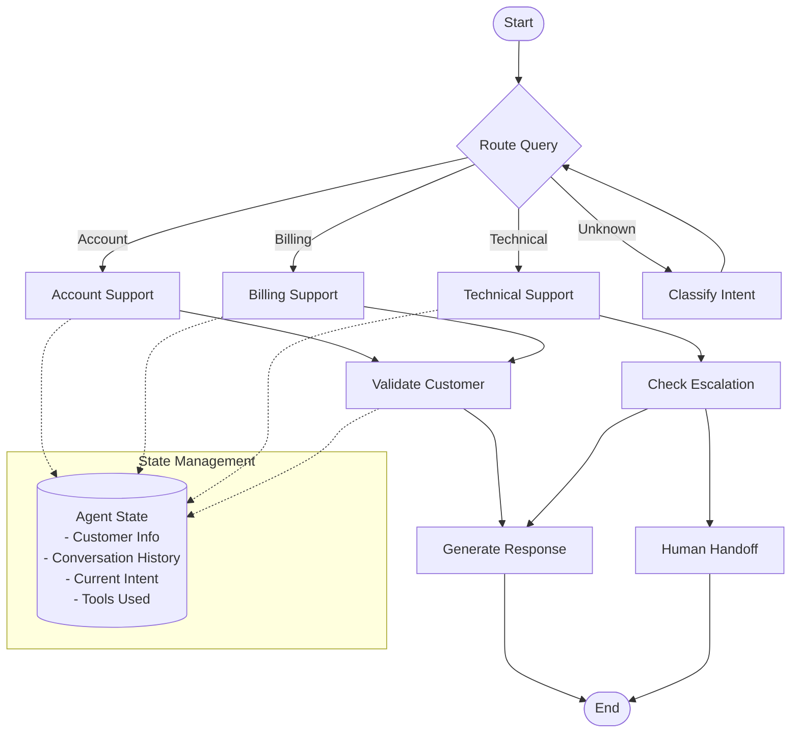

# Part 4: LangGraph Basics for Agent Development

Learn how to use LangGraph to build sophisticated AI agent workflows with state management and tool integration.

## 🎯 What You'll Learn

- Understanding LangGraph architecture and concepts
- Creating state graphs for agent workflows
- Implementing nodes, edges, and conditional routing
- Managing agent state and memory
- Integrating tools and external APIs
- Building reusable workflow components

## 📋 Prerequisites

- Completed [Part 3: Basic Integration](./03-basic-integration.md)
- Basic understanding of state machines and graphs
- Familiarity with LangChain concepts (helpful but not required)

## 🏗️ LangGraph Architecture



### Core LangGraph Concepts

- **Graph**: The overall workflow structure
- **Node**: Individual processing steps (functions)
- **Edge**: Connections between nodes (can be conditional)
- **State**: Shared data that flows through the graph
- **Tools**: External capabilities the agent can use

## 🛠️ Setting Up LangGraph

### Step 1: Install Dependencies

```bash
# Install LangGraph and related packages
poetry add langgraph langchain-core langchain-openai

# Add additional tool dependencies
poetry add httpx requests beautifulsoup4 python-dateutil
```

### Step 2: Create Basic Configuration

Create `src/customer_support_agent/config/langgraph_config.py`:

```python
"""
LangGraph configuration for the customer support agent.
"""

from typing import Dict, Any, Optional
from dataclasses import dataclass, field
from enum import Enum

class IntentType(Enum):
    """Supported customer intent types."""
    ACCOUNT = "account"
    BILLING = "billing"
    TECHNICAL = "technical"
    GENERAL = "general"
    ESCALATION = "escalation"
    UNKNOWN = "unknown"

class Priority(Enum):
    """Support priority levels."""
    LOW = "low"
    MEDIUM = "medium"
    HIGH = "high"
    URGENT = "urgent"

@dataclass
class CustomerInfo:
    """Customer information structure."""
    customer_id: str
    tier: str = "standard"
    name: Optional[str] = None
    email: Optional[str] = None
    phone: Optional[str] = None
    preferences: Dict[str, Any] = field(default_factory=dict)
    support_history: list = field(default_factory=list)

@dataclass
class ConversationTurn:
    """Single conversation turn."""
    timestamp: float
    user_message: str
    agent_response: Optional[str] = None
    intent: Optional[IntentType] = None
    confidence: float = 0.0
    tools_used: list = field(default_factory=list)

@dataclass
class AgentState:
    """Complete agent state that flows through the graph."""
    
    # Current interaction
    user_message: str = ""
    agent_response: str = ""
    
    # Customer information
    customer_info: Optional[CustomerInfo] = None
    
    # Intent and routing
    current_intent: IntentType = IntentType.UNKNOWN
    intent_confidence: float = 0.0
    
    # Conversation management
    conversation_history: list = field(default_factory=list)
    current_turn: Optional[ConversationTurn] = None
    
    # Workflow control
    should_escalate: bool = False
    escalation_reason: str = ""
    priority: Priority = Priority.MEDIUM
    
    # Tools and external data
    tools_used: list = field(default_factory=list)
    external_data: Dict[str, Any] = field(default_factory=dict)
    
    # Metadata
    session_id: str = ""
    metadata: Dict[str, Any] = field(default_factory=dict)
    
    def add_conversation_turn(self, turn: ConversationTurn) -> None:
        """Add a new conversation turn to history."""
        self.conversation_history.append(turn)
        self.current_turn = turn
    
    def update_customer_info(self, **kwargs) -> None:
        """Update customer information."""
        if self.customer_info is None:
            self.customer_info = CustomerInfo(customer_id=kwargs.get("customer_id", ""))
        
        for key, value in kwargs.items():
            if hasattr(self.customer_info, key):
                setattr(self.customer_info, key, value)
    
    def should_route_to_human(self) -> bool:
        """Determine if conversation should be routed to human."""
        return (
            self.should_escalate or
            self.priority == Priority.URGENT or
            self.intent_confidence < 0.3 or
            len(self.conversation_history) > 10
        )

# Configuration settings
LANGGRAPH_CONFIG = {
    "max_conversation_turns": 15,
    "intent_confidence_threshold": 0.7,
    "escalation_keywords": [
        "supervisor", "manager", "human", "person", 
        "frustrated", "angry", "complaint", "legal"
    ],
    "high_priority_tiers": ["premium", "enterprise", "vip"],
    "tool_timeout": 30,  # seconds
    "max_retries": 3
}
```

## 🔄 Building Your First LangGraph Agent

### Step 1: Create the Basic Graph Structure

Create `src/customer_support_agent/agents/customer_support_graph.py`:

```python
"""
Customer support agent built with LangGraph.
"""

import time
import json
from typing import Dict, Any, List, Optional
from langgraph import StateGraph, END
from langchain_core.language_models import BaseLLM
from langchain_openai import ChatOpenAI

import sprintlens
from ..config.langgraph_config import (
    AgentState, IntentType, Priority, ConversationTurn, LANGGRAPH_CONFIG
)
from ..tools.customer_tools import CustomerDatabaseTool
from ..tools.knowledge_base import KnowledgeBaseTool

class CustomerSupportAgent:
    """LangGraph-based customer support agent."""
    
    def __init__(self, llm: Optional[BaseLLM] = None):
        """Initialize the customer support agent."""
        self.llm = llm or ChatOpenAI(
            model="gpt-4o-mini",
            temperature=0.1,
            max_tokens=1000
        )
        
        # Initialize tools
        self.customer_db = CustomerDatabaseTool()
        self.knowledge_base = KnowledgeBaseTool()
        
        # Build the graph
        self.graph = self._build_graph()
    
    def _build_graph(self) -> StateGraph:
        """Build the LangGraph workflow."""
        
        # Create the state graph
        workflow = StateGraph(AgentState)
        
        # Add nodes (processing steps)
        workflow.add_node("parse_input", self._parse_input)
        workflow.add_node("classify_intent", self._classify_intent)
        workflow.add_node("load_customer_data", self._load_customer_data)
        workflow.add_node("route_to_specialist", self._route_to_specialist)
        workflow.add_node("handle_account", self._handle_account_query)
        workflow.add_node("handle_billing", self._handle_billing_query)
        workflow.add_node("handle_technical", self._handle_technical_query)
        workflow.add_node("handle_general", self._handle_general_query)
        workflow.add_node("check_escalation", self._check_escalation)
        workflow.add_node("generate_response", self._generate_response)
        workflow.add_node("human_handoff", self._human_handoff)
        
        # Define the workflow edges
        workflow.set_entry_point("parse_input")
        
        # Sequential flow
        workflow.add_edge("parse_input", "classify_intent")
        workflow.add_edge("classify_intent", "load_customer_data")
        workflow.add_edge("load_customer_data", "route_to_specialist")
        
        # Conditional routing based on intent
        workflow.add_conditional_edges(
            "route_to_specialist",
            self._route_by_intent,
            {
                IntentType.ACCOUNT: "handle_account",
                IntentType.BILLING: "handle_billing", 
                IntentType.TECHNICAL: "handle_technical",
                IntentType.GENERAL: "handle_general",
                IntentType.ESCALATION: "check_escalation"
            }
        )
        
        # All specialist handlers go to escalation check
        workflow.add_edge("handle_account", "check_escalation")
        workflow.add_edge("handle_billing", "check_escalation")
        workflow.add_edge("handle_technical", "check_escalation")
        workflow.add_edge("handle_general", "check_escalation")
        
        # Conditional routing for escalation
        workflow.add_conditional_edges(
            "check_escalation",
            self._should_escalate,
            {
                True: "human_handoff",
                False: "generate_response"
            }
        )
        
        # End states
        workflow.add_edge("generate_response", END)
        workflow.add_edge("human_handoff", END)
        
        return workflow.compile()
    
    @sprintlens.track()
    def _parse_input(self, state: AgentState) -> AgentState:
        """Parse and clean user input."""
        
        # Create conversation turn
        turn = ConversationTurn(
            timestamp=time.time(),
            user_message=state.user_message
        )
        state.add_conversation_turn(turn)
        
        # Basic input cleaning
        cleaned_message = state.user_message.strip()
        state.user_message = cleaned_message
        
        # Add metadata
        state.metadata.update({
            "input_length": len(cleaned_message),
            "word_count": len(cleaned_message.split()),
            "parsed_at": time.time()
        })
        
        return state
    
    @sprintlens.track()
    def _classify_intent(self, state: AgentState) -> AgentState:
        """Classify user intent using LLM."""
        
        # Create classification prompt
        classification_prompt = f"""
        Classify the following customer message into one of these categories:
        - ACCOUNT: Questions about account access, settings, profile
        - BILLING: Questions about payments, invoices, charges
        - TECHNICAL: Technical issues, bugs, performance problems
        - GENERAL: General questions, information requests
        - ESCALATION: Requests for human help, complaints, frustration
        
        Message: "{state.user_message}"
        
        Respond with just the category name and confidence (0-1):
        Format: CATEGORY:confidence
        """
        
        try:
            # Get LLM response
            response = self.llm.invoke(classification_prompt)
            response_text = response.content.strip()
            
            # Parse response
            if ":" in response_text:
                category_str, confidence_str = response_text.split(":", 1)
                category_str = category_str.strip()
                confidence = float(confidence_str.strip())
            else:
                category_str = response_text.strip()
                confidence = 0.5
            
            # Map to intent enum
            intent_mapping = {
                "ACCOUNT": IntentType.ACCOUNT,
                "BILLING": IntentType.BILLING,
                "TECHNICAL": IntentType.TECHNICAL,
                "GENERAL": IntentType.GENERAL,
                "ESCALATION": IntentType.ESCALATION
            }
            
            intent = intent_mapping.get(category_str, IntentType.UNKNOWN)
            
            # Update state
            state.current_intent = intent
            state.intent_confidence = confidence
            
            # Update current turn
            if state.current_turn:
                state.current_turn.intent = intent
                state.current_turn.confidence = confidence
            
        except Exception as e:
            # Fallback classification
            state.current_intent = IntentType.UNKNOWN
            state.intent_confidence = 0.0
            state.metadata["classification_error"] = str(e)
        
        return state
    
    @sprintlens.track()
    def _load_customer_data(self, state: AgentState) -> AgentState:
        """Load customer data from database."""
        
        # Extract customer ID from message or session
        customer_id = state.session_id or "anonymous"
        
        try:
            # Use customer database tool
            customer_data = self.customer_db.get_customer_info(customer_id)
            
            if customer_data:
                state.update_customer_info(**customer_data)
                state.tools_used.append("customer_database")
            
        except Exception as e:
            state.metadata["customer_data_error"] = str(e)
        
        return state
    
    def _route_by_intent(self, state: AgentState) -> IntentType:
        """Route to appropriate handler based on intent."""
        return state.current_intent
    
    @sprintlens.track()
    def _handle_account_query(self, state: AgentState) -> AgentState:
        """Handle account-related queries."""
        
        account_context = "Account support specialist handling your query."
        
        if state.customer_info:
            if state.customer_info.tier in LANGGRAPH_CONFIG["high_priority_tiers"]:
                state.priority = Priority.HIGH
                account_context += f" As a {state.customer_info.tier} customer, you receive priority support."
        
        state.metadata["specialist"] = "account"
        state.metadata["context"] = account_context
        
        return state
    
    @sprintlens.track()
    def _handle_billing_query(self, state: AgentState) -> AgentState:
        """Handle billing-related queries."""
        
        billing_context = "Billing specialist reviewing your account."
        
        # Simulate billing data lookup
        if state.customer_info:
            state.external_data["billing_status"] = "current"
            state.external_data["last_payment"] = "2024-01-15"
            state.tools_used.append("billing_system")
        
        state.metadata["specialist"] = "billing"
        state.metadata["context"] = billing_context
        
        return state
    
    @sprintlens.track()
    def _handle_technical_query(self, state: AgentState) -> AgentState:
        """Handle technical queries."""
        
        technical_context = "Technical support analyzing your issue."
        
        # Technical issues often need escalation
        if any(keyword in state.user_message.lower() 
               for keyword in ["bug", "crash", "error", "broken"]):
            state.priority = Priority.HIGH
            state.should_escalate = True
            state.escalation_reason = "Complex technical issue"
        
        state.metadata["specialist"] = "technical"
        state.metadata["context"] = technical_context
        
        return state
    
    @sprintlens.track()
    def _handle_general_query(self, state: AgentState) -> AgentState:
        """Handle general queries."""
        
        # Use knowledge base for general queries
        try:
            kb_response = self.knowledge_base.search(state.user_message)
            state.external_data["knowledge_base_results"] = kb_response
            state.tools_used.append("knowledge_base")
        except Exception as e:
            state.metadata["kb_error"] = str(e)
        
        state.metadata["specialist"] = "general"
        
        return state
    
    @sprintlens.track()
    def _check_escalation(self, state: AgentState) -> AgentState:
        """Check if escalation to human is needed."""
        
        # Check escalation keywords
        escalation_keywords = LANGGRAPH_CONFIG["escalation_keywords"]
        if any(keyword in state.user_message.lower() for keyword in escalation_keywords):
            state.should_escalate = True
            state.escalation_reason = "Customer requested human assistance"
        
        # Check conversation length
        if len(state.conversation_history) > LANGGRAPH_CONFIG["max_conversation_turns"]:
            state.should_escalate = True
            state.escalation_reason = "Conversation too long"
        
        # Check confidence threshold
        if state.intent_confidence < LANGGRAPH_CONFIG["intent_confidence_threshold"]:
            state.should_escalate = True
            state.escalation_reason = "Low confidence in intent classification"
        
        return state
    
    def _should_escalate(self, state: AgentState) -> bool:
        """Determine if escalation is needed."""
        return state.should_route_to_human()
    
    @sprintlens.track()
    def _generate_response(self, state: AgentState) -> AgentState:
        """Generate final response to customer."""
        
        # Build context for response generation
        context_parts = []
        
        # Add customer context
        if state.customer_info:
            context_parts.append(f"Customer: {state.customer_info.tier} tier")
        
        # Add specialist context
        if "context" in state.metadata:
            context_parts.append(state.metadata["context"])
        
        # Add external data context
        if state.external_data:
            context_parts.append("Additional context: " + 
                               json.dumps(state.external_data, indent=2))
        
        context = "\n".join(context_parts)
        
        # Generate response
        response_prompt = f"""
        You are a helpful customer support agent. Based on the context below, 
        provide a clear, helpful response to the customer's message.
        
        Context:
        {context}
        
        Customer message: "{state.user_message}"
        Intent: {state.current_intent.value}
        
        Provide a helpful, professional response:
        """
        
        try:
            response = self.llm.invoke(response_prompt)
            state.agent_response = response.content.strip()
            
            # Update conversation turn
            if state.current_turn:
                state.current_turn.agent_response = state.agent_response
                state.current_turn.tools_used = state.tools_used.copy()
            
        except Exception as e:
            state.agent_response = "I apologize, but I'm experiencing technical difficulties. Please try again or contact support."
            state.metadata["response_error"] = str(e)
        
        return state
    
    @sprintlens.track()
    def _human_handoff(self, state: AgentState) -> AgentState:
        """Handle escalation to human agent."""
        
        handoff_message = f"""
        I understand you need additional assistance. I'm connecting you with a human agent who can better help you.
        
        Escalation reason: {state.escalation_reason}
        
        A human agent will be with you shortly. Your conversation ID is: {state.session_id}
        """
        
        state.agent_response = handoff_message
        state.metadata["escalated"] = True
        state.metadata["escalation_timestamp"] = time.time()
        
        return state
    
    @sprintlens.track()
    async def process_message(
        self, 
        message: str, 
        session_id: str = "",
        customer_id: str = ""
    ) -> Dict[str, Any]:
        """Process a customer message through the agent graph."""
        
        # Create initial state
        initial_state = AgentState(
            user_message=message,
            session_id=session_id or f"session_{int(time.time())}",
            metadata={"start_time": time.time()}
        )
        
        # Set customer ID if provided
        if customer_id:
            initial_state.update_customer_info(customer_id=customer_id)
        
        try:
            # Process through the graph
            final_state = await self.graph.ainvoke(initial_state)
            
            # Build response
            response = {
                "response": final_state.agent_response,
                "intent": final_state.current_intent.value,
                "confidence": final_state.intent_confidence,
                "escalated": final_state.should_escalate,
                "priority": final_state.priority.value,
                "tools_used": final_state.tools_used,
                "session_id": final_state.session_id,
                "processing_time": time.time() - initial_state.metadata["start_time"]
            }
            
            return response
            
        except Exception as e:
            return {
                "response": "I apologize, but I encountered an error processing your request. Please try again.",
                "error": str(e),
                "intent": "unknown",
                "escalated": True
            }
```

### Step 2: Create Supporting Tools

Create `src/customer_support_agent/tools/customer_tools.py`:

```python
"""
Customer database tools for the support agent.
"""

import time
from typing import Dict, Any, Optional, List
import sprintlens

class CustomerDatabaseTool:
    """Tool for accessing customer information."""
    
    def __init__(self):
        """Initialize the customer database tool."""
        # In a real implementation, this would connect to an actual database
        self._mock_customer_data = {
            "CUST_001": {
                "customer_id": "CUST_001",
                "name": "John Smith",
                "email": "john.smith@example.com",
                "tier": "premium",
                "phone": "+1-555-0123",
                "preferences": {"channel": "chat", "language": "en"},
                "support_history": [
                    {"date": "2024-01-10", "issue": "billing_question", "resolved": True},
                    {"date": "2024-01-05", "issue": "account_access", "resolved": True}
                ]
            },
            "CUST_002": {
                "customer_id": "CUST_002", 
                "name": "Sarah Johnson",
                "email": "sarah.j@example.com",
                "tier": "standard",
                "phone": "+1-555-0456",
                "preferences": {"channel": "email", "language": "en"},
                "support_history": []
            }
        }
    
    @sprintlens.track()
    def get_customer_info(self, customer_id: str) -> Optional[Dict[str, Any]]:
        """Get customer information by ID."""
        
        # Simulate database lookup time
        time.sleep(0.1)
        
        # Return mock data or None
        return self._mock_customer_data.get(customer_id)
    
    @sprintlens.track()
    def update_customer_preferences(
        self, 
        customer_id: str, 
        preferences: Dict[str, Any]
    ) -> bool:
        """Update customer preferences."""
        
        time.sleep(0.05)
        
        if customer_id in self._mock_customer_data:
            self._mock_customer_data[customer_id]["preferences"].update(preferences)
            return True
        
        return False
    
    @sprintlens.track()
    def add_support_interaction(
        self,
        customer_id: str,
        interaction: Dict[str, Any]
    ) -> bool:
        """Add a support interaction to customer history."""
        
        time.sleep(0.05)
        
        if customer_id in self._mock_customer_data:
            self._mock_customer_data[customer_id]["support_history"].append(interaction)
            return True
        
        return False
```

Create `src/customer_support_agent/tools/knowledge_base.py`:

```python
"""
Knowledge base tool for finding relevant information.
"""

import time
from typing import Dict, Any, List, Optional
import sprintlens

class KnowledgeBaseTool:
    """Tool for searching the knowledge base."""
    
    def __init__(self):
        """Initialize the knowledge base tool."""
        # Mock knowledge base with common support topics
        self._knowledge_base = {
            "account_access": {
                "title": "Account Access Issues",
                "content": "If you're having trouble accessing your account, try resetting your password or clearing your browser cache.",
                "tags": ["account", "login", "password", "access"]
            },
            "billing_questions": {
                "title": "Billing and Payment",
                "content": "Billing questions can be resolved by checking your account dashboard or contacting our billing team.",
                "tags": ["billing", "payment", "invoice", "charges"]
            },
            "technical_support": {
                "title": "Technical Support",
                "content": "For technical issues, please provide detailed information about the problem including error messages.",
                "tags": ["technical", "bug", "error", "crash", "performance"]
            },
            "general_info": {
                "title": "General Information",
                "content": "For general questions about our services, please check our FAQ or contact support.",
                "tags": ["general", "information", "faq", "help"]
            }
        }
    
    @sprintlens.track()
    def search(self, query: str, max_results: int = 3) -> List[Dict[str, Any]]:
        """Search the knowledge base for relevant articles."""
        
        # Simulate search time
        time.sleep(0.15)
        
        query_lower = query.lower()
        results = []
        
        for article_id, article in self._knowledge_base.items():
            # Simple keyword matching
            relevance_score = 0
            
            # Check title match
            if any(word in article["title"].lower() for word in query_lower.split()):
                relevance_score += 3
            
            # Check content match
            if any(word in article["content"].lower() for word in query_lower.split()):
                relevance_score += 2
            
            # Check tag match
            for tag in article["tags"]:
                if tag in query_lower:
                    relevance_score += 4
            
            if relevance_score > 0:
                results.append({
                    "id": article_id,
                    "title": article["title"],
                    "content": article["content"],
                    "relevance_score": relevance_score,
                    "tags": article["tags"]
                })
        
        # Sort by relevance and return top results
        results.sort(key=lambda x: x["relevance_score"], reverse=True)
        return results[:max_results]
    
    @sprintlens.track()
    def get_article(self, article_id: str) -> Optional[Dict[str, Any]]:
        """Get a specific article by ID."""
        
        time.sleep(0.05)
        return self._knowledge_base.get(article_id)
```

## 🧪 Testing Your LangGraph Agent

Create `tests/test_langgraph_agent.py`:

```python
"""
Test the LangGraph customer support agent.
"""

import pytest
import asyncio
from customer_support_agent.agents.customer_support_graph import CustomerSupportAgent
from customer_support_agent.config.langgraph_config import IntentType

class TestCustomerSupportAgent:
    """Test the customer support agent."""
    
    def setup_method(self):
        """Setup for each test."""
        self.agent = CustomerSupportAgent()
    
    @pytest.mark.asyncio
    async def test_account_query(self):
        """Test account-related query processing."""
        message = "I can't access my account, please help me reset my password"
        response = await self.agent.process_message(
            message=message,
            session_id="test_session_001",
            customer_id="CUST_001"
        )
        
        assert "response" in response
        assert response["intent"] == IntentType.ACCOUNT.value
        assert not response["escalated"]
        assert "tools_used" in response
    
    @pytest.mark.asyncio
    async def test_billing_query(self):
        """Test billing query processing."""
        message = "I have a question about my invoice and payment"
        response = await self.agent.process_message(
            message=message,
            session_id="test_session_002"
        )
        
        assert "response" in response
        assert response["intent"] == IntentType.BILLING.value
        assert "billing_system" in response.get("tools_used", [])
    
    @pytest.mark.asyncio
    async def test_technical_escalation(self):
        """Test technical query that should escalate."""
        message = "The application keeps crashing and I've lost important data"
        response = await self.agent.process_message(
            message=message,
            session_id="test_session_003"
        )
        
        assert "response" in response
        assert response["intent"] == IntentType.TECHNICAL.value
        assert response["escalated"] == True
        assert response["priority"] == "high"
    
    @pytest.mark.asyncio
    async def test_general_query_with_knowledge_base(self):
        """Test general query using knowledge base."""
        message = "What services do you offer?"
        response = await self.agent.process_message(
            message=message,
            session_id="test_session_004"
        )
        
        assert "response" in response
        assert response["intent"] == IntentType.GENERAL.value
        assert "knowledge_base" in response.get("tools_used", [])
    
    @pytest.mark.asyncio
    async def test_escalation_request(self):
        """Test explicit escalation request."""
        message = "I need to speak with a manager about my complaint"
        response = await self.agent.process_message(
            message=message,
            session_id="test_session_005"
        )
        
        assert "response" in response
        assert response["escalated"] == True
        assert "human agent" in response["response"].lower()
```

### Interactive Testing Script

Create `scripts/test_langgraph_agent.py`:

```python
#!/usr/bin/env python3
"""
Interactive test script for the LangGraph customer support agent.
"""

import asyncio
from customer_support_agent.agents.customer_support_graph import CustomerSupportAgent

async def interactive_test():
    """Run interactive tests with the agent."""
    
    print("🤖 Customer Support Agent - Interactive Test\n")
    
    # Initialize agent
    agent = CustomerSupportAgent()
    
    # Test scenarios
    test_scenarios = [
        {
            "message": "I can't log into my account",
            "customer_id": "CUST_001",
            "description": "Account access issue (premium customer)"
        },
        {
            "message": "Why am I being charged $50 on my invoice?",
            "customer_id": "CUST_002", 
            "description": "Billing question (standard customer)"
        },
        {
            "message": "The app crashes every time I try to upload a file",
            "customer_id": "CUST_001",
            "description": "Technical issue (should escalate)"
        },
        {
            "message": "What are your business hours?",
            "customer_id": "",
            "description": "General information query"
        },
        {
            "message": "I'm very frustrated and want to speak to a manager",
            "customer_id": "CUST_002",
            "description": "Escalation request"
        }
    ]
    
    for i, scenario in enumerate(test_scenarios, 1):
        print(f"--- Test {i}: {scenario['description']} ---")
        print(f"Customer: {scenario['message']}")
        
        # Process message
        response = await agent.process_message(
            message=scenario["message"],
            session_id=f"test_session_{i}",
            customer_id=scenario["customer_id"]
        )
        
        # Display results
        print(f"Agent: {response['response']}")
        print(f"Intent: {response['intent']} (confidence: {response.get('confidence', 0):.2f})")
        print(f"Escalated: {response['escalated']}")
        print(f"Tools used: {response.get('tools_used', [])}")
        print(f"Processing time: {response.get('processing_time', 0):.3f}s")
        print()
    
    print("🎉 Interactive testing completed!")
    print("📊 Check Agent Lens dashboard for detailed traces")

if __name__ == "__main__":
    asyncio.run(interactive_test())
```

Run the tests:

```bash
# Run unit tests
poetry run pytest tests/test_langgraph_agent.py -v

# Run interactive tests
poetry run python scripts/test_langgraph_agent.py
```

## 🎯 Next Steps

You now have a working LangGraph agent with Agent Lens integration! In the next tutorial, we'll:

1. Design a more sophisticated agent architecture
2. Add more advanced tools and integrations
3. Implement memory and context management
4. Add evaluation and monitoring capabilities

Continue to [05-provider-configuration.md](./05-provider-configuration.md) →

## 📚 Key Concepts Learned

### LangGraph Features Used:
- **StateGraph**: Main workflow management
- **Nodes**: Individual processing functions
- **Conditional Edges**: Dynamic routing logic
- **State Management**: Persistent data flow
- **Tool Integration**: External system access

### Agent Lens Integration:
- **Automatic Tracing**: Every node is traced
- **Error Handling**: Traces capture failures
- **Performance Monitoring**: Processing times tracked
- **Tool Usage**: External API calls monitored

---

**Next:** [05-provider-configuration.md](./05-provider-configuration.md) - Configuring LLM providers →