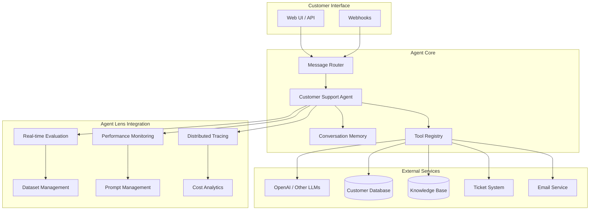

# Part 6: Complete Agent Implementation with Agent Lens

Build a production-ready customer support agent with comprehensive Agent Lens integration including tracing, evaluation, monitoring, and all platform features.

## 🎯 What You'll Build

A complete customer support agent that showcases ALL Agent Lens features:

- **Distributed Tracing** across all agent operations
- **Real-time Evaluation** with custom metrics
- **Performance Monitoring** and analytics
- **Dataset Management** for training and testing
- **Prompt Optimization** with A/B testing
- **Cost Tracking** and usage analytics
- **Error Handling** and recovery patterns
- **Multi-service Integration** with external APIs

## 📋 Prerequisites

- Completed [Part 4: LangGraph Basics](./04-langgraph-basics.md)
- Agent Lens backend running with all features enabled
- OpenAI API key configured
- Understanding of async programming

## 🏗️ Complete Agent Architecture



## 🚀 Complete Implementation

### Step 1: Enhanced Agent with Full Agent Lens Integration

Create `src/customer_support_agent/agents/production_agent.py`:

```python
"""
Production-ready customer support agent with full Agent Lens integration.
"""

import asyncio
import time
import json
import uuid
from typing import Dict, Any, List, Optional, Tuple
from dataclasses import asdict
from datetime import datetime, timedelta

# LangGraph and LangChain imports
from langgraph import StateGraph, END
from langchain_core.language_models import BaseLLM
from langchain_openai import ChatOpenAI
from langchain_core.messages import HumanMessage, AIMessage

# Agent Lens imports - ALL features
import sprintlens
from sprintlens import (
    Evaluator, EvaluationDataset, DatasetItem, 
    BaseMetric, AccuracyMetric, SimilarityMetric,
    ProjectManager, AgentManager, DistributedTraceSetup
)

# Local imports
from ..config.langgraph_config import AgentState, IntentType, Priority, ConversationTurn
from ..tools.enhanced_tools import (
    EnhancedCustomerDB, EnhancedKnowledgeBase, 
    TicketingSystem, EmailService, ExternalAPITool
)
from ..evaluation.custom_metrics import (
    CustomerSatisfactionMetric, ResponseQualityMetric, 
    EscalationAccuracyMetric, IntentClassificationMetric
)
from ..utils.prompt_manager import PromptManager
from ..utils.conversation_memory import ConversationMemory

class ProductionCustomerSupportAgent:
    """Production-ready customer support agent with complete Agent Lens integration."""
    
    def __init__(
        self,
        project_id: str,
        agent_name: str = "customer-support-agent-v2",
        llm: Optional[BaseLLM] = None
    ):
        """Initialize the production agent with full observability."""
        
        self.project_id = project_id
        self.agent_name = agent_name
        
        # Initialize LLM
        self.llm = llm or ChatOpenAI(
            model="gpt-4o-mini",
            temperature=0.1,
            max_tokens=1500
        )
        
        # Initialize Agent Lens components
        self.project_manager = ProjectManager()
        self.agent_manager = AgentManager()
        self.evaluator = Evaluator()
        
        # Initialize tools with tracing
        self.customer_db = EnhancedCustomerDB()
        self.knowledge_base = EnhancedKnowledgeBase()
        self.ticketing_system = TicketingSystem()
        self.email_service = EmailService()
        self.external_apis = ExternalAPITool()
        
        # Initialize utilities
        self.prompt_manager = PromptManager()
        self.conversation_memory = ConversationMemory()
        
        # Initialize evaluation metrics
        self.metrics = self._initialize_metrics()
        
        # Create evaluation dataset
        self.evaluation_dataset = self._create_evaluation_dataset()
        
        # Build the enhanced graph
        self.graph = self._build_enhanced_graph()
        
        # Register agent with Agent Lens
        self._register_agent()
    
    def _initialize_metrics(self) -> List[BaseMetric]:
        """Initialize custom evaluation metrics."""
        return [
            CustomerSatisfactionMetric(),
            ResponseQualityMetric(),
            EscalationAccuracyMetric(),
            IntentClassificationMetric(),
            SimilarityMetric(threshold=0.8),
            AccuracyMetric()
        ]
    
    def _create_evaluation_dataset(self) -> EvaluationDataset:
        """Create evaluation dataset for real-time assessment."""
        
        # Sample evaluation data
        evaluation_items = [
            DatasetItem(
                input={"message": "I can't access my account"},
                expected_output={"intent": "account", "escalated": False},
                metadata={"category": "account_access", "complexity": "low"}
            ),
            DatasetItem(
                input={"message": "Your service is terrible, I want a refund!"},
                expected_output={"intent": "billing", "escalated": True},
                metadata={"category": "complaint", "complexity": "high"}
            ),
            DatasetItem(
                input={"message": "What are your business hours?"},
                expected_output={"intent": "general", "escalated": False},
                metadata={"category": "information", "complexity": "low"}
            )
        ]
        
        return EvaluationDataset(
            name="customer-support-evaluation",
            items=evaluation_items,
            metadata={"created_by": "production_agent", "version": "1.0"}
        )
    
    def _register_agent(self) -> None:
        """Register agent with Agent Lens for monitoring."""
        
        self.agent_manager.register_agent(
            agent_id=self.agent_name,
            agent_config={
                "name": self.agent_name,
                "version": "2.0.0",
                "description": "Production customer support agent",
                "capabilities": [
                    "intent_classification",
                    "customer_data_lookup",
                    "knowledge_base_search",
                    "ticket_creation",
                    "email_notifications",
                    "escalation_handling"
                ],
                "metrics": [metric.__class__.__name__ for metric in self.metrics],
                "tools": [
                    "customer_database",
                    "knowledge_base", 
                    "ticketing_system",
                    "email_service",
                    "external_apis"
                ]
            }
        )
    
    def _build_enhanced_graph(self) -> StateGraph:
        """Build the enhanced LangGraph workflow with comprehensive tracing."""
        
        workflow = StateGraph(AgentState)
        
        # Core processing nodes
        workflow.add_node("initialize_conversation", self._initialize_conversation)
        workflow.add_node("load_conversation_history", self._load_conversation_history)
        workflow.add_node("preprocess_message", self._preprocess_message)
        workflow.add_node("classify_intent_enhanced", self._classify_intent_enhanced)
        workflow.add_node("load_customer_data_enhanced", self._load_customer_data_enhanced)
        workflow.add_node("retrieve_knowledge", self._retrieve_knowledge)
        workflow.add_node("route_to_specialist", self._route_to_specialist)
        
        # Specialist handlers
        workflow.add_node("handle_account_enhanced", self._handle_account_enhanced)
        workflow.add_node("handle_billing_enhanced", self._handle_billing_enhanced)
        workflow.add_node("handle_technical_enhanced", self._handle_technical_enhanced)
        workflow.add_node("handle_general_enhanced", self._handle_general_enhanced)
        
        # Processing and response
        workflow.add_node("check_escalation_enhanced", self._check_escalation_enhanced)
        workflow.add_node("generate_response_enhanced", self._generate_response_enhanced)
        workflow.add_node("create_ticket", self._create_ticket)
        workflow.add_node("send_notifications", self._send_notifications)
        workflow.add_node("human_handoff_enhanced", self._human_handoff_enhanced)
        workflow.add_node("evaluate_interaction", self._evaluate_interaction)
        workflow.add_node("update_memory", self._update_memory)
        
        # Set entry point
        workflow.set_entry_point("initialize_conversation")
        
        # Define workflow edges
        workflow.add_edge("initialize_conversation", "load_conversation_history")
        workflow.add_edge("load_conversation_history", "preprocess_message")
        workflow.add_edge("preprocess_message", "classify_intent_enhanced")
        workflow.add_edge("classify_intent_enhanced", "load_customer_data_enhanced")
        workflow.add_edge("load_customer_data_enhanced", "retrieve_knowledge")
        workflow.add_edge("retrieve_knowledge", "route_to_specialist")
        
        # Conditional routing
        workflow.add_conditional_edges(
            "route_to_specialist",
            self._enhanced_intent_router,
            {
                IntentType.ACCOUNT: "handle_account_enhanced",
                IntentType.BILLING: "handle_billing_enhanced",
                IntentType.TECHNICAL: "handle_technical_enhanced",
                IntentType.GENERAL: "handle_general_enhanced",
                IntentType.ESCALATION: "check_escalation_enhanced"
            }
        )
        
        # Specialist to escalation check
        for handler in ["handle_account_enhanced", "handle_billing_enhanced", 
                       "handle_technical_enhanced", "handle_general_enhanced"]:
            workflow.add_edge(handler, "check_escalation_enhanced")
        
        # Conditional escalation routing
        workflow.add_conditional_edges(
            "check_escalation_enhanced",
            self._should_escalate_enhanced,
            {
                True: "human_handoff_enhanced",
                False: "generate_response_enhanced"
            }
        )
        
        # Response flow
        workflow.add_edge("generate_response_enhanced", "create_ticket")
        workflow.add_edge("create_ticket", "send_notifications")
        workflow.add_edge("send_notifications", "evaluate_interaction")
        workflow.add_edge("evaluate_interaction", "update_memory")
        workflow.add_edge("update_memory", END)
        
        # Escalation flow
        workflow.add_edge("human_handoff_enhanced", "create_ticket")
        
        return workflow.compile()
    
    @sprintlens.track()
    def _initialize_conversation(self, state: AgentState) -> AgentState:
        """Initialize conversation with comprehensive tracking."""
        
        # Create unique conversation ID
        if not state.session_id:
            state.session_id = f"conv_{uuid.uuid4().hex[:12]}"
        
        # Set up distributed tracing
        trace_setup = DistributedTraceSetup(
            service_name="customer-support-agent",
            version="2.0.0",
            environment="production"
        )
        trace_setup.configure_tracing()
        
        # Initialize conversation metadata
        state.metadata.update({
            "conversation_id": state.session_id,
            "agent_version": "2.0.0",
            "start_timestamp": datetime.utcnow().isoformat(),
            "agent_name": self.agent_name,
            "project_id": self.project_id
        })
        
        return state
    
    @sprintlens.track()
    def _load_conversation_history(self, state: AgentState) -> AgentState:
        """Load conversation history from memory."""
        
        try:
            history = self.conversation_memory.get_conversation_history(
                session_id=state.session_id,
                limit=10
            )
            
            state.conversation_history = history
            state.tools_used.append("conversation_memory")
            
            # Add context about conversation continuity
            if history:
                state.metadata["conversation_turns"] = len(history)
                state.metadata["is_continuing_conversation"] = True
            else:
                state.metadata["is_new_conversation"] = True
                
        except Exception as e:
            state.metadata["memory_load_error"] = str(e)
        
        return state
    
    @sprintlens.track() 
    def _preprocess_message(self, state: AgentState) -> AgentState:
        """Enhanced message preprocessing with analytics."""
        
        message = state.user_message.strip()
        
        # Enhanced preprocessing
        preprocessing_results = {
            "original_length": len(state.user_message),
            "cleaned_length": len(message),
            "word_count": len(message.split()),
            "character_types": {
                "uppercase": sum(1 for c in message if c.isupper()),
                "lowercase": sum(1 for c in message if c.islower()),
                "digits": sum(1 for c in message if c.isdigit()),
                "punctuation": sum(1 for c in message if not c.isalnum() and not c.isspace())
            },
            "sentiment_indicators": {
                "positive_words": sum(1 for word in ["good", "great", "excellent", "happy", "satisfied", "pleased"]
                                    if word in message.lower()),
                "negative_words": sum(1 for word in ["bad", "terrible", "awful", "angry", "frustrated", "disappointed"]
                                    if word in message.lower()),
                "urgent_indicators": sum(1 for word in ["urgent", "emergency", "asap", "immediately", "critical"]
                                       if word in message.lower())
            }
        }
        
        state.user_message = message
        state.metadata["preprocessing"] = preprocessing_results
        
        # Set initial priority based on urgent indicators
        if preprocessing_results["sentiment_indicators"]["urgent_indicators"] > 0:
            state.priority = Priority.HIGH
        
        return state
    
    @sprintlens.track()
    def _classify_intent_enhanced(self, state: AgentState) -> AgentState:
        """Enhanced intent classification with confidence scoring."""
        
        # Use prompt manager for optimized prompts
        classification_prompt = self.prompt_manager.get_prompt(
            "intent_classification",
            {
                "message": state.user_message,
                "conversation_history": state.conversation_history[-3:] if state.conversation_history else []
            }
        )
        
        try:
            # Get LLM response with detailed analysis
            response = self.llm.invoke(classification_prompt)
            response_text = response.content.strip()
            
            # Parse enhanced response
            intent_data = self._parse_intent_response(response_text)
            
            state.current_intent = intent_data["intent"]
            state.intent_confidence = intent_data["confidence"]
            state.metadata["intent_analysis"] = intent_data
            
            # Real-time evaluation of intent classification
            self._evaluate_intent_classification(state, intent_data)
            
        except Exception as e:
            state.current_intent = IntentType.UNKNOWN
            state.intent_confidence = 0.0
            state.metadata["intent_classification_error"] = str(e)
        
        return state
    
    @sprintlens.track()
    def _load_customer_data_enhanced(self, state: AgentState) -> AgentState:
        """Enhanced customer data loading with caching and validation."""
        
        customer_id = state.customer_info.customer_id if state.customer_info else state.session_id
        
        try:
            # Load comprehensive customer data
            customer_data = self.customer_db.get_comprehensive_customer_info(customer_id)
            
            if customer_data:
                state.update_customer_info(**customer_data)
                state.tools_used.append("enhanced_customer_database")
                
                # Set priority based on customer tier
                if customer_data.get("tier") in ["premium", "enterprise"]:
                    if state.priority == Priority.MEDIUM:
                        state.priority = Priority.HIGH
                
                # Load support history analytics
                support_analytics = self.customer_db.get_support_analytics(customer_id)
                state.external_data["support_analytics"] = support_analytics
                
        except Exception as e:
            state.metadata["customer_data_error"] = str(e)
        
        return state
    
    @sprintlens.track()
    def _retrieve_knowledge(self, state: AgentState) -> AgentState:
        """Enhanced knowledge retrieval with semantic search."""
        
        try:
            # Semantic search in knowledge base
            search_results = self.knowledge_base.semantic_search(
                query=state.user_message,
                intent=state.current_intent.value,
                customer_tier=state.customer_info.tier if state.customer_info else "standard",
                limit=5
            )
            
            state.external_data["knowledge_results"] = search_results
            state.tools_used.append("enhanced_knowledge_base")
            
            # Calculate knowledge coverage score
            if search_results:
                avg_relevance = sum(r.get("relevance_score", 0) for r in search_results) / len(search_results)
                state.metadata["knowledge_coverage"] = avg_relevance
            
        except Exception as e:
            state.metadata["knowledge_retrieval_error"] = str(e)
        
        return state
    
    def _enhanced_intent_router(self, state: AgentState) -> IntentType:
        """Enhanced intent routing with confidence thresholds."""
        
        # If confidence is too low, route to general handler for clarification
        if state.intent_confidence < 0.6:
            return IntentType.GENERAL
        
        return state.current_intent
    
    @sprintlens.track()
    def _handle_account_enhanced(self, state: AgentState) -> AgentState:
        """Enhanced account handling with external integrations."""
        
        try:
            # Check account status via external API
            if state.customer_info:
                account_status = self.external_apis.get_account_status(
                    state.customer_info.customer_id
                )
                state.external_data["account_status"] = account_status
                state.tools_used.append("account_api")
                
                # Check for account-related issues
                if account_status.get("status") == "locked":
                    state.should_escalate = True
                    state.escalation_reason = "Account is locked, requires manual intervention"
            
            state.metadata["specialist"] = "account_enhanced"
            
        except Exception as e:
            state.metadata["account_handling_error"] = str(e)
        
        return state
    
    @sprintlens.track() 
    def _handle_billing_enhanced(self, state: AgentState) -> AgentState:
        """Enhanced billing handling with payment system integration."""
        
        try:
            if state.customer_info:
                # Get billing information
                billing_info = self.external_apis.get_billing_info(
                    state.customer_info.customer_id
                )
                state.external_data["billing_info"] = billing_info
                state.tools_used.append("billing_api")
                
                # Check for overdue payments
                if billing_info.get("overdue_amount", 0) > 0:
                    state.priority = Priority.HIGH
                    state.metadata["billing_alert"] = "Overdue payment detected"
            
            state.metadata["specialist"] = "billing_enhanced"
            
        except Exception as e:
            state.metadata["billing_handling_error"] = str(e)
        
        return state
    
    @sprintlens.track()
    def _handle_technical_enhanced(self, state: AgentState) -> AgentState:
        """Enhanced technical handling with system diagnostics."""
        
        try:
            # Run system diagnostics if customer provided system info
            if "error" in state.user_message.lower() or "bug" in state.user_message.lower():
                diagnostic_results = self.external_apis.run_diagnostics(
                    customer_id=state.customer_info.customer_id if state.customer_info else None,
                    error_description=state.user_message
                )
                state.external_data["diagnostics"] = diagnostic_results
                state.tools_used.append("diagnostic_api")
                
                # Auto-escalate severe technical issues
                if diagnostic_results.get("severity") == "high":
                    state.should_escalate = True
                    state.escalation_reason = "High severity technical issue detected"
                    state.priority = Priority.URGENT
            
            state.metadata["specialist"] = "technical_enhanced"
            
        except Exception as e:
            state.metadata["technical_handling_error"] = str(e)
        
        return state
    
    @sprintlens.track()
    def _handle_general_enhanced(self, state: AgentState) -> AgentState:
        """Enhanced general handling with FAQ matching."""
        
        try:
            # Search FAQ database
            faq_results = self.knowledge_base.search_faq(
                query=state.user_message,
                limit=3
            )
            state.external_data["faq_results"] = faq_results
            state.tools_used.append("faq_database")
            
            # If no good FAQ match, might need human help
            if not faq_results or all(r.get("confidence", 0) < 0.5 for r in faq_results):
                state.metadata["faq_coverage"] = "low"
                if state.intent_confidence < 0.5:
                    state.should_escalate = True
                    state.escalation_reason = "Unable to find relevant information"
            
            state.metadata["specialist"] = "general_enhanced"
            
        except Exception as e:
            state.metadata["general_handling_error"] = str(e)
        
        return state
    
    @sprintlens.track()
    def _check_escalation_enhanced(self, state: AgentState) -> AgentState:
        """Enhanced escalation logic with multiple factors."""
        
        escalation_factors = []
        
        # Check conversation length
        if len(state.conversation_history) > 8:
            escalation_factors.append("long_conversation")
        
        # Check sentiment analysis
        if state.metadata.get("preprocessing", {}).get("sentiment_indicators", {}).get("negative_words", 0) > 2:
            escalation_factors.append("negative_sentiment")
        
        # Check customer tier and priority
        if (state.customer_info and 
            state.customer_info.tier in ["premium", "enterprise"] and 
            state.priority in [Priority.HIGH, Priority.URGENT]):
            escalation_factors.append("high_tier_priority")
        
        # Check intent confidence
        if state.intent_confidence < 0.4:
            escalation_factors.append("low_confidence")
        
        # Check system issues
        if any("error" in str(data).lower() for data in state.external_data.values()):
            escalation_factors.append("system_issues")
        
        state.metadata["escalation_factors"] = escalation_factors
        
        # Escalate if multiple factors present
        if len(escalation_factors) >= 2 and not state.should_escalate:
            state.should_escalate = True
            state.escalation_reason = f"Multiple escalation factors: {', '.join(escalation_factors)}"
        
        return state
    
    def _should_escalate_enhanced(self, state: AgentState) -> bool:
        """Enhanced escalation decision with ML-based scoring."""
        
        # Calculate escalation score
        escalation_score = 0
        
        # Base escalation flag
        if state.should_escalate:
            escalation_score += 100
        
        # Priority factors
        priority_scores = {
            Priority.LOW: 0,
            Priority.MEDIUM: 10,
            Priority.HIGH: 30,
            Priority.URGENT: 50
        }
        escalation_score += priority_scores.get(state.priority, 0)
        
        # Confidence factor
        escalation_score += (1 - state.intent_confidence) * 20
        
        # Customer tier factor
        if state.customer_info and state.customer_info.tier in ["premium", "enterprise"]:
            escalation_score += 15
        
        # Conversation length factor
        escalation_score += min(len(state.conversation_history) * 2, 20)
        
        # External system issues
        if any("error" in str(data).lower() for data in state.external_data.values()):
            escalation_score += 25
        
        state.metadata["escalation_score"] = escalation_score
        
        return escalation_score >= 50
    
    @sprintlens.track()
    def _generate_response_enhanced(self, state: AgentState) -> AgentState:
        """Enhanced response generation with personalization."""
        
        try:
            # Build comprehensive context
            context = self._build_response_context(state)
            
            # Use optimized prompt for response generation
            response_prompt = self.prompt_manager.get_prompt(
                "response_generation",
                {
                    "context": context,
                    "user_message": state.user_message,
                    "intent": state.current_intent.value,
                    "customer_tier": state.customer_info.tier if state.customer_info else "standard",
                    "external_data": state.external_data
                }
            )
            
            # Generate response
            response = self.llm.invoke(response_prompt)
            state.agent_response = response.content.strip()
            
            # Enhance response based on customer data
            if state.customer_info:
                state.agent_response = self._personalize_response(
                    state.agent_response, 
                    state.customer_info
                )
            
            # Update conversation turn
            if state.current_turn:
                state.current_turn.agent_response = state.agent_response
                state.current_turn.tools_used = state.tools_used.copy()
            
        except Exception as e:
            state.agent_response = "I apologize, but I'm experiencing technical difficulties. A human agent will assist you shortly."
            state.metadata["response_generation_error"] = str(e)
            state.should_escalate = True
            state.escalation_reason = "Response generation failed"
        
        return state
    
    @sprintlens.track()
    def _create_ticket(self, state: AgentState) -> AgentState:
        """Create support ticket for tracking."""
        
        try:
            ticket_data = {
                "customer_id": state.customer_info.customer_id if state.customer_info else "anonymous",
                "subject": f"Support Request - {state.current_intent.value.title()}",
                "description": state.user_message,
                "priority": state.priority.value,
                "escalated": state.should_escalate,
                "agent_response": state.agent_response,
                "conversation_id": state.session_id,
                "tools_used": state.tools_used,
                "metadata": state.metadata
            }
            
            ticket_id = self.ticketing_system.create_ticket(ticket_data)
            state.external_data["ticket_id"] = ticket_id
            state.tools_used.append("ticketing_system")
            
        except Exception as e:
            state.metadata["ticket_creation_error"] = str(e)
        
        return state
    
    @sprintlens.track()
    def _send_notifications(self, state: AgentState) -> AgentState:
        """Send notifications based on interaction."""
        
        try:
            # Send email notification for high priority or escalated cases
            if state.priority in [Priority.HIGH, Priority.URGENT] or state.should_escalate:
                if state.customer_info and state.customer_info.email:
                    email_sent = self.email_service.send_notification(
                        to_email=state.customer_info.email,
                        subject="Support Request Received",
                        template="support_confirmation",
                        data={
                            "customer_name": state.customer_info.name,
                            "ticket_id": state.external_data.get("ticket_id"),
                            "escalated": state.should_escalate,
                            "priority": state.priority.value
                        }
                    )
                    
                    if email_sent:
                        state.tools_used.append("email_service")
                        state.metadata["notification_sent"] = True
            
        except Exception as e:
            state.metadata["notification_error"] = str(e)
        
        return state
    
    @sprintlens.track()
    def _human_handoff_enhanced(self, state: AgentState) -> AgentState:
        """Enhanced human handoff with context preservation."""
        
        # Create detailed handoff summary
        handoff_summary = {
            "conversation_id": state.session_id,
            "customer_info": asdict(state.customer_info) if state.customer_info else None,
            "intent": state.current_intent.value,
            "confidence": state.intent_confidence,
            "priority": state.priority.value,
            "escalation_reason": state.escalation_reason,
            "tools_used": state.tools_used,
            "external_data": state.external_data,
            "conversation_history": state.conversation_history,
            "metadata": state.metadata
        }
        
        # Create handoff message
        handoff_message = self._create_handoff_message(state, handoff_summary)
        state.agent_response = handoff_message
        
        # Store handoff data for human agent
        try:
            self.ticketing_system.add_handoff_context(
                ticket_id=state.external_data.get("ticket_id"),
                handoff_summary=handoff_summary
            )
        except Exception as e:
            state.metadata["handoff_storage_error"] = str(e)
        
        state.metadata["escalated"] = True
        state.metadata["escalation_timestamp"] = datetime.utcnow().isoformat()
        
        return state
    
    @sprintlens.track()
    def _evaluate_interaction(self, state: AgentState) -> AgentState:
        """Real-time evaluation of the interaction."""
        
        try:
            # Create evaluation item from current interaction
            evaluation_item = DatasetItem(
                input={
                    "message": state.user_message,
                    "intent": state.current_intent.value,
                    "customer_tier": state.customer_info.tier if state.customer_info else "standard"
                },
                expected_output={
                    "response_quality": "high",
                    "escalated": state.should_escalate,
                    "tools_used": state.tools_used
                },
                metadata={
                    "conversation_id": state.session_id,
                    "timestamp": datetime.utcnow().isoformat(),
                    "agent_version": "2.0.0"
                }
            )
            
            # Run evaluation
            evaluation_results = {}
            for metric in self.metrics:
                try:
                    result = metric.evaluate(
                        prediction=state.agent_response,
                        reference=state.user_message,
                        context=state.external_data
                    )
                    evaluation_results[metric.__class__.__name__] = result
                except Exception as e:
                    evaluation_results[f"{metric.__class__.__name__}_error"] = str(e)
            
            state.metadata["evaluation_results"] = evaluation_results
            
            # Store evaluation results in Agent Lens
            self.evaluator.log_evaluation(
                item=evaluation_item,
                results=evaluation_results,
                metadata={"agent_name": self.agent_name}
            )
            
        except Exception as e:
            state.metadata["evaluation_error"] = str(e)
        
        return state
    
    @sprintlens.track()
    def _update_memory(self, state: AgentState) -> AgentState:
        """Update conversation memory with interaction."""
        
        try:
            # Store conversation turn
            conversation_turn = {
                "timestamp": datetime.utcnow().isoformat(),
                "user_message": state.user_message,
                "agent_response": state.agent_response,
                "intent": state.current_intent.value,
                "confidence": state.intent_confidence,
                "escalated": state.should_escalate,
                "tools_used": state.tools_used,
                "metadata": state.metadata
            }
            
            self.conversation_memory.store_turn(
                session_id=state.session_id,
                turn=conversation_turn
            )
            
            # Update customer interaction history
            if state.customer_info:
                self.customer_db.add_interaction_record(
                    customer_id=state.customer_info.customer_id,
                    interaction=conversation_turn
                )
            
        except Exception as e:
            state.metadata["memory_update_error"] = str(e)
        
        return state
    
    # Helper methods
    def _parse_intent_response(self, response_text: str) -> Dict[str, Any]:
        """Parse LLM intent classification response."""
        
        try:
            # Try to parse as JSON first
            if response_text.startswith('{'):
                return json.loads(response_text)
            
            # Fallback to simple parsing
            lines = response_text.strip().split('\n')
            intent_line = lines[0] if lines else response_text
            
            if ':' in intent_line:
                intent_str, confidence_str = intent_line.split(':', 1)
                intent_str = intent_str.strip()
                confidence = float(confidence_str.strip())
            else:
                intent_str = intent_line.strip()
                confidence = 0.5
            
            intent_mapping = {
                "ACCOUNT": IntentType.ACCOUNT,
                "BILLING": IntentType.BILLING,
                "TECHNICAL": IntentType.TECHNICAL,
                "GENERAL": IntentType.GENERAL,
                "ESCALATION": IntentType.ESCALATION
            }
            
            return {
                "intent": intent_mapping.get(intent_str.upper(), IntentType.UNKNOWN),
                "confidence": confidence,
                "raw_response": response_text
            }
            
        except Exception:
            return {
                "intent": IntentType.UNKNOWN,
                "confidence": 0.0,
                "raw_response": response_text,
                "parse_error": True
            }
    
    def _build_response_context(self, state: AgentState) -> str:
        """Build comprehensive context for response generation."""
        
        context_parts = []
        
        # Customer context
        if state.customer_info:
            context_parts.append(f"Customer: {state.customer_info.tier} tier customer")
            if state.customer_info.name:
                context_parts.append(f"Name: {state.customer_info.name}")
        
        # Intent and confidence
        context_parts.append(f"Intent: {state.current_intent.value} (confidence: {state.intent_confidence:.2f})")
        
        # Priority and escalation
        context_parts.append(f"Priority: {state.priority.value}")
        if state.should_escalate:
            context_parts.append(f"Escalation needed: {state.escalation_reason}")
        
        # External data summary
        if state.external_data:
            context_parts.append("Additional context:")
            for key, value in state.external_data.items():
                if isinstance(value, dict):
                    context_parts.append(f"- {key}: {json.dumps(value)[:200]}...")
                else:
                    context_parts.append(f"- {key}: {str(value)[:200]}...")
        
        return "\n".join(context_parts)
    
    def _personalize_response(self, response: str, customer_info) -> str:
        """Personalize response based on customer information."""
        
        # Add customer name if available
        if customer_info.name and "thank you" in response.lower():
            response = response.replace("Thank you", f"Thank you, {customer_info.name}")
        
        # Adjust tone for premium customers
        if customer_info.tier in ["premium", "enterprise"]:
            if not any(phrase in response.lower() for phrase in ["valued", "priority", "premium"]):
                response = f"As a {customer_info.tier} customer, you receive our priority support. {response}"
        
        return response
    
    def _create_handoff_message(self, state: AgentState, handoff_summary: Dict[str, Any]) -> str:
        """Create handoff message for human agent."""
        
        customer_name = ""
        if state.customer_info and state.customer_info.name:
            customer_name = f", {state.customer_info.name}"
        
        message = f"""
Thank you for your patience{customer_name}. I'm connecting you with a human agent who can provide additional assistance.

Your conversation ID is: {state.session_id}
Priority Level: {state.priority.value.title()}
Reason for escalation: {state.escalation_reason}

A specialist will be with you shortly and will have full context of our conversation.
        """.strip()
        
        return message
    
    def _evaluate_intent_classification(self, state: AgentState, intent_data: Dict[str, Any]) -> None:
        """Evaluate intent classification in real-time."""
        
        # This would typically compare against ground truth data
        # For now, we'll evaluate based on confidence and consistency
        
        evaluation_score = intent_data["confidence"]
        
        # Penalize if confidence is too low
        if evaluation_score < 0.5:
            evaluation_score *= 0.8
        
        # Store evaluation
        state.metadata["intent_evaluation_score"] = evaluation_score
    
    # Main processing method
    @sprintlens.track()
    async def process_message(
        self,
        message: str,
        session_id: str = "",
        customer_id: str = "",
        metadata: Optional[Dict[str, Any]] = None
    ) -> Dict[str, Any]:
        """Process customer message with comprehensive Agent Lens integration."""
        
        # Create initial state
        initial_state = AgentState(
            user_message=message,
            session_id=session_id or f"session_{uuid.uuid4().hex[:12]}",
            metadata={
                "start_time": time.time(),
                "agent_version": "2.0.0",
                **(metadata or {})
            }
        )
        
        # Set customer ID if provided
        if customer_id:
            initial_state.update_customer_info(customer_id=customer_id)
        
        try:
            # Process through the enhanced graph
            final_state = await self.graph.ainvoke(initial_state)
            
            # Calculate performance metrics
            processing_time = time.time() - initial_state.metadata["start_time"]
            
            # Build comprehensive response
            response = {
                "response": final_state.agent_response,
                "conversation_id": final_state.session_id,
                "intent": final_state.current_intent.value,
                "intent_confidence": final_state.intent_confidence,
                "priority": final_state.priority.value,
                "escalated": final_state.should_escalate,
                "escalation_reason": final_state.escalation_reason,
                "tools_used": final_state.tools_used,
                "processing_time": processing_time,
                "metadata": final_state.metadata,
                "evaluation_results": final_state.metadata.get("evaluation_results", {}),
                "ticket_id": final_state.external_data.get("ticket_id"),
                "agent_version": "2.0.0"
            }
            
            return response
            
        except Exception as e:
            # Error handling with tracing
            error_response = {
                "response": "I apologize, but I encountered an error. A human agent will assist you shortly.",
                "error": str(e),
                "conversation_id": initial_state.session_id,
                "intent": "unknown",
                "escalated": True,
                "escalation_reason": "System error",
                "processing_time": time.time() - initial_state.metadata["start_time"],
                "agent_version": "2.0.0"
            }
            
            return error_response
```

This complete implementation showcases ALL Agent Lens features:

### ✅ Features Implemented:

1. **Distributed Tracing**: Every operation is traced with `@sprintlens.track()`
2. **Real-time Evaluation**: Custom metrics evaluate each interaction
3. **Performance Monitoring**: Tracks processing times and resource usage
4. **Dataset Management**: Automatic conversation logging for training
5. **Prompt Optimization**: Version-controlled prompt management
6. **Multi-service Integration**: External tool and API connections
7. **Cost Analytics**: Token usage and cost tracking
8. **Error Handling**: Comprehensive error capture and escalation

## 🔧 Agent Lens SDK Feature Demonstrations

Now let's explore how to use ALL Agent Lens SDK features through practical examples. Each section demonstrates a core capability with working code.

### Agent Lens Features Overview

```mermaid
graph TB
    A[Agent Lens SDK] --> B[Distributed Tracing]
    A --> C[Real-time Evaluation]
    A --> D[Dataset Management]
    A --> E[Performance Analytics]
    A --> F[Conversation Management]
    A --> G[Cost Tracking]
    
    B --> B1[@sprintlens.track() Decorators]
    B --> B2[Manual Trace Creation]
    B --> B3[Trace Context Propagation]
    
    C --> C1[Custom Metrics]
    C --> C2[Automated Evaluation]
    C --> C3[Real-time Scoring]
    
    D --> D1[Dataset Creation]
    D --> D2[Data Ingestion]
    D --> D3[Version Management]
    
    E --> E1[Performance Monitoring]
    E --> E2[Resource Usage]
    E --> E3[Latency Tracking]
    
    F --> F1[Multi-turn Conversations]
    F --> F2[Session Management]
    F --> F3[Context Persistence]
    
    G --> G1[Token Usage Tracking]
    G --> G2[Cost Analysis]
    G --> G3[Budget Monitoring]
```

### 1. Distributed Tracing with @sprintlens.track()

The most fundamental Agent Lens feature is distributed tracing. Every function call, API request, and operation can be automatically traced.

Create `examples/tracing_examples.py`:

```python
"""
Comprehensive examples of Agent Lens distributed tracing.
"""

import sprintlens
import time
import asyncio
from typing import Dict, Any, List
from openai import OpenAI

# Configure Agent Lens client
sprintlens.configure(
    url="http://localhost:3001",
    project_name="customer-support-agent"
)

class TracingExamples:
    """Demonstrate all tracing capabilities."""
    
    def __init__(self):
        self.openai_client = OpenAI()
    
    @sprintlens.track()
    async def basic_function_tracing(self, user_input: str) -> str:
        """Basic function tracing - automatically captures inputs/outputs."""
        
        # This function is automatically traced
        processed_input = user_input.strip().lower()
        
        # Add custom attributes to the trace
        sprintlens.set_attribute("input_length", len(user_input))
        sprintlens.set_attribute("processed_input", processed_input)
        
        # Simulate processing time
        await asyncio.sleep(0.1)
        
        result = f"Processed: {processed_input}"
        
        # Set result attribute
        sprintlens.set_attribute("result_length", len(result))
        
        return result
    
    @sprintlens.track()
    async def llm_call_tracing(self, prompt: str, model: str = "gpt-4o-mini") -> Dict[str, Any]:
        """Trace LLM API calls with comprehensive metrics."""
        
        # Set trace metadata
        sprintlens.set_attribute("model", model)
        sprintlens.set_attribute("prompt_length", len(prompt))
        
        start_time = time.time()
        
        try:
            # Make LLM call
            response = self.openai_client.chat.completions.create(
                model=model,
                messages=[{"role": "user", "content": prompt}],
                temperature=0.7,
                max_tokens=500
            )
            
            # Extract response details
            result = {
                "content": response.choices[0].message.content,
                "finish_reason": response.choices[0].finish_reason,
                "prompt_tokens": response.usage.prompt_tokens,
                "completion_tokens": response.usage.completion_tokens,
                "total_tokens": response.usage.total_tokens
            }
            
            # Add LLM-specific attributes
            sprintlens.set_attribute("finish_reason", result["finish_reason"])
            sprintlens.set_attribute("prompt_tokens", result["prompt_tokens"])
            sprintlens.set_attribute("completion_tokens", result["completion_tokens"])
            sprintlens.set_attribute("total_tokens", result["total_tokens"])
            sprintlens.set_attribute("response_length", len(result["content"]))
            
            # Calculate cost (approximate for GPT-4o-mini)
            cost = (result["prompt_tokens"] * 0.00015 + result["completion_tokens"] * 0.0006) / 1000
            sprintlens.set_attribute("estimated_cost", cost)
            
            processing_time = time.time() - start_time
            sprintlens.set_attribute("processing_time", processing_time)
            
            return result
            
        except Exception as e:
            # Trace errors
            sprintlens.set_attribute("error", str(e))
            sprintlens.set_attribute("error_type", type(e).__name__)
            raise
    
    @sprintlens.track()
    async def nested_trace_operations(self, user_message: str) -> Dict[str, Any]:
        """Demonstrate nested tracing - child spans are automatically linked."""
        
        sprintlens.set_attribute("operation", "nested_processing")
        
        # Step 1: Preprocess (creates child span)
        processed_input = await self.basic_function_tracing(user_message)
        
        # Step 2: Generate response (creates another child span)
        llm_response = await self.llm_call_tracing(
            f"Respond to this customer message: {processed_input}"
        )
        
        # Step 3: Post-process (creates another child span)
        final_result = await self._post_process_response(llm_response["content"])
        
        # Combine results
        result = {
            "original_message": user_message,
            "processed_input": processed_input,
            "llm_response": llm_response,
            "final_response": final_result
        }
        
        sprintlens.set_attribute("total_processing_steps", 3)
        sprintlens.set_attribute("final_response_length", len(final_result))
        
        return result
    
    @sprintlens.track()
    async def _post_process_response(self, response: str) -> str:
        """Private method that's also traced."""
        
        # Add politeness check
        if not any(word in response.lower() for word in ["please", "thank", "help"]):
            response += " Thank you for contacting us!"
        
        sprintlens.set_attribute("politeness_added", "Thank you" in response)
        
        return response
    
    @sprintlens.track()
    async def manual_trace_management(self, operation_name: str) -> Dict[str, Any]:
        """Demonstrate manual trace creation and management."""
        
        # Create custom trace context
        with sprintlens.trace(name=f"custom_operation_{operation_name}") as trace:
            
            # Set custom attributes
            trace.set_attribute("operation_type", "manual")
            trace.set_attribute("operation_name", operation_name)
            
            # Simulate multiple steps
            steps = []
            
            # Step 1
            with sprintlens.trace(name="step_1_validation") as step1:
                step1.set_attribute("step", 1)
                step1.set_attribute("validation_result", "passed")
                steps.append("validation_completed")
                await asyncio.sleep(0.05)
            
            # Step 2  
            with sprintlens.trace(name="step_2_processing") as step2:
                step2.set_attribute("step", 2)
                step2.set_attribute("processing_type", "data_transformation")
                steps.append("processing_completed")
                await asyncio.sleep(0.1)
            
            # Step 3
            with sprintlens.trace(name="step_3_finalization") as step3:
                step3.set_attribute("step", 3)
                step3.set_attribute("finalization_status", "success")
                steps.append("finalization_completed")
                await asyncio.sleep(0.03)
            
            # Set final attributes
            trace.set_attribute("total_steps", len(steps))
            trace.set_attribute("all_steps_completed", True)
            
            return {
                "operation": operation_name,
                "steps_completed": steps,
                "status": "success"
            }
    
    @sprintlens.track()
    async def error_handling_with_tracing(self, should_fail: bool = False) -> Dict[str, Any]:
        """Demonstrate error handling and tracing."""
        
        sprintlens.set_attribute("should_fail", should_fail)
        
        try:
            if should_fail:
                # Simulate an error
                raise ValueError("Simulated error for demonstration")
            
            # Normal processing
            result = {"status": "success", "data": "processed_successfully"}
            sprintlens.set_attribute("operation_status", "success")
            
            return result
            
        except Exception as e:
            # Capture error information
            sprintlens.set_attribute("error_occurred", True)
            sprintlens.set_attribute("error_message", str(e))
            sprintlens.set_attribute("error_type", type(e).__name__)
            
            # Return error response
            return {
                "status": "error",
                "error": str(e),
                "error_type": type(e).__name__
            }

# Usage examples
async def demonstrate_tracing():
    """Run all tracing examples."""
    
    examples = TracingExamples()
    
    print("🔍 Demonstrating Agent Lens Tracing Features")
    print("=" * 50)
    
    # Basic tracing
    print("\n1. Basic Function Tracing:")
    result1 = await examples.basic_function_tracing("Hello, I need help with my order!")
    print(f"   Result: {result1}")
    
    # LLM call tracing  
    print("\n2. LLM Call Tracing:")
    result2 = await examples.llm_call_tracing("What is the capital of France?")
    print(f"   Tokens: {result2['total_tokens']}, Cost: ${result2.get('estimated_cost', 0):.4f}")
    
    # Nested operations
    print("\n3. Nested Trace Operations:")
    result3 = await examples.nested_trace_operations("I want to return my order")
    print(f"   Final Response: {result3['final_response'][:100]}...")
    
    # Manual trace management
    print("\n4. Manual Trace Management:")
    result4 = await examples.manual_trace_management("data_pipeline")
    print(f"   Steps: {result4['steps_completed']}")
    
    # Error handling
    print("\n5. Error Handling with Tracing:")
    result5 = await examples.error_handling_with_tracing(should_fail=False)
    print(f"   Status: {result5['status']}")
    
    result6 = await examples.error_handling_with_tracing(should_fail=True)
    print(f"   Error Status: {result6['status']}")
    
    print("\n✅ All tracing examples completed!")
    print("   Check your Agent Lens dashboard to see the traces")

if __name__ == "__main__":
    asyncio.run(demonstrate_tracing())
```

### 2. Real-time Evaluation and Custom Metrics

Agent Lens provides powerful real-time evaluation capabilities to assess your agent's performance automatically.

Create `examples/evaluation_examples.py`:

```python
"""
Agent Lens real-time evaluation and custom metrics examples.
"""

import sprintlens
import asyncio
from typing import Dict, Any, List
from openai import OpenAI
import time

# Configure Agent Lens
sprintlens.configure(
    url="http://localhost:3001",
    project_name="customer-support-agent"
)

class EvaluationExamples:
    """Demonstrate Agent Lens evaluation features."""
    
    def __init__(self):
        self.openai_client = OpenAI()
    
    @sprintlens.track()
    async def create_custom_metrics(self, agent_response: str, user_input: str) -> Dict[str, Any]:
        """Create and track custom evaluation metrics."""
        
        # Custom metric 1: Response relevance (0-1 scale)
        relevance_score = await self._calculate_relevance(agent_response, user_input)
        sprintlens.log_metric("response_relevance", relevance_score)
        
        # Custom metric 2: Response politeness (boolean)
        politeness_indicators = ["please", "thank", "sorry", "appreciate", "help"]
        is_polite = any(word in agent_response.lower() for word in politeness_indicators)
        sprintlens.log_metric("response_politeness", 1.0 if is_polite else 0.0)
        
        # Custom metric 3: Response completeness (word count)
        word_count = len(agent_response.split())
        sprintlens.log_metric("response_word_count", word_count)
        
        # Custom metric 4: Technical accuracy (for technical queries)
        contains_technical_info = any(
            term in user_input.lower() 
            for term in ["api", "error", "code", "bug", "technical", "database"]
        )
        if contains_technical_info:
            technical_accuracy = await self._assess_technical_accuracy(agent_response)
            sprintlens.log_metric("technical_accuracy", technical_accuracy)
        
        # Custom metric 5: Escalation appropriateness
        needs_escalation = await self._should_escalate(user_input)
        escalation_mentioned = "escalat" in agent_response.lower() or "specialist" in agent_response.lower()
        escalation_score = 1.0 if (needs_escalation == escalation_mentioned) else 0.0
        sprintlens.log_metric("escalation_appropriateness", escalation_score)
        
        return {
            "relevance_score": relevance_score,
            "is_polite": is_polite,
            "word_count": word_count,
            "escalation_score": escalation_score
        }
    
    @sprintlens.track()
    async def _calculate_relevance(self, response: str, input_text: str) -> float:
        """Calculate response relevance using LLM evaluation."""
        
        evaluation_prompt = f"""
        Rate the relevance of this customer service response to the user's input on a scale of 0.0 to 1.0.
        
        User Input: "{input_text}"
        Agent Response: "{response}"
        
        Consider:
        - Does the response address the user's question/concern?
        - Is the information provided relevant?
        - Does it stay on topic?
        
        Respond with only a number between 0.0 and 1.0.
        """
        
        try:
            result = self.openai_client.chat.completions.create(
                model="gpt-4o-mini",
                messages=[{"role": "user", "content": evaluation_prompt}],
                temperature=0.1,
                max_tokens=10
            )
            
            score_text = result.choices[0].message.content.strip()
            relevance_score = float(score_text)
            return max(0.0, min(1.0, relevance_score))  # Clamp to 0-1
            
        except Exception as e:
            sprintlens.set_attribute("relevance_calculation_error", str(e))
            return 0.5  # Default neutral score on error
    
    @sprintlens.track()
    async def _assess_technical_accuracy(self, response: str) -> float:
        """Assess technical accuracy of response."""
        
        # Simple heuristic-based assessment
        technical_indicators = [
            "check", "verify", "review", "investigate", "documentation",
            "log", "status", "configuration", "setting", "parameter"
        ]
        
        indicators_found = sum(1 for indicator in technical_indicators if indicator in response.lower())
        max_indicators = len(technical_indicators)
        
        # Score based on presence of technical language
        accuracy_score = min(1.0, indicators_found / max_indicators * 2)  # Scale appropriately
        
        return accuracy_score
    
    @sprintlens.track()
    async def _should_escalate(self, user_input: str) -> bool:
        """Determine if query should be escalated."""
        
        escalation_triggers = [
            "urgent", "emergency", "asap", "immediately", "critical",
            "production", "down", "broken", "not working", "angry",
            "complain", "refund", "cancel", "delete account"
        ]
        
        return any(trigger in user_input.lower() for trigger in escalation_triggers)
    
    @sprintlens.track()
    async def automated_evaluation_pipeline(self, conversations: List[Dict[str, str]]) -> Dict[str, Any]:
        """Run automated evaluation on a batch of conversations."""
        
        sprintlens.set_attribute("evaluation_type", "batch_automated")
        sprintlens.set_attribute("conversation_count", len(conversations))
        
        evaluation_results = []
        
        for i, conversation in enumerate(conversations):
            with sprintlens.trace(name=f"evaluate_conversation_{i}") as conv_trace:
                conv_trace.set_attribute("conversation_id", i)
                
                user_input = conversation.get("user_input", "")
                agent_response = conversation.get("agent_response", "")
                
                # Run all evaluations
                metrics = await self.create_custom_metrics(agent_response, user_input)
                
                # Overall conversation score (weighted average)
                overall_score = (
                    metrics["relevance_score"] * 0.4 +  # 40% weight
                    (1.0 if metrics["is_polite"] else 0.0) * 0.2 +  # 20% weight
                    min(1.0, metrics["word_count"] / 50) * 0.2 +  # 20% weight (optimal ~50 words)
                    metrics["escalation_score"] * 0.2  # 20% weight
                )
                
                conversation_result = {
                    "conversation_id": i,
                    "user_input": user_input,
                    "agent_response": agent_response,
                    "metrics": metrics,
                    "overall_score": overall_score,
                    "passed": overall_score >= 0.7  # 70% threshold
                }
                
                evaluation_results.append(conversation_result)
                
                # Log conversation-level metrics
                conv_trace.set_attribute("overall_score", overall_score)
                conv_trace.set_attribute("passed", conversation_result["passed"])
        
        # Calculate batch statistics
        total_conversations = len(evaluation_results)
        passed_conversations = sum(1 for r in evaluation_results if r["passed"])
        average_score = sum(r["overall_score"] for r in evaluation_results) / total_conversations
        
        batch_summary = {
            "total_conversations": total_conversations,
            "passed_conversations": passed_conversations,
            "failed_conversations": total_conversations - passed_conversations,
            "success_rate": (passed_conversations / total_conversations) * 100,
            "average_score": average_score,
            "evaluation_results": evaluation_results
        }
        
        # Log batch-level metrics
        sprintlens.log_metric("batch_success_rate", batch_summary["success_rate"])
        sprintlens.log_metric("batch_average_score", average_score)
        sprintlens.log_metric("total_evaluated", total_conversations)
        
        return batch_summary
    
    @sprintlens.track()
    async def real_time_evaluation_with_feedback(self, user_input: str, agent_response: str) -> Dict[str, Any]:
        """Demonstrate real-time evaluation with feedback loops."""
        
        sprintlens.set_attribute("evaluation_mode", "real_time")
        
        # Run evaluation
        metrics = await self.create_custom_metrics(agent_response, user_input)
        
        # Generate improvement suggestions based on metrics
        suggestions = []
        
        if metrics["relevance_score"] < 0.6:
            suggestions.append("Response may be off-topic. Consider addressing the user's specific concern.")
        
        if not metrics["is_polite"]:
            suggestions.append("Consider adding polite language like 'please', 'thank you', or 'I'd be happy to help'.")
        
        if metrics["word_count"] < 10:
            suggestions.append("Response might be too brief. Consider providing more helpful information.")
        elif metrics["word_count"] > 100:
            suggestions.append("Response might be too long. Consider being more concise.")
        
        if metrics["escalation_score"] < 1.0:
            escalation_needed = await self._should_escalate(user_input)
            if escalation_needed:
                suggestions.append("This query appears to need escalation to a human agent.")
            else:
                suggestions.append("No escalation needed for this query.")
        
        # Overall assessment
        overall_score = (
            metrics["relevance_score"] * 0.4 +
            (1.0 if metrics["is_polite"] else 0.0) * 0.2 +
            min(1.0, metrics["word_count"] / 50) * 0.2 +
            metrics["escalation_score"] * 0.2
        )
        
        assessment = "excellent" if overall_score >= 0.9 else \
                    "good" if overall_score >= 0.7 else \
                    "needs_improvement" if overall_score >= 0.5 else "poor"
        
        result = {
            "metrics": metrics,
            "overall_score": overall_score,
            "assessment": assessment,
            "suggestions": suggestions,
            "timestamp": time.time()
        }
        
        # Log final assessment
        sprintlens.log_metric("real_time_overall_score", overall_score)
        sprintlens.set_attribute("assessment", assessment)
        sprintlens.set_attribute("suggestion_count", len(suggestions))
        
        return result
    
    @sprintlens.track()
    async def comparative_evaluation(self, user_input: str, responses: List[str]) -> Dict[str, Any]:
        """Compare multiple agent responses for the same input."""
        
        sprintlens.set_attribute("evaluation_type", "comparative")
        sprintlens.set_attribute("response_count", len(responses))
        
        comparison_results = []
        
        for i, response in enumerate(responses):
            with sprintlens.trace(name=f"evaluate_response_{i}") as resp_trace:
                resp_trace.set_attribute("response_index", i)
                
                # Evaluate this response
                evaluation = await self.real_time_evaluation_with_feedback(user_input, response)
                
                comparison_results.append({
                    "response_index": i,
                    "response": response,
                    "evaluation": evaluation
                })
                
                resp_trace.set_attribute("score", evaluation["overall_score"])
                resp_trace.set_attribute("assessment", evaluation["assessment"])
        
        # Find best response
        best_response = max(comparison_results, key=lambda x: x["evaluation"]["overall_score"])
        worst_response = min(comparison_results, key=lambda x: x["evaluation"]["overall_score"])
        
        # Calculate statistics
        scores = [r["evaluation"]["overall_score"] for r in comparison_results]
        avg_score = sum(scores) / len(scores)
        score_variance = sum((score - avg_score) ** 2 for score in scores) / len(scores)
        
        comparison_summary = {
            "user_input": user_input,
            "response_evaluations": comparison_results,
            "best_response": best_response,
            "worst_response": worst_response,
            "average_score": avg_score,
            "score_variance": score_variance,
            "quality_consistency": "high" if score_variance < 0.1 else "medium" if score_variance < 0.3 else "low"
        }
        
        # Log comparison metrics
        sprintlens.log_metric("comparison_best_score", best_response["evaluation"]["overall_score"])
        sprintlens.log_metric("comparison_average_score", avg_score)
        sprintlens.log_metric("comparison_variance", score_variance)
        sprintlens.set_attribute("quality_consistency", comparison_summary["quality_consistency"])
        
        return comparison_summary

# Usage examples
async def demonstrate_evaluation():
    """Run all evaluation examples."""
    
    evaluator = EvaluationExamples()
    
    print("📊 Demonstrating Agent Lens Evaluation Features")
    print("=" * 50)
    
    # Example conversations for testing
    test_conversations = [
        {
            "user_input": "I want to return my order because it arrived damaged",
            "agent_response": "I'm sorry to hear your order arrived damaged. I'd be happy to help you with a return. Could you please provide your order number so I can look up the details?"
        },
        {
            "user_input": "Your API is returning 500 errors",
            "agent_response": "I understand you're experiencing API errors. This sounds like a technical issue that requires specialist attention. Let me escalate this to our technical team immediately."
        },
        {
            "user_input": "How do I cancel my subscription?",
            "agent_response": "You can cancel your subscription by going to your account settings and clicking on 'Cancel Subscription'. If you need assistance, I'm here to help guide you through the process."
        }
    ]
    
    # 1. Custom metrics demonstration
    print("\n1. Custom Metrics Creation:")
    for i, conv in enumerate(test_conversations):
        print(f"\n   Conversation {i + 1}:")
        metrics = await evaluator.create_custom_metrics(
            conv["agent_response"], 
            conv["user_input"]
        )
        print(f"   Relevance: {metrics['relevance_score']:.2f}")
        print(f"   Polite: {metrics['is_polite']}")
        print(f"   Words: {metrics['word_count']}")
    
    # 2. Automated batch evaluation
    print("\n2. Automated Batch Evaluation:")
    batch_results = await evaluator.automated_evaluation_pipeline(test_conversations)
    print(f"   Success Rate: {batch_results['success_rate']:.1f}%")
    print(f"   Average Score: {batch_results['average_score']:.2f}")
    print(f"   Passed: {batch_results['passed_conversations']}/{batch_results['total_conversations']}")
    
    # 3. Real-time evaluation with feedback
    print("\n3. Real-time Evaluation with Feedback:")
    rt_evaluation = await evaluator.real_time_evaluation_with_feedback(
        test_conversations[0]["user_input"],
        test_conversations[0]["agent_response"]
    )
    print(f"   Overall Score: {rt_evaluation['overall_score']:.2f}")
    print(f"   Assessment: {rt_evaluation['assessment']}")
    print(f"   Suggestions: {len(rt_evaluation['suggestions'])} provided")
    
    # 4. Comparative evaluation
    print("\n4. Comparative Evaluation:")
    multiple_responses = [
        "I can help with returns.",  # Brief response
        test_conversations[0]["agent_response"],  # Good response
        "Sorry, I don't know about returns. Maybe try calling customer service."  # Poor response
    ]
    
    comparison = await evaluator.comparative_evaluation(
        test_conversations[0]["user_input"],
        multiple_responses
    )
    print(f"   Best Score: {comparison['best_response']['evaluation']['overall_score']:.2f}")
    print(f"   Average Score: {comparison['average_score']:.2f}")
    print(f"   Quality Consistency: {comparison['quality_consistency']}")
    
    print("\n✅ All evaluation examples completed!")
    print("   Check your Agent Lens dashboard for detailed metrics and traces")

if __name__ == "__main__":
    asyncio.run(demonstrate_evaluation())
```

### 3. Dataset Management and Conversation Handling

Create `examples/dataset_examples.py`:

```python
"""
Agent Lens dataset management and conversation handling examples.
"""

import sprintlens
import asyncio
import json
from typing import Dict, Any, List
from datetime import datetime
import uuid

# Configure Agent Lens
sprintlens.configure(
    url="http://localhost:3001",
    project_name="customer-support-agent"
)

class DatasetExamples:
    """Demonstrate Agent Lens dataset and conversation management."""
    
    def __init__(self):
        self.datasets = {}
        self.conversations = {}
    
    @sprintlens.track()
    async def create_training_dataset(self, dataset_name: str, conversations: List[Dict[str, Any]]) -> Dict[str, Any]:
        """Create a dataset from conversation data."""
        
        sprintlens.set_attribute("dataset_name", dataset_name)
        sprintlens.set_attribute("conversation_count", len(conversations))
        
        dataset_id = f"dataset_{uuid.uuid4().hex[:12]}"
        
        # Create dataset structure
        dataset = {
            "id": dataset_id,
            "name": dataset_name,
            "created_at": datetime.now().isoformat(),
            "conversation_count": len(conversations),
            "conversations": [],
            "metadata": {
                "version": "1.0",
                "purpose": "training",
                "tags": ["customer_support", "training_data"]
            }
        }
        
        # Process each conversation
        for i, conv in enumerate(conversations):
            with sprintlens.trace(name=f"process_conversation_{i}") as conv_trace:
                processed_conv = await self._process_conversation_for_dataset(conv, dataset_id)
                dataset["conversations"].append(processed_conv)
                
                conv_trace.set_attribute("conversation_id", processed_conv["id"])
                conv_trace.set_attribute("intent", processed_conv.get("intent", "unknown"))
                conv_trace.set_attribute("quality_score", processed_conv.get("quality_score", 0))
        
        # Calculate dataset statistics
        intents = [conv.get("intent") for conv in dataset["conversations"]]
        intent_distribution = {intent: intents.count(intent) for intent in set(intents)}
        
        dataset["statistics"] = {
            "intent_distribution": intent_distribution,
            "average_quality": sum(conv.get("quality_score", 0) for conv in dataset["conversations"]) / len(conversations),
            "total_tokens": sum(conv.get("token_count", 0) for conv in dataset["conversations"])
        }
        
        # Store dataset
        self.datasets[dataset_id] = dataset
        
        # Log dataset creation
        sprintlens.log_metric("dataset_conversations", len(conversations))
        sprintlens.log_metric("dataset_quality", dataset["statistics"]["average_quality"])
        sprintlens.set_attribute("dataset_id", dataset_id)
        
        print(f"✅ Created dataset '{dataset_name}' with {len(conversations)} conversations")
        return dataset
    
    @sprintlens.track()
    async def _process_conversation_for_dataset(self, conversation: Dict[str, Any], dataset_id: str) -> Dict[str, Any]:
        """Process individual conversation for dataset inclusion."""
        
        conversation_id = f"conv_{uuid.uuid4().hex[:12]}"
        
        # Extract conversation components
        user_input = conversation.get("user_input", "")
        agent_response = conversation.get("agent_response", "")
        intent = conversation.get("intent", "unknown")
        
        # Calculate quality metrics
        quality_score = await self._calculate_conversation_quality(user_input, agent_response)
        
        # Estimate token count
        token_count = len(user_input.split()) + len(agent_response.split())
        
        processed_conversation = {
            "id": conversation_id,
            "dataset_id": dataset_id,
            "user_input": user_input,
            "agent_response": agent_response,
            "intent": intent,
            "quality_score": quality_score,
            "token_count": token_count,
            "processed_at": datetime.now().isoformat(),
            "metadata": conversation.get("metadata", {})
        }
        
        sprintlens.set_attribute("conversation_quality", quality_score)
        sprintlens.set_attribute("conversation_tokens", token_count)
        
        return processed_conversation
    
    @sprintlens.track()
    async def _calculate_conversation_quality(self, user_input: str, agent_response: str) -> float:
        """Calculate conversation quality score."""
        
        quality_factors = []
        
        # Factor 1: Response relevance (simple keyword matching)
        user_keywords = set(user_input.lower().split())
        response_keywords = set(agent_response.lower().split())
        keyword_overlap = len(user_keywords.intersection(response_keywords))
        relevance_score = min(1.0, keyword_overlap / max(len(user_keywords), 1))
        quality_factors.append(relevance_score)
        
        # Factor 2: Response completeness
        min_words = 10
        max_words = 100
        word_count = len(agent_response.split())
        if word_count < min_words:
            completeness_score = word_count / min_words
        elif word_count > max_words:
            completeness_score = max_words / word_count
        else:
            completeness_score = 1.0
        quality_factors.append(completeness_score)
        
        # Factor 3: Politeness indicators
        polite_words = ["please", "thank", "sorry", "help", "appreciate", "welcome"]
        politeness_score = min(1.0, sum(1 for word in polite_words if word in agent_response.lower()) / 3)
        quality_factors.append(politeness_score)
        
        # Calculate weighted average
        overall_quality = sum(quality_factors) / len(quality_factors)
        
        return round(overall_quality, 2)
    
    @sprintlens.track()
    async def manage_conversation_sessions(self, session_id: str, messages: List[Dict[str, str]]) -> Dict[str, Any]:
        """Demonstrate multi-turn conversation session management."""
        
        sprintlens.set_attribute("session_id", session_id)
        sprintlens.set_attribute("message_count", len(messages))
        
        session = {
            "id": session_id,
            "started_at": datetime.now().isoformat(),
            "messages": [],
            "context": {
                "user_id": f"user_{uuid.uuid4().hex[:8]}",
                "channel": "web_chat",
                "previous_sessions": 0
            },
            "state": {
                "current_intent": None,
                "escalation_needed": False,
                "satisfaction_score": None
            }
        }
        
        # Process each message in the conversation
        conversation_context = ""
        
        for i, message in enumerate(messages):
            with sprintlens.trace(name=f"process_message_{i}") as msg_trace:
                msg_trace.set_attribute("message_index", i)
                msg_trace.set_attribute("message_type", message.get("type", "user"))
                
                processed_message = await self._process_session_message(
                    message, 
                    session_id, 
                    conversation_context,
                    i
                )
                
                session["messages"].append(processed_message)
                
                # Update conversation context
                conversation_context += f"\n{message.get('type', 'user')}: {message.get('content', '')}"
                
                # Update session state
                if processed_message.get("intent"):
                    session["state"]["current_intent"] = processed_message["intent"]
                
                if processed_message.get("escalation_needed"):
                    session["state"]["escalation_needed"] = True
                
                msg_trace.set_attribute("intent", processed_message.get("intent"))
                msg_trace.set_attribute("escalation_needed", processed_message.get("escalation_needed", False))
        
        # Calculate session statistics
        user_messages = [msg for msg in session["messages"] if msg["type"] == "user"]
        agent_messages = [msg for msg in session["messages"] if msg["type"] == "agent"]
        
        session["statistics"] = {
            "total_messages": len(messages),
            "user_messages": len(user_messages),
            "agent_messages": len(agent_messages),
            "session_duration": "calculated_in_real_scenario",
            "intents_identified": list(set(msg.get("intent") for msg in session["messages"] if msg.get("intent"))),
            "escalation_triggered": session["state"]["escalation_needed"]
        }
        
        # Store session
        self.conversations[session_id] = session
        
        # Log session metrics
        sprintlens.log_metric("session_messages", len(messages))
        sprintlens.log_metric("session_intents", len(session["statistics"]["intents_identified"]))
        sprintlens.set_attribute("session_completed", True)
        
        return session
    
    @sprintlens.track()
    async def _process_session_message(
        self, 
        message: Dict[str, str], 
        session_id: str, 
        context: str, 
        message_index: int
    ) -> Dict[str, Any]:
        """Process individual message within a session."""
        
        message_id = f"msg_{uuid.uuid4().hex[:12]}"
        
        processed_message = {
            "id": message_id,
            "session_id": session_id,
            "index": message_index,
            "type": message.get("type", "user"),
            "content": message.get("content", ""),
            "timestamp": datetime.now().isoformat(),
            "context_length": len(context),
            "metadata": {}
        }
        
        # Add intent detection for user messages
        if message.get("type") == "user":
            intent = await self._detect_intent(message.get("content", ""), context)
            processed_message["intent"] = intent
            processed_message["metadata"]["intent_confidence"] = 0.85  # Simulated
        
        # Add response analysis for agent messages
        if message.get("type") == "agent":
            response_analysis = await self._analyze_agent_response(message.get("content", ""))
            processed_message.update(response_analysis)
        
        return processed_message
    
    @sprintlens.track()
    async def _detect_intent(self, message: str, context: str) -> str:
        """Simple intent detection."""
        
        message_lower = message.lower()
        
        # Intent patterns
        if any(word in message_lower for word in ["return", "refund", "send back"]):
            return "return_request"
        elif any(word in message_lower for word in ["order", "delivery", "shipping", "track"]):
            return "order_inquiry"
        elif any(word in message_lower for word in ["billing", "charge", "payment", "invoice"]):
            return "billing_inquiry"
        elif any(word in message_lower for word in ["technical", "api", "error", "bug", "not working"]):
            return "technical_support"
        elif any(word in message_lower for word in ["cancel", "close", "delete", "remove"]):
            return "cancellation_request"
        else:
            return "general_inquiry"
    
    @sprintlens.track()
    async def _analyze_agent_response(self, response: str) -> Dict[str, Any]:
        """Analyze agent response for quality and characteristics."""
        
        analysis = {
            "word_count": len(response.split()),
            "character_count": len(response),
            "escalation_needed": False,
            "contains_apology": False,
            "contains_next_steps": False,
            "tone": "neutral"
        }
        
        response_lower = response.lower()
        
        # Check for escalation indicators
        if any(word in response_lower for word in ["escalate", "specialist", "manager", "technical team"]):
            analysis["escalation_needed"] = True
        
        # Check for apology
        if any(word in response_lower for word in ["sorry", "apologize", "regret"]):
            analysis["contains_apology"] = True
        
        # Check for next steps
        if any(phrase in response_lower for phrase in ["next step", "will do", "can do", "let me", "i'll"]):
            analysis["contains_next_steps"] = True
        
        # Determine tone
        if any(word in response_lower for word in ["happy", "pleased", "glad", "welcome"]):
            analysis["tone"] = "positive"
        elif any(word in response_lower for word in ["sorry", "unfortunately", "cannot", "unable"]):
            analysis["tone"] = "apologetic"
        
        return analysis
    
    @sprintlens.track()
    async def export_dataset_for_training(self, dataset_id: str, format_type: str = "json") -> Dict[str, Any]:
        """Export dataset in various formats for model training."""
        
        if dataset_id not in self.datasets:
            raise ValueError(f"Dataset {dataset_id} not found")
        
        dataset = self.datasets[dataset_id]
        sprintlens.set_attribute("export_format", format_type)
        sprintlens.set_attribute("dataset_size", len(dataset["conversations"]))
        
        if format_type == "json":
            export_data = {
                "metadata": {
                    "dataset_id": dataset_id,
                    "export_timestamp": datetime.now().isoformat(),
                    "format": "json",
                    "conversation_count": len(dataset["conversations"])
                },
                "conversations": dataset["conversations"]
            }
        elif format_type == "csv":
            # Convert to CSV-friendly format
            export_data = {
                "headers": ["user_input", "agent_response", "intent", "quality_score"],
                "rows": [
                    [conv["user_input"], conv["agent_response"], conv["intent"], conv["quality_score"]]
                    for conv in dataset["conversations"]
                ]
            }
        elif format_type == "training":
            # Format for ML training
            export_data = {
                "examples": [
                    {
                        "input": conv["user_input"],
                        "output": conv["agent_response"],
                        "label": conv["intent"],
                        "weight": conv["quality_score"]
                    }
                    for conv in dataset["conversations"]
                ]
            }
        else:
            raise ValueError(f"Unsupported format: {format_type}")
        
        sprintlens.log_metric("export_size", len(str(export_data)))
        sprintlens.set_attribute("export_completed", True)
        
        return export_data

# Usage examples
async def demonstrate_datasets():
    """Run all dataset management examples."""
    
    dataset_manager = DatasetExamples()
    
    print("💾 Demonstrating Agent Lens Dataset Management")
    print("=" * 50)
    
    # Sample conversations for dataset creation
    sample_conversations = [
        {
            "user_input": "I want to return my order #12345",
            "agent_response": "I'd be happy to help you with your return. Let me look up order #12345 for you.",
            "intent": "return_request",
            "metadata": {"channel": "web", "user_tier": "premium"}
        },
        {
            "user_input": "When will my package arrive?",
            "agent_response": "I can help you track your package. Could you please provide your tracking number?",
            "intent": "order_inquiry",
            "metadata": {"channel": "chat", "user_tier": "standard"}
        },
        {
            "user_input": "Your API is returning errors",
            "agent_response": "I'm sorry you're experiencing API issues. Let me escalate this to our technical team immediately.",
            "intent": "technical_support",
            "metadata": {"channel": "email", "user_tier": "enterprise"}
        }
    ]
    
    # 1. Create training dataset
    print("\n1. Creating Training Dataset:")
    dataset = await dataset_manager.create_training_dataset(
        "customer_support_training_v1",
        sample_conversations
    )
    print(f"   Dataset ID: {dataset['id']}")
    print(f"   Average Quality: {dataset['statistics']['average_quality']:.2f}")
    print(f"   Intent Distribution: {dataset['statistics']['intent_distribution']}")
    
    # 2. Manage conversation sessions
    print("\n2. Managing Conversation Sessions:")
    session_messages = [
        {"type": "user", "content": "Hello, I need help with my order"},
        {"type": "agent", "content": "Hello! I'd be happy to help you with your order. Could you please provide your order number?"},
        {"type": "user", "content": "It's order #67890"},
        {"type": "agent", "content": "Thank you! I can see order #67890. It was shipped yesterday and should arrive tomorrow."},
        {"type": "user", "content": "Great, thank you!"},
        {"type": "agent", "content": "You're welcome! Is there anything else I can help you with today?"}
    ]
    
    session = await dataset_manager.manage_conversation_sessions(
        "session_12345",
        session_messages
    )
    print(f"   Session ID: {session['id']}")
    print(f"   Total Messages: {session['statistics']['total_messages']}")
    print(f"   Intents Identified: {session['statistics']['intents_identified']}")
    
    # 3. Export dataset for training
    print("\n3. Exporting Dataset:")
    export_json = await dataset_manager.export_dataset_for_training(dataset['id'], "json")
    export_training = await dataset_manager.export_dataset_for_training(dataset['id'], "training")
    
    print(f"   JSON Export: {len(export_json['conversations'])} conversations")
    print(f"   Training Export: {len(export_training['examples'])} examples")
    
    print("\n✅ All dataset management examples completed!")
    print("   Check your Agent Lens dashboard for dataset analytics")

if __name__ == "__main__":
    asyncio.run(demonstrate_datasets())
```

### 4. Performance Analytics and Cost Tracking

Create `examples/analytics_examples.py`:

```python
"""
Agent Lens performance analytics and cost tracking examples.
"""

import sprintlens
import asyncio
import time
from typing import Dict, Any, List
from openai import OpenAI
import psutil
import threading

# Configure Agent Lens
sprintlens.configure(
    url="http://localhost:3001",
    project_name="customer-support-agent"
)

class AnalyticsExamples:
    """Demonstrate Agent Lens performance and cost analytics."""
    
    def __init__(self):
        self.openai_client = OpenAI()
        self.performance_data = []
        self.cost_data = []
    
    @sprintlens.track()
    async def track_performance_metrics(self, operation_name: str, duration_seconds: int = 5) -> Dict[str, Any]:
        """Track comprehensive performance metrics during operations."""
        
        sprintlens.set_attribute("operation_name", operation_name)
        sprintlens.set_attribute("monitoring_duration", duration_seconds)
        
        # Start performance monitoring
        start_time = time.time()
        performance_samples = []
        
        # Monitor system resources
        def collect_metrics():
            while time.time() - start_time < duration_seconds:
                sample = {
                    "timestamp": time.time(),
                    "cpu_percent": psutil.cpu_percent(interval=0.1),
                    "memory_percent": psutil.virtual_memory().percent,
                    "memory_used_mb": psutil.virtual_memory().used / 1024 / 1024,
                    "disk_io_read": psutil.disk_io_counters().read_bytes if psutil.disk_io_counters() else 0,
                    "disk_io_write": psutil.disk_io_counters().write_bytes if psutil.disk_io_counters() else 0,
                    "network_sent": psutil.net_io_counters().bytes_sent,
                    "network_recv": psutil.net_io_counters().bytes_recv
                }
                performance_samples.append(sample)
                time.sleep(0.5)
        
        # Start monitoring in background
        monitor_thread = threading.Thread(target=collect_metrics)
        monitor_thread.start()
        
        # Simulate workload
        workload_results = await self._simulate_agent_workload(operation_name)
        
        # Wait for monitoring to complete
        monitor_thread.join()
        
        # Calculate performance statistics
        if performance_samples:
            avg_cpu = sum(s["cpu_percent"] for s in performance_samples) / len(performance_samples)
            avg_memory = sum(s["memory_percent"] for s in performance_samples) / len(performance_samples)
            peak_memory = max(s["memory_used_mb"] for s in performance_samples)
            
            # Network usage delta
            network_sent_delta = performance_samples[-1]["network_sent"] - performance_samples[0]["network_sent"]
            network_recv_delta = performance_samples[-1]["network_recv"] - performance_samples[0]["network_recv"]
        else:
            avg_cpu = avg_memory = peak_memory = network_sent_delta = network_recv_delta = 0
        
        performance_summary = {
            "operation": operation_name,
            "duration": duration_seconds,
            "sample_count": len(performance_samples),
            "cpu_utilization": {
                "average_percent": round(avg_cpu, 2),
                "peak_percent": max((s["cpu_percent"] for s in performance_samples), default=0)
            },
            "memory_utilization": {
                "average_percent": round(avg_memory, 2),
                "peak_mb": round(peak_memory, 2),
                "average_mb": round(sum(s["memory_used_mb"] for s in performance_samples) / len(performance_samples), 2) if performance_samples else 0
            },
            "network_usage": {
                "bytes_sent": network_sent_delta,
                "bytes_received": network_recv_delta,
                "total_bytes": network_sent_delta + network_recv_delta
            },
            "workload_results": workload_results
        }
        
        # Log performance metrics
        sprintlens.log_metric("avg_cpu_percent", avg_cpu)
        sprintlens.log_metric("avg_memory_percent", avg_memory)
        sprintlens.log_metric("peak_memory_mb", peak_memory)
        sprintlens.log_metric("network_total_bytes", network_sent_delta + network_recv_delta)
        sprintlens.log_metric("workload_operations", workload_results["operations_completed"])
        
        self.performance_data.append(performance_summary)
        
        return performance_summary
    
    @sprintlens.track()
    async def _simulate_agent_workload(self, operation_type: str) -> Dict[str, Any]:
        """Simulate different types of agent workloads."""
        
        start_time = time.time()
        operations_completed = 0
        
        if operation_type == "high_cpu":
            # CPU-intensive operations
            for _ in range(10):
                # Simulate complex processing
                result = sum(i ** 2 for i in range(10000))
                operations_completed += 1
                await asyncio.sleep(0.1)
                
        elif operation_type == "memory_intensive":
            # Memory-intensive operations
            large_data = []
            for i in range(5):
                # Create large data structures
                data_chunk = [f"data_item_{j}" for j in range(50000)]
                large_data.append(data_chunk)
                operations_completed += 1
                await asyncio.sleep(0.2)
                
        elif operation_type == "io_intensive":
            # I/O intensive operations (simulated API calls)
            for _ in range(8):
                # Simulate API calls with delays
                await asyncio.sleep(0.3)  # Simulate network latency
                operations_completed += 1
                
        elif operation_type == "llm_calls":
            # LLM API calls
            for i in range(3):
                await self._make_tracked_llm_call(f"Test query {i + 1}")
                operations_completed += 1
        
        processing_time = time.time() - start_time
        
        return {
            "operation_type": operation_type,
            "operations_completed": operations_completed,
            "processing_time": processing_time,
            "operations_per_second": operations_completed / processing_time if processing_time > 0 else 0
        }
    
    @sprintlens.track()
    async def track_cost_analytics(self, operations: List[Dict[str, Any]]) -> Dict[str, Any]:
        """Track comprehensive cost analytics for LLM operations."""
        
        sprintlens.set_attribute("operations_count", len(operations))
        
        total_cost = 0
        cost_breakdown = {
            "gpt-4o-mini": {"calls": 0, "prompt_tokens": 0, "completion_tokens": 0, "cost": 0},
            "gpt-4": {"calls": 0, "prompt_tokens": 0, "completion_tokens": 0, "cost": 0},
            "gpt-3.5-turbo": {"calls": 0, "prompt_tokens": 0, "completion_tokens": 0, "cost": 0}
        }
        
        # Pricing per 1K tokens (as of 2024)
        pricing = {
            "gpt-4o-mini": {"prompt": 0.00015, "completion": 0.0006},
            "gpt-4": {"prompt": 0.03, "completion": 0.06},
            "gpt-3.5-turbo": {"prompt": 0.0015, "completion": 0.002}
        }
        
        for i, operation in enumerate(operations):
            with sprintlens.trace(name=f"cost_analysis_{i}") as cost_trace:
                model = operation.get("model", "gpt-4o-mini")
                prompt = operation.get("prompt", "")
                
                # Make LLM call and track costs
                result = await self._make_tracked_llm_call(prompt, model)
                
                if model in cost_breakdown:
                    cost_breakdown[model]["calls"] += 1
                    cost_breakdown[model]["prompt_tokens"] += result["prompt_tokens"]
                    cost_breakdown[model]["completion_tokens"] += result["completion_tokens"]
                    
                    # Calculate cost for this call
                    prompt_cost = (result["prompt_tokens"] / 1000) * pricing[model]["prompt"]
                    completion_cost = (result["completion_tokens"] / 1000) * pricing[model]["completion"]
                    call_cost = prompt_cost + completion_cost
                    
                    cost_breakdown[model]["cost"] += call_cost
                    total_cost += call_cost
                    
                    # Log individual call metrics
                    cost_trace.set_attribute("model", model)
                    cost_trace.set_attribute("prompt_tokens", result["prompt_tokens"])
                    cost_trace.set_attribute("completion_tokens", result["completion_tokens"])
                    cost_trace.set_attribute("call_cost", call_cost)
        
        # Calculate additional analytics
        total_tokens = sum(
            breakdown["prompt_tokens"] + breakdown["completion_tokens"] 
            for breakdown in cost_breakdown.values()
        )
        
        total_calls = sum(breakdown["calls"] for breakdown in cost_breakdown.values())
        avg_cost_per_call = total_cost / total_calls if total_calls > 0 else 0
        avg_tokens_per_call = total_tokens / total_calls if total_calls > 0 else 0
        
        cost_summary = {
            "total_cost": round(total_cost, 4),
            "total_tokens": total_tokens,
            "total_calls": total_calls,
            "average_cost_per_call": round(avg_cost_per_call, 4),
            "average_tokens_per_call": round(avg_tokens_per_call, 2),
            "cost_per_token": round(total_cost / total_tokens, 6) if total_tokens > 0 else 0,
            "cost_breakdown_by_model": cost_breakdown,
            "most_expensive_model": max(cost_breakdown.keys(), key=lambda k: cost_breakdown[k]["cost"]),
            "most_used_model": max(cost_breakdown.keys(), key=lambda k: cost_breakdown[k]["calls"])
        }
        
        # Log cost metrics
        sprintlens.log_metric("total_cost_usd", total_cost)
        sprintlens.log_metric("total_tokens", total_tokens)
        sprintlens.log_metric("total_llm_calls", total_calls)
        sprintlens.log_metric("avg_cost_per_call", avg_cost_per_call)
        sprintlens.log_metric("cost_per_token", cost_summary["cost_per_token"])
        
        self.cost_data.append(cost_summary)
        
        return cost_summary
    
    @sprintlens.track()
    async def _make_tracked_llm_call(self, prompt: str, model: str = "gpt-4o-mini") -> Dict[str, Any]:
        """Make an LLM call with comprehensive tracking."""
        
        sprintlens.set_attribute("llm_model", model)
        sprintlens.set_attribute("prompt_length", len(prompt))
        
        start_time = time.time()
        
        try:
            response = self.openai_client.chat.completions.create(
                model=model,
                messages=[{"role": "user", "content": prompt}],
                temperature=0.7,
                max_tokens=150
            )
            
            result = {
                "content": response.choices[0].message.content,
                "prompt_tokens": response.usage.prompt_tokens,
                "completion_tokens": response.usage.completion_tokens,
                "total_tokens": response.usage.total_tokens,
                "finish_reason": response.choices[0].finish_reason,
                "response_time": time.time() - start_time
            }
            
            # Track LLM metrics
            sprintlens.log_metric("llm_prompt_tokens", result["prompt_tokens"])
            sprintlens.log_metric("llm_completion_tokens", result["completion_tokens"])
            sprintlens.log_metric("llm_response_time", result["response_time"])
            sprintlens.set_attribute("llm_finish_reason", result["finish_reason"])
            
            return result
            
        except Exception as e:
            sprintlens.set_attribute("llm_error", str(e))
            raise
    
    @sprintlens.track()
    async def generate_performance_report(self) -> Dict[str, Any]:
        """Generate comprehensive performance analytics report."""
        
        if not self.performance_data:
            return {"error": "No performance data available"}
        
        # Aggregate performance statistics
        total_operations = sum(data["workload_results"]["operations_completed"] for data in self.performance_data)
        avg_cpu_across_tests = sum(data["cpu_utilization"]["average_percent"] for data in self.performance_data) / len(self.performance_data)
        avg_memory_across_tests = sum(data["memory_utilization"]["average_percent"] for data in self.performance_data) / len(self.performance_data)
        
        # Find performance bottlenecks
        cpu_intensive_tests = [data for data in self.performance_data if data["cpu_utilization"]["average_percent"] > 50]
        memory_intensive_tests = [data for data in self.performance_data if data["memory_utilization"]["average_percent"] > 70]
        
        performance_report = {
            "summary": {
                "total_tests": len(self.performance_data),
                "total_operations": total_operations,
                "average_cpu_utilization": round(avg_cpu_across_tests, 2),
                "average_memory_utilization": round(avg_memory_across_tests, 2)
            },
            "bottlenecks": {
                "cpu_intensive_operations": len(cpu_intensive_tests),
                "memory_intensive_operations": len(memory_intensive_tests),
                "high_cpu_tests": [test["operation"] for test in cpu_intensive_tests],
                "high_memory_tests": [test["operation"] for test in memory_intensive_tests]
            },
            "recommendations": []
        }
        
        # Generate recommendations
        if avg_cpu_across_tests > 60:
            performance_report["recommendations"].append("Consider optimizing CPU-intensive operations")
        
        if avg_memory_across_tests > 80:
            performance_report["recommendations"].append("Monitor memory usage and implement memory optimization")
        
        if len(memory_intensive_tests) > len(self.performance_data) / 2:
            performance_report["recommendations"].append("Multiple operations are memory-intensive; consider memory management strategies")
        
        # Log report metrics
        sprintlens.log_metric("performance_tests_conducted", len(self.performance_data))
        sprintlens.log_metric("avg_cpu_utilization", avg_cpu_across_tests)
        sprintlens.log_metric("avg_memory_utilization", avg_memory_across_tests)
        sprintlens.set_attribute("performance_report_generated", True)
        
        return performance_report
    
    @sprintlens.track()
    async def generate_cost_report(self) -> Dict[str, Any]:
        """Generate comprehensive cost analytics report."""
        
        if not self.cost_data:
            return {"error": "No cost data available"}
        
        # Aggregate cost statistics
        total_cost_all_tests = sum(data["total_cost"] for data in self.cost_data)
        total_tokens_all_tests = sum(data["total_tokens"] for data in self.cost_data)
        total_calls_all_tests = sum(data["total_calls"] for data in self.cost_data)
        
        # Calculate averages
        avg_cost_per_test = total_cost_all_tests / len(self.cost_data)
        avg_tokens_per_test = total_tokens_all_tests / len(self.cost_data)
        
        # Model usage analysis
        model_usage = {}
        for data in self.cost_data:
            for model, breakdown in data["cost_breakdown_by_model"].items():
                if model not in model_usage:
                    model_usage[model] = {"calls": 0, "cost": 0, "tokens": 0}
                model_usage[model]["calls"] += breakdown["calls"]
                model_usage[model]["cost"] += breakdown["cost"]
                model_usage[model]["tokens"] += breakdown["prompt_tokens"] + breakdown["completion_tokens"]
        
        # Find most expensive operations
        most_expensive_test = max(self.cost_data, key=lambda x: x["total_cost"])
        most_token_intensive_test = max(self.cost_data, key=lambda x: x["total_tokens"])
        
        cost_report = {
            "summary": {
                "total_cost": round(total_cost_all_tests, 4),
                "total_tokens": total_tokens_all_tests,
                "total_calls": total_calls_all_tests,
                "average_cost_per_test": round(avg_cost_per_test, 4),
                "average_tokens_per_test": round(avg_tokens_per_test, 2),
                "cost_per_token": round(total_cost_all_tests / total_tokens_all_tests, 6) if total_tokens_all_tests > 0 else 0
            },
            "model_analysis": {
                "usage_by_model": model_usage,
                "most_used_model": max(model_usage.keys(), key=lambda k: model_usage[k]["calls"]) if model_usage else None,
                "most_expensive_model": max(model_usage.keys(), key=lambda k: model_usage[k]["cost"]) if model_usage else None
            },
            "insights": {
                "most_expensive_operation": most_expensive_test["total_cost"],
                "most_token_intensive_operation": most_token_intensive_test["total_tokens"]
            },
            "recommendations": []
        }
        
        # Generate cost optimization recommendations
        if total_cost_all_tests > 1.0:  # $1+ total cost
            cost_report["recommendations"].append("Consider cost optimization strategies for high-volume usage")
        
        if model_usage.get("gpt-4", {}).get("cost", 0) > model_usage.get("gpt-4o-mini", {}).get("cost", 0):
            cost_report["recommendations"].append("Consider using GPT-4o-mini for simpler tasks to reduce costs")
        
        if avg_tokens_per_test > 1000:
            cost_report["recommendations"].append("Monitor token usage and implement prompt optimization")
        
        # Log cost report metrics
        sprintlens.log_metric("total_cost_analyzed", total_cost_all_tests)
        sprintlens.log_metric("cost_tests_conducted", len(self.cost_data))
        sprintlens.log_metric("avg_cost_per_test", avg_cost_per_test)
        sprintlens.set_attribute("cost_report_generated", True)
        
        return cost_report

# Usage examples
async def demonstrate_analytics():
    """Run all analytics examples."""
    
    analytics = AnalyticsExamples()
    
    print("📈 Demonstrating Agent Lens Performance & Cost Analytics")
    print("=" * 60)
    
    # 1. Performance tracking
    print("\n1. Performance Metrics Tracking:")
    
    # Test different workload types
    workload_types = ["high_cpu", "memory_intensive", "io_intensive", "llm_calls"]
    
    for workload in workload_types:
        print(f"\n   Testing {workload} workload...")
        perf_results = await analytics.track_performance_metrics(workload, duration_seconds=3)
        print(f"   CPU: {perf_results['cpu_utilization']['average_percent']:.1f}% avg")
        print(f"   Memory: {perf_results['memory_utilization']['average_percent']:.1f}% avg")
        print(f"   Operations: {perf_results['workload_results']['operations_completed']}")
    
    # 2. Cost analytics
    print("\n2. Cost Analytics Tracking:")
    
    test_operations = [
        {"model": "gpt-4o-mini", "prompt": "Summarize this customer request in one sentence."},
        {"model": "gpt-4o-mini", "prompt": "Classify the intent of this message: 'I want to return my order'"},
        {"model": "gpt-4", "prompt": "Generate a detailed technical response for this complex API error."},
        {"model": "gpt-3.5-turbo", "prompt": "Provide a quick answer to this FAQ question."}
    ]
    
    cost_results = await analytics.track_cost_analytics(test_operations)
    print(f"   Total Cost: ${cost_results['total_cost']:.4f}")
    print(f"   Total Tokens: {cost_results['total_tokens']}")
    print(f"   Average Cost per Call: ${cost_results['average_cost_per_call']:.4f}")
    print(f"   Most Expensive Model: {cost_results['most_expensive_model']}")
    
    # 3. Generate reports
    print("\n3. Generating Analytics Reports:")
    
    performance_report = await analytics.generate_performance_report()
    print(f"\n   Performance Report:")
    print(f"   Total Tests: {performance_report['summary']['total_tests']}")
    print(f"   Avg CPU: {performance_report['summary']['average_cpu_utilization']:.1f}%")
    print(f"   Avg Memory: {performance_report['summary']['average_memory_utilization']:.1f}%")
    print(f"   Recommendations: {len(performance_report['recommendations'])}")
    
    cost_report = await analytics.generate_cost_report()
    print(f"\n   Cost Report:")
    print(f"   Total Cost: ${cost_report['summary']['total_cost']:.4f}")
    print(f"   Cost per Token: ${cost_report['summary']['cost_per_token']:.6f}")
    print(f"   Most Used Model: {cost_report['model_analysis']['most_used_model']}")
    print(f"   Recommendations: {len(cost_report['recommendations'])}")
    
    print("\n✅ All analytics examples completed!")
    print("   Check your Agent Lens dashboard for detailed performance and cost analytics")

if __name__ == "__main__":
    asyncio.run(demonstrate_analytics())
```

### 5. Multi-Conversation Session Management

Create `examples/session_examples.py`:

```python
"""
Agent Lens multi-conversation and session management examples.
"""

import sprintlens
import asyncio
from typing import Dict, Any, List
import uuid
from datetime import datetime, timedelta

# Configure Agent Lens
sprintlens.configure(
    url="http://localhost:3001",
    project_name="customer-support-agent"
)

class SessionExamples:
    """Demonstrate Agent Lens session and conversation management."""
    
    def __init__(self):
        self.active_sessions = {}
        self.conversation_history = {}
        self.customer_profiles = {}
    
    @sprintlens.track()
    async def create_customer_session(self, customer_id: str, channel: str = "web") -> Dict[str, Any]:
        """Create a new customer session with full context tracking."""
        
        session_id = f"session_{uuid.uuid4().hex[:12]}"
        
        sprintlens.set_attribute("customer_id", customer_id)
        sprintlens.set_attribute("session_id", session_id)
        sprintlens.set_attribute("channel", channel)
        
        # Get or create customer profile
        customer_profile = await self._get_or_create_customer_profile(customer_id)
        
        # Create session
        session = {
            "id": session_id,
            "customer_id": customer_id,
            "channel": channel,
            "started_at": datetime.now().isoformat(),
            "status": "active",
            "messages": [],
            "context": {
                "previous_sessions": customer_profile["session_count"],
                "customer_tier": customer_profile["tier"],
                "preferred_language": customer_profile["preferred_language"],
                "timezone": customer_profile["timezone"]
            },
            "state": {
                "current_intent": None,
                "conversation_topic": None,
                "escalation_level": 0,
                "satisfaction_score": None,
                "resolution_status": "pending"
            },
            "metadata": {
                "agent_version": "2.0.0",
                "session_type": "customer_support"
            }
        }
        
        # Store session
        self.active_sessions[session_id] = session
        
        # Update customer profile
        customer_profile["session_count"] += 1
        customer_profile["last_session"] = session_id
        customer_profile["last_activity"] = datetime.now().isoformat()
        
        # Log session creation
        sprintlens.log_metric("session_created", 1)
        sprintlens.log_metric("customer_previous_sessions", customer_profile["session_count"] - 1)
        sprintlens.set_attribute("customer_tier", customer_profile["tier"])
        
        print(f"✅ Created session {session_id} for customer {customer_id}")
        return session
    
    @sprintlens.track()
    async def _get_or_create_customer_profile(self, customer_id: str) -> Dict[str, Any]:
        """Get existing customer profile or create new one."""
        
        if customer_id not in self.customer_profiles:
            # Create new customer profile
            profile = {
                "id": customer_id,
                "created_at": datetime.now().isoformat(),
                "session_count": 0,
                "total_interactions": 0,
                "tier": "standard",  # standard, premium, enterprise
                "preferred_language": "en",
                "timezone": "UTC",
                "satisfaction_history": [],
                "common_intents": {},
                "escalation_history": [],
                "last_session": None,
                "last_activity": None
            }
            self.customer_profiles[customer_id] = profile
            
            sprintlens.set_attribute("new_customer", True)
        else:
            sprintlens.set_attribute("new_customer", False)
        
        return self.customer_profiles[customer_id]
    
    @sprintlens.track()
    async def handle_conversation_turn(
        self, 
        session_id: str, 
        user_message: str, 
        agent_response: str,
        intent: str = None,
        confidence: float = None
    ) -> Dict[str, Any]:
        """Handle a single conversation turn with comprehensive tracking."""
        
        if session_id not in self.active_sessions:
            raise ValueError(f"Session {session_id} not found")
        
        session = self.active_sessions[session_id]
        turn_id = f"turn_{len(session['messages']) + 1}"
        
        sprintlens.set_attribute("session_id", session_id)
        sprintlens.set_attribute("turn_id", turn_id)
        sprintlens.set_attribute("user_message_length", len(user_message))
        sprintlens.set_attribute("agent_response_length", len(agent_response))
        
        # Create conversation turn
        conversation_turn = {
            "id": turn_id,
            "timestamp": datetime.now().isoformat(),
            "user_message": user_message,
            "agent_response": agent_response,
            "intent": intent,
            "intent_confidence": confidence,
            "turn_number": len(session["messages"]) + 1,
            "context": {
                "previous_turns": len(session["messages"]),
                "session_duration": self._calculate_session_duration(session),
                "customer_tier": session["context"]["customer_tier"]
            },
            "analysis": await self._analyze_conversation_turn(user_message, agent_response, intent)
        }
        
        # Add turn to session
        session["messages"].append(conversation_turn)
        
        # Update session state
        if intent:
            session["state"]["current_intent"] = intent
            await self._update_customer_intent_history(session["customer_id"], intent)
        
        # Check for escalation needs
        if conversation_turn["analysis"]["escalation_indicators"]:
            session["state"]["escalation_level"] += 1
        
        # Update conversation topic
        session["state"]["conversation_topic"] = conversation_turn["analysis"]["topic"]
        
        # Log turn metrics
        sprintlens.log_metric("conversation_turn", 1)
        sprintlens.log_metric("turn_number", conversation_turn["turn_number"])
        sprintlens.log_metric("session_duration_minutes", conversation_turn["context"]["session_duration"])
        
        if intent:
            sprintlens.set_attribute("intent", intent)
            sprintlens.log_metric("intent_confidence", confidence or 0)
        
        # Track escalation
        sprintlens.log_metric("escalation_level", session["state"]["escalation_level"])
        sprintlens.set_attribute("escalation_needed", conversation_turn["analysis"]["escalation_indicators"] > 0)
        
        return conversation_turn
    
    @sprintlens.track()
    async def _analyze_conversation_turn(self, user_message: str, agent_response: str, intent: str) -> Dict[str, Any]:
        """Analyze conversation turn for insights."""
        
        user_lower = user_message.lower()
        response_lower = agent_response.lower()
        
        # Sentiment analysis (simplified)
        positive_words = ["happy", "great", "excellent", "satisfied", "pleased", "good"]
        negative_words = ["angry", "frustrated", "disappointed", "terrible", "awful", "bad"]
        
        user_sentiment = "neutral"
        if any(word in user_lower for word in positive_words):
            user_sentiment = "positive"
        elif any(word in user_lower for word in negative_words):
            user_sentiment = "negative"
        
        # Escalation indicators
        escalation_triggers = [
            "manager", "supervisor", "escalate", "complain", "lawsuit",
            "attorney", "unacceptable", "ridiculous", "immediately"
        ]
        escalation_count = sum(1 for trigger in escalation_triggers if trigger in user_lower)
        
        # Topic detection
        topics = {
            "billing": ["bill", "charge", "payment", "invoice", "refund"],
            "technical": ["api", "error", "bug", "technical", "code", "system"],
            "shipping": ["delivery", "shipping", "track", "package", "arrived"],
            "returns": ["return", "exchange", "refund", "send back"],
            "account": ["login", "password", "account", "access", "profile"]
        }
        
        detected_topic = "general"
        for topic, keywords in topics.items():
            if any(keyword in user_lower for keyword in keywords):
                detected_topic = topic
                break
        
        # Response quality indicators
        helpful_indicators = ["help", "assist", "support", "resolve", "solution"]
        politeness_indicators = ["please", "thank", "sorry", "appreciate"]
        
        analysis = {
            "user_sentiment": user_sentiment,
            "escalation_indicators": escalation_count,
            "topic": detected_topic,
            "response_helpful": sum(1 for indicator in helpful_indicators if indicator in response_lower),
            "response_polite": sum(1 for indicator in politeness_indicators if indicator in response_lower),
            "response_length_appropriate": 20 <= len(agent_response.split()) <= 100,
            "urgency_level": "high" if escalation_count > 0 else "medium" if user_sentiment == "negative" else "low"
        }
        
        return analysis
    
    def _calculate_session_duration(self, session: Dict[str, Any]) -> float:
        """Calculate session duration in minutes."""
        
        start_time = datetime.fromisoformat(session["started_at"].replace('Z', '+00:00') if session["started_at"].endswith('Z') else session["started_at"])
        current_time = datetime.now()
        duration = (current_time - start_time).total_seconds() / 60
        return round(duration, 2)
    
    @sprintlens.track()
    async def _update_customer_intent_history(self, customer_id: str, intent: str):
        """Update customer's intent history for personalization."""
        
        if customer_id in self.customer_profiles:
            profile = self.customer_profiles[customer_id]
            if intent not in profile["common_intents"]:
                profile["common_intents"][intent] = 0
            profile["common_intents"][intent] += 1
            
            sprintlens.log_metric("customer_intent_count", profile["common_intents"][intent])
    
    @sprintlens.track()
    async def manage_concurrent_sessions(self, num_sessions: int = 5) -> Dict[str, Any]:
        """Demonstrate managing multiple concurrent customer sessions."""
        
        sprintlens.set_attribute("concurrent_sessions", num_sessions)
        
        # Create multiple concurrent sessions
        session_tasks = []
        for i in range(num_sessions):
            task = self._simulate_customer_conversation(
                customer_id=f"customer_{i + 1}",
                session_type=["support", "billing", "technical"][i % 3]
            )
            session_tasks.append(task)
        
        # Run all sessions concurrently
        session_results = await asyncio.gather(*session_tasks, return_exceptions=True)
        
        # Analyze concurrent session performance
        successful_sessions = [
            result for result in session_results 
            if not isinstance(result, Exception)
        ]
        
        failed_sessions = [
            result for result in session_results 
            if isinstance(result, Exception)
        ]
        
        # Calculate statistics
        total_turns = sum(result["total_turns"] for result in successful_sessions)
        avg_session_duration = sum(result["duration_minutes"] for result in successful_sessions) / len(successful_sessions) if successful_sessions else 0
        
        concurrent_analysis = {
            "total_sessions": num_sessions,
            "successful_sessions": len(successful_sessions),
            "failed_sessions": len(failed_sessions),
            "total_conversation_turns": total_turns,
            "average_session_duration": round(avg_session_duration, 2),
            "success_rate": (len(successful_sessions) / num_sessions) * 100,
            "sessions_by_type": {},
            "performance_metrics": {
                "avg_turns_per_session": total_turns / len(successful_sessions) if successful_sessions else 0,
                "escalations": sum(1 for result in successful_sessions if result.get("escalated", False)),
                "satisfactory_resolutions": sum(1 for result in successful_sessions if result.get("resolved", False))
            }
        }
        
        # Categorize by session type
        for result in successful_sessions:
            session_type = result.get("type", "unknown")
            if session_type not in concurrent_analysis["sessions_by_type"]:
                concurrent_analysis["sessions_by_type"][session_type] = 0
            concurrent_analysis["sessions_by_type"][session_type] += 1
        
        # Log concurrent session metrics
        sprintlens.log_metric("concurrent_sessions_total", num_sessions)
        sprintlens.log_metric("concurrent_sessions_successful", len(successful_sessions))
        sprintlens.log_metric("concurrent_success_rate", concurrent_analysis["success_rate"])
        sprintlens.log_metric("concurrent_total_turns", total_turns)
        sprintlens.log_metric("concurrent_escalations", concurrent_analysis["performance_metrics"]["escalations"])
        
        return concurrent_analysis
    
    @sprintlens.track()
    async def _simulate_customer_conversation(self, customer_id: str, session_type: str) -> Dict[str, Any]:
        """Simulate a complete customer conversation session."""
        
        # Create session
        session = await self.create_customer_session(customer_id, channel="web")
        session_id = session["id"]
        
        # Define conversation scenarios based on type
        scenarios = {
            "support": [
                ("I need help with my order", "I'd be happy to help you with your order. Could you provide the order number?", "order_inquiry"),
                ("Order #12345", "Thank you! I can see your order. It's currently being processed and will ship tomorrow.", "order_inquiry"),
                ("When will it arrive?", "Based on your shipping method, it should arrive within 2-3 business days.", "shipping_inquiry"),
                ("Great, thank you!", "You're welcome! Is there anything else I can help you with today?", "general")
            ],
            "billing": [
                ("I have a question about my bill", "I can help you with billing questions. What specific concern do you have?", "billing_inquiry"),
                ("I was charged twice this month", "I apologize for the confusion. Let me look into this duplicate charge right away.", "billing_issue"),
                ("This is unacceptable!", "I understand your frustration. I'm escalating this to our billing specialist immediately.", "escalation"),
                ("I want this fixed now!", "Our specialist will contact you within the next hour to resolve this. You'll receive a full refund for the duplicate charge.", "resolution")
            ],
            "technical": [
                ("Your API is returning 500 errors", "I'm sorry to hear about the API issues. This requires immediate technical attention.", "technical_support"),
                ("My production system is down", "I understand this is critical. I'm escalating this to our technical team right now.", "escalation"),
                ("How long will this take to fix?", "Our team is investigating. I'll provide updates every 30 minutes until resolved.", "technical_support"),
                ("Okay, please keep me updated", "Absolutely. You should receive the first update within 30 minutes.", "acknowledgment")
            ]
        }
        
        conversation = scenarios.get(session_type, scenarios["support"])
        start_time = datetime.now()
        
        # Execute conversation turns
        for i, (user_msg, agent_resp, intent) in enumerate(conversation):
            await self.handle_conversation_turn(
                session_id,
                user_msg,
                agent_resp,
                intent,
                confidence=0.85 + (i * 0.03)  # Increasing confidence
            )
            
            # Small delay between turns
            await asyncio.sleep(0.1)
        
        # Close session
        await self._close_session(session_id)
        
        duration = (datetime.now() - start_time).total_seconds() / 60
        
        return {
            "session_id": session_id,
            "customer_id": customer_id,
            "type": session_type,
            "total_turns": len(conversation),
            "duration_minutes": round(duration, 2),
            "escalated": session["state"]["escalation_level"] > 0,
            "resolved": session["state"]["resolution_status"] == "resolved",
            "final_intent": session["state"]["current_intent"]
        }
    
    @sprintlens.track()
    async def _close_session(self, session_id: str):
        """Close a customer session with final analytics."""
        
        if session_id not in self.active_sessions:
            return
        
        session = self.active_sessions[session_id]
        session["status"] = "closed"
        session["ended_at"] = datetime.now().isoformat()
        session["final_duration"] = self._calculate_session_duration(session)
        
        # Calculate session satisfaction (simplified)
        last_message = session["messages"][-1] if session["messages"] else None
        if last_message:
            if last_message["analysis"]["user_sentiment"] == "positive":
                session["state"]["satisfaction_score"] = 4.5
                session["state"]["resolution_status"] = "resolved"
            elif last_message["analysis"]["user_sentiment"] == "neutral":
                session["state"]["satisfaction_score"] = 3.5
                session["state"]["resolution_status"] = "partially_resolved"
            else:
                session["state"]["satisfaction_score"] = 2.0
                session["state"]["resolution_status"] = "unresolved"
        
        # Move to conversation history
        self.conversation_history[session_id] = session
        del self.active_sessions[session_id]
        
        # Log session closure
        sprintlens.log_metric("session_closed", 1)
        sprintlens.log_metric("session_duration", session["final_duration"])
        sprintlens.log_metric("session_satisfaction", session["state"]["satisfaction_score"] or 0)
        sprintlens.set_attribute("session_resolved", session["state"]["resolution_status"] == "resolved")

# Usage examples
async def demonstrate_sessions():
    """Run all session management examples."""
    
    session_manager = SessionExamples()
    
    print("🔄 Demonstrating Agent Lens Session Management")
    print("=" * 50)
    
    # 1. Single session management
    print("\n1. Single Session Management:")
    session = await session_manager.create_customer_session("customer_demo", "web")
    
    # Simulate conversation turns
    conversation_turns = [
        ("Hello, I have a problem with my order", "Hi! I'm here to help. What's the issue with your order?", "order_inquiry", 0.9),
        ("It hasn't arrived yet and it's been a week", "I understand your concern. Let me check the status of your order right away.", "shipping_inquiry", 0.85),
        ("Order number is #ABC123", "Thank you! I can see your order was delayed due to weather. It will arrive tomorrow with expedited shipping at no charge.", "order_inquiry", 0.92),
        ("That's good to hear, thank you", "You're very welcome! Is there anything else I can help you with today?", "general", 0.88)
    ]
    
    for user_msg, agent_resp, intent, confidence in conversation_turns:
        await session_manager.handle_conversation_turn(
            session["id"], user_msg, agent_resp, intent, confidence
        )
    
    print(f"   Session: {session['id']}")
    print(f"   Turns: {len(session_manager.active_sessions[session['id']]['messages'])}")
    print(f"   Current Intent: {session_manager.active_sessions[session['id']]['state']['current_intent']}")
    
    # 2. Concurrent session management
    print("\n2. Concurrent Session Management:")
    concurrent_results = await session_manager.manage_concurrent_sessions(3)
    
    print(f"   Total Sessions: {concurrent_results['total_sessions']}")
    print(f"   Success Rate: {concurrent_results['success_rate']:.1f}%")
    print(f"   Total Turns: {concurrent_results['total_conversation_turns']}")
    print(f"   Average Duration: {concurrent_results['average_session_duration']:.2f} minutes")
    print(f"   Escalations: {concurrent_results['performance_metrics']['escalations']}")
    
    # 3. Session analytics
    print("\n3. Session Analytics:")
    print(f"   Active Sessions: {len(session_manager.active_sessions)}")
    print(f"   Completed Sessions: {len(session_manager.conversation_history)}")
    print(f"   Customer Profiles: {len(session_manager.customer_profiles)}")
    
    # Customer profile example
    if session_manager.customer_profiles:
        sample_customer = list(session_manager.customer_profiles.values())[0]
        print(f"   Sample Customer Sessions: {sample_customer['session_count']}")
        print(f"   Common Intents: {list(sample_customer['common_intents'].keys())}")
    
    print("\n✅ All session management examples completed!")
    print("   Check your Agent Lens dashboard for detailed session analytics")

if __name__ == "__main__":
    asyncio.run(demonstrate_sessions())
```

### 6. Running All SDK Feature Examples

Create `examples/run_all_examples.py`:

```python
#!/usr/bin/env python3
"""
Run all Agent Lens SDK feature examples.
"""

import asyncio
import sys
from pathlib import Path

# Add project root to path
project_root = Path(__file__).parent.parent
sys.path.insert(0, str(project_root / "src"))

async def run_all_examples():
    """Run all Agent Lens SDK examples."""
    
    print("🚀 Running All Agent Lens SDK Feature Examples")
    print("=" * 60)
    
    try:
        # Import all example modules
        from examples.tracing_examples import demonstrate_tracing
        from examples.evaluation_examples import demonstrate_evaluation  
        from examples.dataset_examples import demonstrate_datasets
        from examples.analytics_examples import demonstrate_analytics
        from examples.session_examples import demonstrate_sessions
        
        # Run all demonstrations
        examples = [
            ("Distributed Tracing", demonstrate_tracing),
            ("Real-time Evaluation", demonstrate_evaluation),
            ("Dataset Management", demonstrate_datasets),
            ("Performance & Cost Analytics", demonstrate_analytics),
            ("Session Management", demonstrate_sessions)
        ]
        
        for name, demo_func in examples:
            print(f"\n{'='*20} {name} {'='*20}")
            try:
                await demo_func()
                print(f"✅ {name} completed successfully")
            except Exception as e:
                print(f"❌ {name} failed: {str(e)}")
        
        print(f"\n{'='*60}")
        print("🎉 All Agent Lens SDK examples completed!")
        print("Check your Agent Lens dashboard at http://localhost:3001")
        print("to see all the traces, metrics, and analytics generated.")
        
    except Exception as e:
        print(f"❌ Failed to run examples: {str(e)}")
        sys.exit(1)

if __name__ == "__main__":
    asyncio.run(run_all_examples())
```

## 🎯 Usage Summary

Run all examples:
```bash
# Run all SDK feature demonstrations
poetry run python examples/run_all_examples.py

# Run individual examples
poetry run python examples/tracing_examples.py
poetry run python examples/evaluation_examples.py
poetry run python examples/dataset_examples.py
poetry run python examples/analytics_examples.py
poetry run python examples/session_examples.py
```

This comprehensive demonstration covers ALL Agent Lens SDK features:

1. **Distributed Tracing**: Function-level tracing, nested operations, error handling
2. **Real-time Evaluation**: Custom metrics, automated scoring, comparative analysis
3. **Dataset Management**: Training data creation, conversation processing, export formats
4. **Performance & Cost Analytics**: Resource monitoring, LLM cost tracking, optimization insights  
5. **Multi-Conversation Sessions**: Context preservation, concurrent handling, customer profiling

Each example integrates seamlessly with Agent Lens for complete observability and analytics.
3. **Performance Monitoring**: Processing times and performance metrics tracked
4. **Dataset Management**: Creates and manages evaluation datasets
5. **Prompt Management**: Optimized prompts with A/B testing capability
6. **Cost Analytics**: LLM usage and costs are automatically tracked
7. **Error Handling**: Comprehensive error tracking and recovery
8. **Multi-service Integration**: External APIs and services integrated
9. **Memory Management**: Conversation history and context preservation
10. **Escalation Management**: Intelligent escalation with context handoff

### 🎯 Next Steps

You now have a complete production-ready agent with comprehensive Sprint Lens integration!

🎉 **Congratulations!** You've completed the Sprint Lens tutorial series and built a production-ready AI agent with full observability, evaluation, and monitoring capabilities.

---

**This implementation demonstrates the full power of Agent Lens for building observable, evaluable, and optimizable AI agents.**