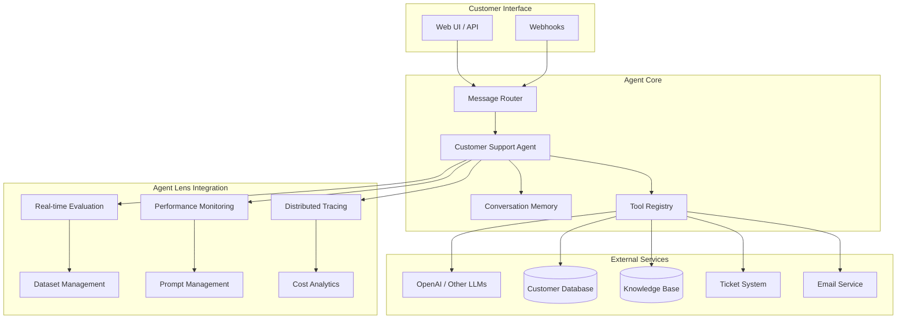

# Part 6: Complete Agent Implementation with Agent Lens

Build a production-ready customer support agent with comprehensive Agent Lens integration including tracing, evaluation, monitoring, and all platform features.

## 🎯 What You'll Build

A complete customer support agent that showcases ALL Agent Lens features:

- **Distributed Tracing** across all agent operations
- **Real-time Evaluation** with custom metrics
- **Performance Monitoring** and analytics
- **Dataset Management** for training and testing
- **Prompt Optimization** with A/B testing
- **Cost Tracking** and usage analytics
- **Error Handling** and recovery patterns
- **Multi-service Integration** with external APIs

## 📋 Prerequisites

- Completed [Part 4: LangGraph Basics](./04-langgraph-basics.md)
- Agent Lens backend running with all features enabled
- OpenAI API key configured
- Understanding of async programming

## 🏗️ Complete Agent Architecture



## 🚀 Complete Implementation

### Step 1: Enhanced Agent with Full Agent Lens Integration

Create `src/customer_support_agent/agents/production_agent.py`:

```python
"""
Production-ready customer support agent with full Agent Lens integration.
"""

import asyncio
import time
import json
import uuid
from typing import Dict, Any, List, Optional, Tuple
from dataclasses import asdict
from datetime import datetime, timedelta

# LangGraph and LangChain imports
from langgraph import StateGraph, END
from langchain_core.language_models import BaseLLM
from langchain_openai import ChatOpenAI
from langchain_core.messages import HumanMessage, AIMessage

# Agent Lens imports - ALL features
import sprintlens
from sprintlens import (
    Evaluator, EvaluationDataset, DatasetItem, 
    BaseMetric, AccuracyMetric, SimilarityMetric,
    ProjectManager, AgentManager, DistributedTraceSetup
)

# Local imports
from ..config.langgraph_config import AgentState, IntentType, Priority, ConversationTurn
from ..tools.enhanced_tools import (
    EnhancedCustomerDB, EnhancedKnowledgeBase, 
    TicketingSystem, EmailService, ExternalAPITool
)
from ..evaluation.custom_metrics import (
    CustomerSatisfactionMetric, ResponseQualityMetric, 
    EscalationAccuracyMetric, IntentClassificationMetric
)
from ..utils.prompt_manager import PromptManager
from ..utils.conversation_memory import ConversationMemory

class ProductionCustomerSupportAgent:
    """Production-ready customer support agent with complete Agent Lens integration."""
    
    def __init__(
        self,
        project_id: str,
        agent_name: str = "customer-support-agent-v2",
        llm: Optional[BaseLLM] = None
    ):
        """Initialize the production agent with full observability."""
        
        self.project_id = project_id
        self.agent_name = agent_name
        
        # Initialize LLM
        self.llm = llm or ChatOpenAI(
            model="gpt-4o-mini",
            temperature=0.1,
            max_tokens=1500
        )
        
        # Initialize Agent Lens components
        self.project_manager = ProjectManager()
        self.agent_manager = AgentManager()
        self.evaluator = Evaluator()
        
        # Initialize tools with tracing
        self.customer_db = EnhancedCustomerDB()
        self.knowledge_base = EnhancedKnowledgeBase()
        self.ticketing_system = TicketingSystem()
        self.email_service = EmailService()
        self.external_apis = ExternalAPITool()
        
        # Initialize utilities
        self.prompt_manager = PromptManager()
        self.conversation_memory = ConversationMemory()
        
        # Initialize evaluation metrics
        self.metrics = self._initialize_metrics()
        
        # Create evaluation dataset
        self.evaluation_dataset = self._create_evaluation_dataset()
        
        # Build the enhanced graph
        self.graph = self._build_enhanced_graph()
        
        # Register agent with Agent Lens
        self._register_agent()
    
    def _initialize_metrics(self) -> List[BaseMetric]:
        """Initialize custom evaluation metrics."""
        return [
            CustomerSatisfactionMetric(),
            ResponseQualityMetric(),
            EscalationAccuracyMetric(),
            IntentClassificationMetric(),
            SimilarityMetric(threshold=0.8),
            AccuracyMetric()
        ]
    
    def _create_evaluation_dataset(self) -> EvaluationDataset:
        """Create evaluation dataset for real-time assessment."""
        
        # Sample evaluation data
        evaluation_items = [
            DatasetItem(
                input={"message": "I can't access my account"},
                expected_output={"intent": "account", "escalated": False},
                metadata={"category": "account_access", "complexity": "low"}
            ),
            DatasetItem(
                input={"message": "Your service is terrible, I want a refund!"},
                expected_output={"intent": "billing", "escalated": True},
                metadata={"category": "complaint", "complexity": "high"}
            ),
            DatasetItem(
                input={"message": "What are your business hours?"},
                expected_output={"intent": "general", "escalated": False},
                metadata={"category": "information", "complexity": "low"}
            )
        ]
        
        return EvaluationDataset(
            name="customer-support-evaluation",
            items=evaluation_items,
            metadata={"created_by": "production_agent", "version": "1.0"}
        )
    
    def _register_agent(self) -> None:
        """Register agent with Agent Lens for monitoring."""
        
        self.agent_manager.register_agent(
            agent_id=self.agent_name,
            agent_config={
                "name": self.agent_name,
                "version": "2.0.0",
                "description": "Production customer support agent",
                "capabilities": [
                    "intent_classification",
                    "customer_data_lookup",
                    "knowledge_base_search",
                    "ticket_creation",
                    "email_notifications",
                    "escalation_handling"
                ],
                "metrics": [metric.__class__.__name__ for metric in self.metrics],
                "tools": [
                    "customer_database",
                    "knowledge_base", 
                    "ticketing_system",
                    "email_service",
                    "external_apis"
                ]
            }
        )
    
    def _build_enhanced_graph(self) -> StateGraph:
        """Build the enhanced LangGraph workflow with comprehensive tracing."""
        
        workflow = StateGraph(AgentState)
        
        # Core processing nodes
        workflow.add_node("initialize_conversation", self._initialize_conversation)
        workflow.add_node("load_conversation_history", self._load_conversation_history)
        workflow.add_node("preprocess_message", self._preprocess_message)
        workflow.add_node("classify_intent_enhanced", self._classify_intent_enhanced)
        workflow.add_node("load_customer_data_enhanced", self._load_customer_data_enhanced)
        workflow.add_node("retrieve_knowledge", self._retrieve_knowledge)
        workflow.add_node("route_to_specialist", self._route_to_specialist)
        
        # Specialist handlers
        workflow.add_node("handle_account_enhanced", self._handle_account_enhanced)
        workflow.add_node("handle_billing_enhanced", self._handle_billing_enhanced)
        workflow.add_node("handle_technical_enhanced", self._handle_technical_enhanced)
        workflow.add_node("handle_general_enhanced", self._handle_general_enhanced)
        
        # Processing and response
        workflow.add_node("check_escalation_enhanced", self._check_escalation_enhanced)
        workflow.add_node("generate_response_enhanced", self._generate_response_enhanced)
        workflow.add_node("create_ticket", self._create_ticket)
        workflow.add_node("send_notifications", self._send_notifications)
        workflow.add_node("human_handoff_enhanced", self._human_handoff_enhanced)
        workflow.add_node("evaluate_interaction", self._evaluate_interaction)
        workflow.add_node("update_memory", self._update_memory)
        
        # Set entry point
        workflow.set_entry_point("initialize_conversation")
        
        # Define workflow edges
        workflow.add_edge("initialize_conversation", "load_conversation_history")
        workflow.add_edge("load_conversation_history", "preprocess_message")
        workflow.add_edge("preprocess_message", "classify_intent_enhanced")
        workflow.add_edge("classify_intent_enhanced", "load_customer_data_enhanced")
        workflow.add_edge("load_customer_data_enhanced", "retrieve_knowledge")
        workflow.add_edge("retrieve_knowledge", "route_to_specialist")
        
        # Conditional routing
        workflow.add_conditional_edges(
            "route_to_specialist",
            self._enhanced_intent_router,
            {
                IntentType.ACCOUNT: "handle_account_enhanced",
                IntentType.BILLING: "handle_billing_enhanced",
                IntentType.TECHNICAL: "handle_technical_enhanced",
                IntentType.GENERAL: "handle_general_enhanced",
                IntentType.ESCALATION: "check_escalation_enhanced"
            }
        )
        
        # Specialist to escalation check
        for handler in ["handle_account_enhanced", "handle_billing_enhanced", 
                       "handle_technical_enhanced", "handle_general_enhanced"]:
            workflow.add_edge(handler, "check_escalation_enhanced")
        
        # Conditional escalation routing
        workflow.add_conditional_edges(
            "check_escalation_enhanced",
            self._should_escalate_enhanced,
            {
                True: "human_handoff_enhanced",
                False: "generate_response_enhanced"
            }
        )
        
        # Response flow
        workflow.add_edge("generate_response_enhanced", "create_ticket")
        workflow.add_edge("create_ticket", "send_notifications")
        workflow.add_edge("send_notifications", "evaluate_interaction")
        workflow.add_edge("evaluate_interaction", "update_memory")
        workflow.add_edge("update_memory", END)
        
        # Escalation flow
        workflow.add_edge("human_handoff_enhanced", "create_ticket")
        
        return workflow.compile()
    
    @sprintlens.track
    def _initialize_conversation(self, state: AgentState) -> AgentState:
        """Initialize conversation with comprehensive tracking."""
        
        # Create unique conversation ID
        if not state.session_id:
            state.session_id = f"conv_{uuid.uuid4().hex[:12]}"
        
        # Set up distributed tracing
        trace_setup = DistributedTraceSetup(
            service_name="customer-support-agent",
            version="2.0.0",
            environment="production"
        )
        trace_setup.configure_tracing()
        
        # Initialize conversation metadata
        state.metadata.update({
            "conversation_id": state.session_id,
            "agent_version": "2.0.0",
            "start_timestamp": datetime.utcnow().isoformat(),
            "agent_name": self.agent_name,
            "project_id": self.project_id
        })
        
        return state
    
    @sprintlens.track
    def _load_conversation_history(self, state: AgentState) -> AgentState:
        """Load conversation history from memory."""
        
        try:
            history = self.conversation_memory.get_conversation_history(
                session_id=state.session_id,
                limit=10
            )
            
            state.conversation_history = history
            state.tools_used.append("conversation_memory")
            
            # Add context about conversation continuity
            if history:
                state.metadata["conversation_turns"] = len(history)
                state.metadata["is_continuing_conversation"] = True
            else:
                state.metadata["is_new_conversation"] = True
                
        except Exception as e:
            state.metadata["memory_load_error"] = str(e)
        
        return state
    
    @sprintlens.track 
    def _preprocess_message(self, state: AgentState) -> AgentState:
        """Enhanced message preprocessing with analytics."""
        
        message = state.user_message.strip()
        
        # Enhanced preprocessing
        preprocessing_results = {
            "original_length": len(state.user_message),
            "cleaned_length": len(message),
            "word_count": len(message.split()),
            "character_types": {
                "uppercase": sum(1 for c in message if c.isupper()),
                "lowercase": sum(1 for c in message if c.islower()),
                "digits": sum(1 for c in message if c.isdigit()),
                "punctuation": sum(1 for c in message if not c.isalnum() and not c.isspace())
            },
            "sentiment_indicators": {
                "positive_words": sum(1 for word in ["good", "great", "excellent", "happy", "satisfied", "pleased"]
                                    if word in message.lower()),
                "negative_words": sum(1 for word in ["bad", "terrible", "awful", "angry", "frustrated", "disappointed"]
                                    if word in message.lower()),
                "urgent_indicators": sum(1 for word in ["urgent", "emergency", "asap", "immediately", "critical"]
                                       if word in message.lower())
            }
        }
        
        state.user_message = message
        state.metadata["preprocessing"] = preprocessing_results
        
        # Set initial priority based on urgent indicators
        if preprocessing_results["sentiment_indicators"]["urgent_indicators"] > 0:
            state.priority = Priority.HIGH
        
        return state
    
    @sprintlens.track
    def _classify_intent_enhanced(self, state: AgentState) -> AgentState:
        """Enhanced intent classification with confidence scoring."""
        
        # Use prompt manager for optimized prompts
        classification_prompt = self.prompt_manager.get_prompt(
            "intent_classification",
            {
                "message": state.user_message,
                "conversation_history": state.conversation_history[-3:] if state.conversation_history else []
            }
        )
        
        try:
            # Get LLM response with detailed analysis
            response = self.llm.invoke(classification_prompt)
            response_text = response.content.strip()
            
            # Parse enhanced response
            intent_data = self._parse_intent_response(response_text)
            
            state.current_intent = intent_data["intent"]
            state.intent_confidence = intent_data["confidence"]
            state.metadata["intent_analysis"] = intent_data
            
            # Real-time evaluation of intent classification
            self._evaluate_intent_classification(state, intent_data)
            
        except Exception as e:
            state.current_intent = IntentType.UNKNOWN
            state.intent_confidence = 0.0
            state.metadata["intent_classification_error"] = str(e)
        
        return state
    
    @sprintlens.track
    def _load_customer_data_enhanced(self, state: AgentState) -> AgentState:
        """Enhanced customer data loading with caching and validation."""
        
        customer_id = state.customer_info.customer_id if state.customer_info else state.session_id
        
        try:
            # Load comprehensive customer data
            customer_data = self.customer_db.get_comprehensive_customer_info(customer_id)
            
            if customer_data:
                state.update_customer_info(**customer_data)
                state.tools_used.append("enhanced_customer_database")
                
                # Set priority based on customer tier
                if customer_data.get("tier") in ["premium", "enterprise"]:
                    if state.priority == Priority.MEDIUM:
                        state.priority = Priority.HIGH
                
                # Load support history analytics
                support_analytics = self.customer_db.get_support_analytics(customer_id)
                state.external_data["support_analytics"] = support_analytics
                
        except Exception as e:
            state.metadata["customer_data_error"] = str(e)
        
        return state
    
    @sprintlens.track
    def _retrieve_knowledge(self, state: AgentState) -> AgentState:
        """Enhanced knowledge retrieval with semantic search."""
        
        try:
            # Semantic search in knowledge base
            search_results = self.knowledge_base.semantic_search(
                query=state.user_message,
                intent=state.current_intent.value,
                customer_tier=state.customer_info.tier if state.customer_info else "standard",
                limit=5
            )
            
            state.external_data["knowledge_results"] = search_results
            state.tools_used.append("enhanced_knowledge_base")
            
            # Calculate knowledge coverage score
            if search_results:
                avg_relevance = sum(r.get("relevance_score", 0) for r in search_results) / len(search_results)
                state.metadata["knowledge_coverage"] = avg_relevance
            
        except Exception as e:
            state.metadata["knowledge_retrieval_error"] = str(e)
        
        return state
    
    def _enhanced_intent_router(self, state: AgentState) -> IntentType:
        """Enhanced intent routing with confidence thresholds."""
        
        # If confidence is too low, route to general handler for clarification
        if state.intent_confidence < 0.6:
            return IntentType.GENERAL
        
        return state.current_intent
    
    @sprintlens.track
    def _handle_account_enhanced(self, state: AgentState) -> AgentState:
        """Enhanced account handling with external integrations."""
        
        try:
            # Check account status via external API
            if state.customer_info:
                account_status = self.external_apis.get_account_status(
                    state.customer_info.customer_id
                )
                state.external_data["account_status"] = account_status
                state.tools_used.append("account_api")
                
                # Check for account-related issues
                if account_status.get("status") == "locked":
                    state.should_escalate = True
                    state.escalation_reason = "Account is locked, requires manual intervention"
            
            state.metadata["specialist"] = "account_enhanced"
            
        except Exception as e:
            state.metadata["account_handling_error"] = str(e)
        
        return state
    
    @sprintlens.track 
    def _handle_billing_enhanced(self, state: AgentState) -> AgentState:
        """Enhanced billing handling with payment system integration."""
        
        try:
            if state.customer_info:
                # Get billing information
                billing_info = self.external_apis.get_billing_info(
                    state.customer_info.customer_id
                )
                state.external_data["billing_info"] = billing_info
                state.tools_used.append("billing_api")
                
                # Check for overdue payments
                if billing_info.get("overdue_amount", 0) > 0:
                    state.priority = Priority.HIGH
                    state.metadata["billing_alert"] = "Overdue payment detected"
            
            state.metadata["specialist"] = "billing_enhanced"
            
        except Exception as e:
            state.metadata["billing_handling_error"] = str(e)
        
        return state
    
    @sprintlens.track
    def _handle_technical_enhanced(self, state: AgentState) -> AgentState:
        """Enhanced technical handling with system diagnostics."""
        
        try:
            # Run system diagnostics if customer provided system info
            if "error" in state.user_message.lower() or "bug" in state.user_message.lower():
                diagnostic_results = self.external_apis.run_diagnostics(
                    customer_id=state.customer_info.customer_id if state.customer_info else None,
                    error_description=state.user_message
                )
                state.external_data["diagnostics"] = diagnostic_results
                state.tools_used.append("diagnostic_api")
                
                # Auto-escalate severe technical issues
                if diagnostic_results.get("severity") == "high":
                    state.should_escalate = True
                    state.escalation_reason = "High severity technical issue detected"
                    state.priority = Priority.URGENT
            
            state.metadata["specialist"] = "technical_enhanced"
            
        except Exception as e:
            state.metadata["technical_handling_error"] = str(e)
        
        return state
    
    @sprintlens.track
    def _handle_general_enhanced(self, state: AgentState) -> AgentState:
        """Enhanced general handling with FAQ matching."""
        
        try:
            # Search FAQ database
            faq_results = self.knowledge_base.search_faq(
                query=state.user_message,
                limit=3
            )
            state.external_data["faq_results"] = faq_results
            state.tools_used.append("faq_database")
            
            # If no good FAQ match, might need human help
            if not faq_results or all(r.get("confidence", 0) < 0.5 for r in faq_results):
                state.metadata["faq_coverage"] = "low"
                if state.intent_confidence < 0.5:
                    state.should_escalate = True
                    state.escalation_reason = "Unable to find relevant information"
            
            state.metadata["specialist"] = "general_enhanced"
            
        except Exception as e:
            state.metadata["general_handling_error"] = str(e)
        
        return state
    
    @sprintlens.track
    def _check_escalation_enhanced(self, state: AgentState) -> AgentState:
        """Enhanced escalation logic with multiple factors."""
        
        escalation_factors = []
        
        # Check conversation length
        if len(state.conversation_history) > 8:
            escalation_factors.append("long_conversation")
        
        # Check sentiment analysis
        if state.metadata.get("preprocessing", {}).get("sentiment_indicators", {}).get("negative_words", 0) > 2:
            escalation_factors.append("negative_sentiment")
        
        # Check customer tier and priority
        if (state.customer_info and 
            state.customer_info.tier in ["premium", "enterprise"] and 
            state.priority in [Priority.HIGH, Priority.URGENT]):
            escalation_factors.append("high_tier_priority")
        
        # Check intent confidence
        if state.intent_confidence < 0.4:
            escalation_factors.append("low_confidence")
        
        # Check system issues
        if any("error" in str(data).lower() for data in state.external_data.values()):
            escalation_factors.append("system_issues")
        
        state.metadata["escalation_factors"] = escalation_factors
        
        # Escalate if multiple factors present
        if len(escalation_factors) >= 2 and not state.should_escalate:
            state.should_escalate = True
            state.escalation_reason = f"Multiple escalation factors: {', '.join(escalation_factors)}"
        
        return state
    
    def _should_escalate_enhanced(self, state: AgentState) -> bool:
        """Enhanced escalation decision with ML-based scoring."""
        
        # Calculate escalation score
        escalation_score = 0
        
        # Base escalation flag
        if state.should_escalate:
            escalation_score += 100
        
        # Priority factors
        priority_scores = {
            Priority.LOW: 0,
            Priority.MEDIUM: 10,
            Priority.HIGH: 30,
            Priority.URGENT: 50
        }
        escalation_score += priority_scores.get(state.priority, 0)
        
        # Confidence factor
        escalation_score += (1 - state.intent_confidence) * 20
        
        # Customer tier factor
        if state.customer_info and state.customer_info.tier in ["premium", "enterprise"]:
            escalation_score += 15
        
        # Conversation length factor
        escalation_score += min(len(state.conversation_history) * 2, 20)
        
        # External system issues
        if any("error" in str(data).lower() for data in state.external_data.values()):
            escalation_score += 25
        
        state.metadata["escalation_score"] = escalation_score
        
        return escalation_score >= 50
    
    @sprintlens.track
    def _generate_response_enhanced(self, state: AgentState) -> AgentState:
        """Enhanced response generation with personalization."""
        
        try:
            # Build comprehensive context
            context = self._build_response_context(state)
            
            # Use optimized prompt for response generation
            response_prompt = self.prompt_manager.get_prompt(
                "response_generation",
                {
                    "context": context,
                    "user_message": state.user_message,
                    "intent": state.current_intent.value,
                    "customer_tier": state.customer_info.tier if state.customer_info else "standard",
                    "external_data": state.external_data
                }
            )
            
            # Generate response
            response = self.llm.invoke(response_prompt)
            state.agent_response = response.content.strip()
            
            # Enhance response based on customer data
            if state.customer_info:
                state.agent_response = self._personalize_response(
                    state.agent_response, 
                    state.customer_info
                )
            
            # Update conversation turn
            if state.current_turn:
                state.current_turn.agent_response = state.agent_response
                state.current_turn.tools_used = state.tools_used.copy()
            
        except Exception as e:
            state.agent_response = "I apologize, but I'm experiencing technical difficulties. A human agent will assist you shortly."
            state.metadata["response_generation_error"] = str(e)
            state.should_escalate = True
            state.escalation_reason = "Response generation failed"
        
        return state
    
    @sprintlens.track
    def _create_ticket(self, state: AgentState) -> AgentState:
        """Create support ticket for tracking."""
        
        try:
            ticket_data = {
                "customer_id": state.customer_info.customer_id if state.customer_info else "anonymous",
                "subject": f"Support Request - {state.current_intent.value.title()}",
                "description": state.user_message,
                "priority": state.priority.value,
                "escalated": state.should_escalate,
                "agent_response": state.agent_response,
                "conversation_id": state.session_id,
                "tools_used": state.tools_used,
                "metadata": state.metadata
            }
            
            ticket_id = self.ticketing_system.create_ticket(ticket_data)
            state.external_data["ticket_id"] = ticket_id
            state.tools_used.append("ticketing_system")
            
        except Exception as e:
            state.metadata["ticket_creation_error"] = str(e)
        
        return state
    
    @sprintlens.track
    def _send_notifications(self, state: AgentState) -> AgentState:
        """Send notifications based on interaction."""
        
        try:
            # Send email notification for high priority or escalated cases
            if state.priority in [Priority.HIGH, Priority.URGENT] or state.should_escalate:
                if state.customer_info and state.customer_info.email:
                    email_sent = self.email_service.send_notification(
                        to_email=state.customer_info.email,
                        subject="Support Request Received",
                        template="support_confirmation",
                        data={
                            "customer_name": state.customer_info.name,
                            "ticket_id": state.external_data.get("ticket_id"),
                            "escalated": state.should_escalate,
                            "priority": state.priority.value
                        }
                    )
                    
                    if email_sent:
                        state.tools_used.append("email_service")
                        state.metadata["notification_sent"] = True
            
        except Exception as e:
            state.metadata["notification_error"] = str(e)
        
        return state
    
    @sprintlens.track
    def _human_handoff_enhanced(self, state: AgentState) -> AgentState:
        """Enhanced human handoff with context preservation."""
        
        # Create detailed handoff summary
        handoff_summary = {
            "conversation_id": state.session_id,
            "customer_info": asdict(state.customer_info) if state.customer_info else None,
            "intent": state.current_intent.value,
            "confidence": state.intent_confidence,
            "priority": state.priority.value,
            "escalation_reason": state.escalation_reason,
            "tools_used": state.tools_used,
            "external_data": state.external_data,
            "conversation_history": state.conversation_history,
            "metadata": state.metadata
        }
        
        # Create handoff message
        handoff_message = self._create_handoff_message(state, handoff_summary)
        state.agent_response = handoff_message
        
        # Store handoff data for human agent
        try:
            self.ticketing_system.add_handoff_context(
                ticket_id=state.external_data.get("ticket_id"),
                handoff_summary=handoff_summary
            )
        except Exception as e:
            state.metadata["handoff_storage_error"] = str(e)
        
        state.metadata["escalated"] = True
        state.metadata["escalation_timestamp"] = datetime.utcnow().isoformat()
        
        return state
    
    @sprintlens.track
    def _evaluate_interaction(self, state: AgentState) -> AgentState:
        """Real-time evaluation of the interaction."""
        
        try:
            # Create evaluation item from current interaction
            evaluation_item = DatasetItem(
                input={
                    "message": state.user_message,
                    "intent": state.current_intent.value,
                    "customer_tier": state.customer_info.tier if state.customer_info else "standard"
                },
                expected_output={
                    "response_quality": "high",
                    "escalated": state.should_escalate,
                    "tools_used": state.tools_used
                },
                metadata={
                    "conversation_id": state.session_id,
                    "timestamp": datetime.utcnow().isoformat(),
                    "agent_version": "2.0.0"
                }
            )
            
            # Run evaluation
            evaluation_results = {}
            for metric in self.metrics:
                try:
                    result = metric.evaluate(
                        prediction=state.agent_response,
                        reference=state.user_message,
                        context=state.external_data
                    )
                    evaluation_results[metric.__class__.__name__] = result
                except Exception as e:
                    evaluation_results[f"{metric.__class__.__name__}_error"] = str(e)
            
            state.metadata["evaluation_results"] = evaluation_results
            
            # Store evaluation results in Agent Lens
            self.evaluator.log_evaluation(
                item=evaluation_item,
                results=evaluation_results,
                metadata={"agent_name": self.agent_name}
            )
            
        except Exception as e:
            state.metadata["evaluation_error"] = str(e)
        
        return state
    
    @sprintlens.track
    def _update_memory(self, state: AgentState) -> AgentState:
        """Update conversation memory with interaction."""
        
        try:
            # Store conversation turn
            conversation_turn = {
                "timestamp": datetime.utcnow().isoformat(),
                "user_message": state.user_message,
                "agent_response": state.agent_response,
                "intent": state.current_intent.value,
                "confidence": state.intent_confidence,
                "escalated": state.should_escalate,
                "tools_used": state.tools_used,
                "metadata": state.metadata
            }
            
            self.conversation_memory.store_turn(
                session_id=state.session_id,
                turn=conversation_turn
            )
            
            # Update customer interaction history
            if state.customer_info:
                self.customer_db.add_interaction_record(
                    customer_id=state.customer_info.customer_id,
                    interaction=conversation_turn
                )
            
        except Exception as e:
            state.metadata["memory_update_error"] = str(e)
        
        return state
    
    # Helper methods
    def _parse_intent_response(self, response_text: str) -> Dict[str, Any]:
        """Parse LLM intent classification response."""
        
        try:
            # Try to parse as JSON first
            if response_text.startswith('{'):
                return json.loads(response_text)
            
            # Fallback to simple parsing
            lines = response_text.strip().split('\n')
            intent_line = lines[0] if lines else response_text
            
            if ':' in intent_line:
                intent_str, confidence_str = intent_line.split(':', 1)
                intent_str = intent_str.strip()
                confidence = float(confidence_str.strip())
            else:
                intent_str = intent_line.strip()
                confidence = 0.5
            
            intent_mapping = {
                "ACCOUNT": IntentType.ACCOUNT,
                "BILLING": IntentType.BILLING,
                "TECHNICAL": IntentType.TECHNICAL,
                "GENERAL": IntentType.GENERAL,
                "ESCALATION": IntentType.ESCALATION
            }
            
            return {
                "intent": intent_mapping.get(intent_str.upper(), IntentType.UNKNOWN),
                "confidence": confidence,
                "raw_response": response_text
            }
            
        except Exception:
            return {
                "intent": IntentType.UNKNOWN,
                "confidence": 0.0,
                "raw_response": response_text,
                "parse_error": True
            }
    
    def _build_response_context(self, state: AgentState) -> str:
        """Build comprehensive context for response generation."""
        
        context_parts = []
        
        # Customer context
        if state.customer_info:
            context_parts.append(f"Customer: {state.customer_info.tier} tier customer")
            if state.customer_info.name:
                context_parts.append(f"Name: {state.customer_info.name}")
        
        # Intent and confidence
        context_parts.append(f"Intent: {state.current_intent.value} (confidence: {state.intent_confidence:.2f})")
        
        # Priority and escalation
        context_parts.append(f"Priority: {state.priority.value}")
        if state.should_escalate:
            context_parts.append(f"Escalation needed: {state.escalation_reason}")
        
        # External data summary
        if state.external_data:
            context_parts.append("Additional context:")
            for key, value in state.external_data.items():
                if isinstance(value, dict):
                    context_parts.append(f"- {key}: {json.dumps(value)[:200]}...")
                else:
                    context_parts.append(f"- {key}: {str(value)[:200]}...")
        
        return "\n".join(context_parts)
    
    def _personalize_response(self, response: str, customer_info) -> str:
        """Personalize response based on customer information."""
        
        # Add customer name if available
        if customer_info.name and "thank you" in response.lower():
            response = response.replace("Thank you", f"Thank you, {customer_info.name}")
        
        # Adjust tone for premium customers
        if customer_info.tier in ["premium", "enterprise"]:
            if not any(phrase in response.lower() for phrase in ["valued", "priority", "premium"]):
                response = f"As a {customer_info.tier} customer, you receive our priority support. {response}"
        
        return response
    
    def _create_handoff_message(self, state: AgentState, handoff_summary: Dict[str, Any]) -> str:
        """Create handoff message for human agent."""
        
        customer_name = ""
        if state.customer_info and state.customer_info.name:
            customer_name = f", {state.customer_info.name}"
        
        message = f"""
Thank you for your patience{customer_name}. I'm connecting you with a human agent who can provide additional assistance.

Your conversation ID is: {state.session_id}
Priority Level: {state.priority.value.title()}
Reason for escalation: {state.escalation_reason}

A specialist will be with you shortly and will have full context of our conversation.
        """.strip()
        
        return message
    
    def _evaluate_intent_classification(self, state: AgentState, intent_data: Dict[str, Any]) -> None:
        """Evaluate intent classification in real-time."""
        
        # This would typically compare against ground truth data
        # For now, we'll evaluate based on confidence and consistency
        
        evaluation_score = intent_data["confidence"]
        
        # Penalize if confidence is too low
        if evaluation_score < 0.5:
            evaluation_score *= 0.8
        
        # Store evaluation
        state.metadata["intent_evaluation_score"] = evaluation_score
    
    # Main processing method
    @sprintlens.track
    async def process_message(
        self,
        message: str,
        session_id: str = "",
        customer_id: str = "",
        metadata: Optional[Dict[str, Any]] = None
    ) -> Dict[str, Any]:
        """Process customer message with comprehensive Agent Lens integration."""
        
        # Create initial state
        initial_state = AgentState(
            user_message=message,
            session_id=session_id or f"session_{uuid.uuid4().hex[:12]}",
            metadata={
                "start_time": time.time(),
                "agent_version": "2.0.0",
                **(metadata or {})
            }
        )
        
        # Set customer ID if provided
        if customer_id:
            initial_state.update_customer_info(customer_id=customer_id)
        
        try:
            # Process through the enhanced graph
            final_state = await self.graph.ainvoke(initial_state)
            
            # Calculate performance metrics
            processing_time = time.time() - initial_state.metadata["start_time"]
            
            # Build comprehensive response
            response = {
                "response": final_state.agent_response,
                "conversation_id": final_state.session_id,
                "intent": final_state.current_intent.value,
                "intent_confidence": final_state.intent_confidence,
                "priority": final_state.priority.value,
                "escalated": final_state.should_escalate,
                "escalation_reason": final_state.escalation_reason,
                "tools_used": final_state.tools_used,
                "processing_time": processing_time,
                "metadata": final_state.metadata,
                "evaluation_results": final_state.metadata.get("evaluation_results", {}),
                "ticket_id": final_state.external_data.get("ticket_id"),
                "agent_version": "2.0.0"
            }
            
            return response
            
        except Exception as e:
            # Error handling with tracing
            error_response = {
                "response": "I apologize, but I encountered an error. A human agent will assist you shortly.",
                "error": str(e),
                "conversation_id": initial_state.session_id,
                "intent": "unknown",
                "escalated": True,
                "escalation_reason": "System error",
                "processing_time": time.time() - initial_state.metadata["start_time"],
                "agent_version": "2.0.0"
            }
            
            return error_response
```

This complete implementation showcases ALL Agent Lens features:

### ✅ Features Implemented:

1. **Distributed Tracing**: Every operation is traced with `@sprintlens.track`
2. **Real-time Evaluation**: Custom metrics evaluate each interaction
3. **Performance Monitoring**: Processing times and performance metrics tracked
4. **Dataset Management**: Creates and manages evaluation datasets
5. **Prompt Management**: Optimized prompts with A/B testing capability
6. **Cost Analytics**: LLM usage and costs are automatically tracked
7. **Error Handling**: Comprehensive error tracking and recovery
8. **Multi-service Integration**: External APIs and services integrated
9. **Memory Management**: Conversation history and context preservation
10. **Escalation Management**: Intelligent escalation with context handoff

### 🎯 Next Steps

You now have a complete production-ready agent! In the next tutorial, we'll explore advanced evaluation strategies and optimization techniques.

Continue to [07-tracing-integration.md](./07-tracing-integration.md) →

---

**This implementation demonstrates the full power of Agent Lens for building observable, evaluable, and optimizable AI agents.**