# Agent Lens Developer Tutorial Series

Welcome to the comprehensive Agent Lens tutorial series! This guide will take you from zero to building a production-ready AI agent with full observability, evaluation, and monitoring capabilities using Agent Lens.

## 🎯 What You'll Build

By the end of this tutorial, you'll have built a complete **Customer Support Agent** using LangGraph with Agent Lens integration, featuring:

- **Conversational AI** with memory and context management
- **Tool integration** for accessing external APIs
- **Comprehensive tracing** of all agent operations
- **Real-time evaluation** with custom metrics
- **Cost monitoring** and performance analytics
- **Distributed tracing** across multiple services
- **Dataset creation** and management
- **Prompt optimization** and A/B testing

## 🏗️ Architecture Overview

```mermaid
graph TB
    User[👤 User] --> Agent[🤖 Customer Support Agent]
    Agent --> LangGraph[🔄 LangGraph Workflow]
    LangGraph --> Tools[🛠️ External Tools]
    LangGraph --> LLM[🧠 Language Model]
    
    Agent --> SprintLens[📊 Sprint Lens SDK]
    SprintLens --> Backend[🏢 Agent Lens Backend]
    Backend --> Dashboard[📈 Agent Lens Dashboard]
    
    Tools --> DB[(🗄️ Knowledge Base)]
    Tools --> API[🌐 External APIs]
    
    subgraph "Agent Lens Features"
        Backend --> Tracing[📍 Distributed Tracing]
        Backend --> Evaluation[✅ Real-time Evaluation]
        Backend --> Monitoring[📊 Performance Monitoring]
        Backend --> Datasets[📋 Dataset Management]
        Backend --> Prompts[📝 Prompt Management]
    end
```

## 📚 Tutorial Structure

### Part 1: Setup & Foundation
- [01-environment-setup.md](./01-environment-setup.md) - Setting up your development environment
- [02-sdk-installation.md](./02-sdk-installation.md) - Installing and configuring Agent Lens SDK
- [03-basic-integration.md](./03-basic-integration.md) - Your first Agent Lens integration

### Part 2: Building the Agent
- [04-langgraph-basics.md](./04-langgraph-basics.md) - Introduction to LangGraph for agent workflows
- [05-agent-architecture.md](./05-agent-architecture.md) - Designing our customer support agent
- [06-implementing-agent.md](./06-implementing-agent.md) - Implementing the agent with LangGraph

### Part 3: Agent Lens Integration
- [07-tracing-integration.md](./07-tracing-integration.md) - Adding comprehensive tracing
- [08-evaluation-setup.md](./08-evaluation-setup.md) - Setting up evaluation metrics
- [09-monitoring-analytics.md](./09-monitoring-analytics.md) - Performance monitoring and analytics

### Part 4: Advanced Features
- [10-dataset-management.md](./10-dataset-management.md) - Creating and managing evaluation datasets
- [11-prompt-optimization.md](./11-prompt-optimization.md) - Prompt engineering with Agent Lens
- [12-distributed-tracing.md](./12-distributed-tracing.md) - Multi-service distributed tracing

### Part 5: Production & Optimization
- [13-production-deployment.md](./13-production-deployment.md) - Deploying your agent to production
- [14-performance-optimization.md](./14-performance-optimization.md) - Optimizing performance with Agent Lens insights
- [15-advanced-evaluation.md](./15-advanced-evaluation.md) - Advanced evaluation strategies

## 🎓 Prerequisites

- **Python 3.9+** with uv and poetry installed
- **Basic understanding** of Python and async programming
- **Agent Lens instance** running (local or cloud)
- **OpenAI API key** or access to other LLM providers
- **Familiarity** with AI/ML concepts (helpful but not required)

## 🚀 Quick Start

If you want to dive right in, follow this quick path:

1. **Setup Environment**: Follow [01-environment-setup.md](./01-environment-setup.md)
2. **Install SDK**: Complete [02-sdk-installation.md](./02-sdk-installation.md)
3. **Basic Integration**: Work through [03-basic-integration.md](./03-basic-integration.md)
4. **Build Agent**: Jump to [06-implementing-agent.md](./06-implementing-agent.md)

## 📖 Tutorial Conventions

- 📝 **Code blocks** include full working examples
- 🔍 **Explanation sections** provide context and best practices
- ⚠️ **Warning boxes** highlight important considerations
- 💡 **Tip boxes** share optimization insights
- 🧪 **Testing sections** show how to verify your implementation

## 🎯 Learning Objectives

After completing this tutorial series, you will:

- ✅ Understand Agent Lens architecture and capabilities
- ✅ Build production-ready AI agents with LangGraph
- ✅ Implement comprehensive observability and monitoring
- ✅ Create evaluation frameworks for agent performance
- ✅ Optimize agent performance using data-driven insights
- ✅ Deploy and scale agents in production environments

## 🤝 Getting Help

- **Documentation**: [docs.sprintagentlens.com](https://docs.sprintagentlens.com)
- **GitHub Issues**: Report bugs and request features
- **Community Discord**: Join our developer community
- **Support Email**: support@sprintagentlens.com

## 📋 Checklist

Track your progress through the tutorial:

- [ ] Environment setup complete
- [ ] SDK installed and configured
- [ ] Basic integration working
- [ ] LangGraph agent implemented
- [ ] Tracing integrated
- [ ] Evaluation metrics configured
- [ ] Monitoring dashboard configured
- [ ] Dataset management setup
- [ ] Prompt optimization working
- [ ] Distributed tracing implemented
- [ ] Production deployment ready

---

Ready to build amazing AI agents? Let's start with [01-environment-setup.md](./01-environment-setup.md)! 🚀