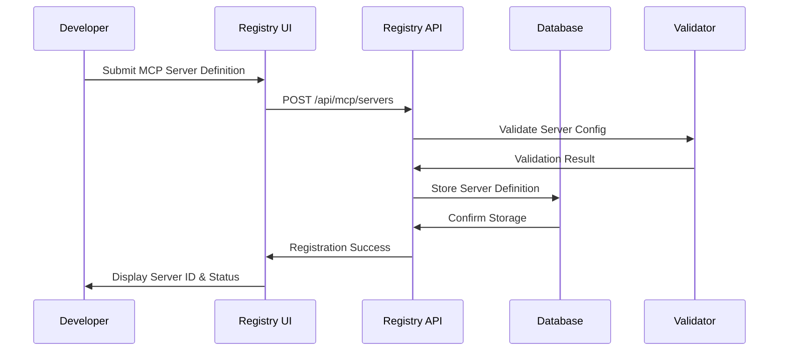
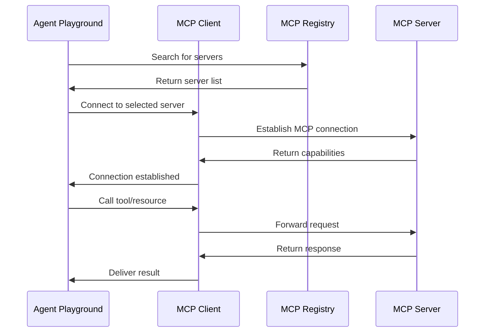

# MCP Registry Architecture for Agent Playground

## Overview

This document outlines the comprehensive architecture for implementing a Model Context Protocol (MCP) registry that enables seamless connection between the Agent Playground and external agents, tools, and data sources.

## MCP Protocol Understanding

### What is MCP?
The Model Context Protocol (MCP) is an open standard developed by Anthropic that standardizes how AI applications connect to external data sources and tools. It's designed to be the "USB-C for AI" - providing a universal connection protocol.

### Key MCP Concepts

1. **MCP Clients**: AI applications or agents that consume external resources (our Agent Playground agents)
2. **MCP Servers**: Programs that expose capabilities like tools, resources, and prompts
3. **Registry**: Centralized discovery service for MCP servers
4. **Protocol**: Standardized communication format (JSON-RPC based)

### MCP Capabilities

- **Tools**: Executable functions that agents can call
- **Resources**: Data sources that can be read (files, databases, APIs)
- **Prompts**: Pre-defined prompt templates with parameters

## Architecture Overview

```
┌─────────────────────────────────────────────────────────────────┐
│                    AgentLens Platform                          │
├─────────────────────────────────────────────────────────────────┤
│  ┌─────────────────┐  ┌─────────────────┐  ┌─────────────────┐  │
│  │ Agent Playground│  │ MCP Registry UI │  │ Agent Dashboard │  │
│  │                 │  │                 │  │                 │  │
│  │ - Agent Builder │  │ - Server Browse │  │ - Agent Monitor │  │
│  │ - Testing Env   │  │ - Connection Mgmt│  │ - MCP Status    │  │
│  │ - Code Gen      │  │ - Config Editor │  │ - Performance   │  │
│  └─────────────────┘  └─────────────────┘  └─────────────────┘  │
├─────────────────────────────────────────────────────────────────┤
│                    MCP Client Layer                            │
│  ┌─────────────────┐  ┌─────────────────┐  ┌─────────────────┐  │
│  │ MCP Client SDK  │  │ Connection Pool │  │ Protocol Handler│  │
│  │                 │  │                 │  │                 │  │
│  │ - Server Conn   │  │ - Load Balancer │  │ - JSON-RPC      │  │
│  │ - Tool Invok    │  │ - Health Check  │  │ - Message Queue │  │
│  │ - Resource Acc  │  │ - Retry Logic   │  │ - Event Stream  │  │
│  └─────────────────┘  └─────────────────┘  └─────────────────┘  │
├─────────────────────────────────────────────────────────────────┤
│                    MCP Registry Core                           │
│  ┌─────────────────┐  ┌─────────────────┐  ┌─────────────────┐  │
│  │ Registry API    │  │ Discovery Svc   │  │ Auth & Security │  │
│  │                 │  │                 │  │                 │  │
│  │ - Server CRUD   │  │ - Search        │  │ - API Keys      │  │
│  │ - Metadata Mgmt │  │ - Categories    │  │ - OAuth         │  │
│  │ - Version Track │  │ - Health Status │  │ - Rate Limiting │  │
│  └─────────────────┘  └─────────────────┘  └─────────────────┘  │
├─────────────────────────────────────────────────────────────────┤
│                    Data & Storage Layer                        │
│  ┌─────────────────┐  ┌─────────────────┐  ┌─────────────────┐  │
│  │ Registry DB     │  │ Configuration   │  │ Monitoring      │  │
│  │                 │  │                 │  │                 │  │
│  │ - Server Catalog│  │ - Connection    │  │ - Metrics       │  │
│  │ - Capabilities  │  │ - Credentials   │  │ - Logs          │  │
│  │ - Relationships │  │ - Settings      │  │ - Analytics     │  │
│  └─────────────────┘  └─────────────────┘  └─────────────────┘  │
└─────────────────────────────────────────────────────────────────┘
                                │
                                ▼
┌─────────────────────────────────────────────────────────────────┐
│                    External MCP Ecosystem                      │
├─────────────────────────────────────────────────────────────────┤
│  ┌─────────────────┐  ┌─────────────────┐  ┌─────────────────┐  │
│  │ Community       │  │ Enterprise      │  │ Custom Agents   │  │
│  │ MCP Servers     │  │ MCP Servers     │  │                 │  │
│  │                 │  │                 │  │ - User Agents   │  │
│  │ - GitHub        │  │ - Salesforce    │  │ - Team Agents   │  │
│  │ - Google Drive  │  │ - Slack         │  │ - Specialized   │  │
│  │ - PostgreSQL    │  │ - Jira          │  │ - Third-party   │  │
│  │ - Puppeteer     │  │ - Custom Tools  │  │ - Legacy System │  │
│  └─────────────────┘  └─────────────────┘  └─────────────────┘  │
└─────────────────────────────────────────────────────────────────┘
```

## Core Components

### 1. MCP Registry Core

#### Registry API Service
```typescript
interface MCPRegistryAPI {
  // Server Management
  registerServer(server: MCPServerDefinition): Promise<ServerRegistration>
  updateServer(id: string, updates: Partial<MCPServerDefinition>): Promise<void>
  deregisterServer(id: string): Promise<void>
  
  // Discovery
  searchServers(query: SearchQuery): Promise<MCPServer[]>
  getServersByCategory(category: string): Promise<MCPServer[]>
  getServerCapabilities(serverId: string): Promise<ServerCapabilities>
  
  // Health & Status
  getServerHealth(serverId: string): Promise<HealthStatus>
  testConnection(serverId: string): Promise<ConnectionTest>
}
```

#### Data Models
```typescript
interface MCPServerDefinition {
  id: string
  name: string
  description: string
  version: string
  author: string
  category: ServerCategory
  tags: string[]
  
  // Connection
  endpoint: string
  protocol: 'stdio' | 'sse' | 'websocket'
  authentication: AuthConfig
  
  // Capabilities
  capabilities: {
    tools: ToolDefinition[]
    resources: ResourceDefinition[]
    prompts: PromptDefinition[]
  }
  
  // Metadata
  documentation: string
  repository: string
  license: string
  created: Date
  updated: Date
  status: 'active' | 'deprecated' | 'maintenance'
}

interface ToolDefinition {
  name: string
  description: string
  inputSchema: JSONSchema
  outputSchema: JSONSchema
  examples: ToolExample[]
}

interface ResourceDefinition {
  uri: string
  name: string
  description: string
  mimeType: string
}

interface PromptDefinition {
  name: string
  description: string
  arguments: PromptArgument[]
}
```

### 2. MCP Client Integration

#### Agent Playground Integration
```typescript
class MCPIntegratedAgent {
  private mcpClient: MCPClient
  private connectedServers: Map<string, MCPServerConnection>
  
  constructor(agentConfig: AgentConfig) {
    this.mcpClient = new MCPClient()
    this.connectedServers = new Map()
  }
  
  // Connect to MCP servers
  async connectToServer(serverId: string): Promise<void> {
    const serverDef = await mcpRegistry.getServer(serverId)
    const connection = await this.mcpClient.connect(serverDef)
    this.connectedServers.set(serverId, connection)
  }
  
  // Execute tools through MCP
  async executeTool(serverId: string, toolName: string, args: any): Promise<any> {
    const connection = this.connectedServers.get(serverId)
    return await connection.callTool(toolName, args)
  }
  
  // Access resources through MCP
  async getResource(serverId: string, uri: string): Promise<ResourceContent> {
    const connection = this.connectedServers.get(serverId)
    return await connection.readResource(uri)
  }
}
```

### 3. Registry Database Schema

```sql
-- MCP Servers Registry
CREATE TABLE mcp_servers (
  id UUID PRIMARY KEY DEFAULT gen_random_uuid(),
  name VARCHAR(255) NOT NULL,
  description TEXT,
  version VARCHAR(50),
  author VARCHAR(255),
  category VARCHAR(100),
  tags TEXT[],
  endpoint VARCHAR(500),
  protocol VARCHAR(20),
  authentication JSONB,
  capabilities JSONB,
  documentation TEXT,
  repository VARCHAR(500),
  license VARCHAR(100),
  status VARCHAR(20) DEFAULT 'active',
  created_at TIMESTAMP DEFAULT NOW(),
  updated_at TIMESTAMP DEFAULT NOW()
);

-- Server Capabilities
CREATE TABLE server_capabilities (
  id UUID PRIMARY KEY DEFAULT gen_random_uuid(),
  server_id UUID REFERENCES mcp_servers(id),
  type VARCHAR(20), -- 'tool', 'resource', 'prompt'
  name VARCHAR(255),
  description TEXT,
  schema JSONB,
  created_at TIMESTAMP DEFAULT NOW()
);

-- Connection History
CREATE TABLE mcp_connections (
  id UUID PRIMARY KEY DEFAULT gen_random_uuid(),
  agent_id UUID,
  server_id UUID REFERENCES mcp_servers(id),
  status VARCHAR(20),
  connected_at TIMESTAMP DEFAULT NOW(),
  disconnected_at TIMESTAMP,
  error_message TEXT
);

-- Usage Analytics
CREATE TABLE mcp_usage_analytics (
  id UUID PRIMARY KEY DEFAULT gen_random_uuid(),
  server_id UUID REFERENCES mcp_servers(id),
  agent_id UUID,
  operation_type VARCHAR(50), -- 'tool_call', 'resource_read', 'prompt_use'
  operation_name VARCHAR(255),
  duration_ms INTEGER,
  success BOOLEAN,
  timestamp TIMESTAMP DEFAULT NOW()
);
```

### 4. Security & Authentication

#### Multi-tier Security Model
```typescript
interface SecurityConfig {
  // API-level security
  apiKey: string
  rateLimiting: {
    requestsPerMinute: number
    burstLimit: number
  }
  
  // MCP Server authentication
  serverAuth: {
    type: 'apikey' | 'oauth' | 'basic' | 'certificate'
    credentials: any
  }
  
  // Agent-level permissions
  permissions: {
    allowedServers: string[]
    allowedOperations: string[]
    resourceAccess: ResourcePermission[]
  }
}
```

## Integration Workflows

### 1. Server Registration Flow



### 2. Agent Connection Flow



### 3. Discovery & Browsing

```typescript
class MCPDiscoveryService {
  async searchServers(query: {
    text?: string
    category?: string
    capabilities?: string[]
    tags?: string[]
  }): Promise<MCPServer[]> {
    // Implementation with fuzzy search, filtering, ranking
  }
  
  async getPopularServers(): Promise<MCPServer[]> {
    // Based on usage analytics
  }
  
  async getRecommendations(agentId: string): Promise<MCPServer[]> {
    // ML-based recommendations
  }
  
  async getServersByCompatibility(
    agentType: string, 
    framework: string
  ): Promise<MCPServer[]> {
    // Compatibility-based filtering
  }
}
```

## Implementation Phases

### Phase 1: Core Registry (2-3 weeks)
- Basic MCP registry API
- Server registration and discovery
- Simple UI for browsing servers
- Database schema and basic operations

### Phase 2: Agent Integration (2-3 weeks)
- MCP client SDK integration
- Agent Playground connection UI
- Basic tool and resource access
- Connection management

### Phase 3: Advanced Features (3-4 weeks)
- Authentication and security
- Usage analytics and monitoring
- Advanced discovery and recommendations
- Performance optimization

### Phase 4: Ecosystem Integration (2-3 weeks)
- Community server integration
- Enterprise connectors
- Plugin architecture
- Documentation and examples

## Technical Specifications

### Communication Protocol
- **Base Protocol**: JSON-RPC 2.0 over WebSocket/SSE/stdio
- **Message Format**: Structured JSON with capability negotiation
- **Authentication**: JWT tokens with scope-based permissions
- **Error Handling**: Standardized error codes and retry mechanisms

### Performance Requirements
- **Registry Response Time**: < 200ms for search queries
- **Connection Establishment**: < 1s for MCP server connections
- **Tool Invocation**: < 5s timeout with configurable limits
- **Concurrent Connections**: Support 1000+ simultaneous MCP connections

### Scalability Considerations
- **Horizontal Scaling**: Load-balanced registry instances
- **Caching**: Redis for frequently accessed server definitions
- **Database**: PostgreSQL with read replicas
- **Monitoring**: Prometheus + Grafana for observability

## Benefits for Agent Playground

### 1. Enhanced Agent Capabilities
- **External Tool Access**: Agents can use GitHub, Slack, databases, etc.
- **Real-time Data**: Access to live data sources
- **Specialized Functions**: Domain-specific tools and resources

### 2. Ecosystem Integration
- **Community Tools**: Access to growing MCP ecosystem
- **Enterprise Systems**: Connect to corporate data and tools
- **Custom Extensions**: Easy integration of proprietary systems

### 3. Standardization
- **Consistent Interface**: Uniform way to connect to any MCP server
- **Interoperability**: Agents work with any MCP-compliant server
- **Future-Proof**: Aligned with industry standard protocol

### 4. Development Efficiency
- **Rapid Prototyping**: Quickly connect agents to new capabilities
- **Reusable Components**: Shared MCP servers across multiple agents
- **Reduced Integration Effort**: Standard protocol eliminates custom integrations

This architecture provides a comprehensive foundation for building an MCP registry that seamlessly integrates with the Agent Playground, enabling powerful agent capabilities while maintaining security, scalability, and ease of use.